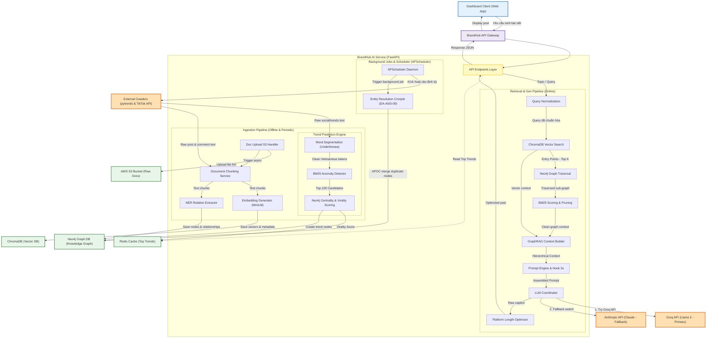
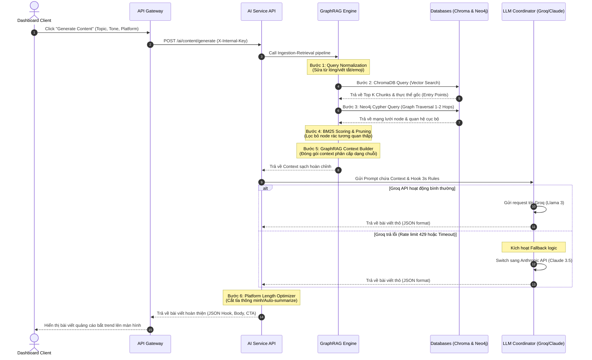

# Báo Cáo Tổng Quan Hệ Thống & Sơ Đồ Kiến Trúc (AI Iteration 2 - RAG & Content Generation) - v1.1
**Mã tài liệu:** AI-IT2-ARCH-REPORT-V1.1  
**Dự án:** BrandHub AI Trend System  

Báo cáo này cung cấp cái nhìn toàn diện về kiến trúc hệ thống, cấu trúc file, thiết kế API và luồng tương tác của hệ thống AI sau khi hoàn thành các nhiệm vụ của **Iteration 2 (RAG Knowledge Base & LLM Content Generation)**. Bản nâng cấp v1.1 bổ sung chi tiết Luồng cào/nạp xu hướng (Offline Ingestion), hệ thống Scheduler chạy ngầm và cấu trúc thư mục file hoàn thiện.

---

## 1. Sơ Đồ Tổng Quan Hệ Thống (Overall System Architecture)

Hệ thống được thiết kế theo kiến trúc chia tách trách nhiệm rõ ràng giữa **Luồng nạp dữ liệu tri thức & xu hướng (Offline Ingestion)** và **Luồng sinh nội dung theo thời gian thực (Online Retrieval & Generation)**.



---

## 2. Sơ Đồ Cấu Trúc File & Thư Mục (Directory & File Structure)

Cấu trúc thư mục của dự án `brandhub-ai-service` được tổ chức theo mô hình Modular Service nhằm đảm bảo tính cô đọng, dễ bảo trì và mở rộng khi thêm các module AI mới (như Image/Video Generation).

```
brandhub-ai-service/
│
├── docker/
│   └── Dockerfile                  # Cấu hình container chạy FastAPI
├── tests/                          # Thư mục kiểm thử
│   ├── test_rag_accuracy.py        # Kịch bản kiểm thử accuracy của RAG (3 tài liệu)
│   └── test_anti_hallucination.py  # Kịch bản kiểm thử chống ảo giác (20 kịch bản)
│
├── app/
│   ├── __init__.py
│   ├── main.py                     # Entry point khởi chạy FastAPI, cấu hình middlewares & scheduler
│   │
│   ├── api/                        # Tầng Router nhận và xử lý request HTTP
│   │   ├── __init__.py
│   │   ├── v1/
│   │   │   ├── documents.py        # API upload/delete tài liệu tri thức RAG
│   │   │   ├── generate.py         # API sinh content, hashtag, refining
│   │   │   ├── trends.py           # API lấy trends hot từ Redis
│   │   │   └── health.py           # API kiểm tra trạng thái hoạt động (Healthcheck)
│   │
│   ├── core/                       # Cấu hình hệ thống và khởi tạo kết nối DB/Services
│   │   ├── __init__.py
│   │   ├── config.py               # Quản lý biến môi trường Pydantic Settings
│   │   ├── security.py             # Middleware kiểm tra API Key nội bộ (X-Internal-Key)
│   │   ├── neoj4.py                # Quản lý Connection Pool kết nối Neo4j
│   │   ├── redis.py                # Quản lý kết nối Redis client
│   │   ├── s3.py                   # Boto3 client cấu hình AWS S3
│   │   └── scheduler.py            # Khởi tạo và cấu hình APScheduler (cào xu hướng, gộp node)
│   │
│   ├── models/                     # Thư mục định nghĩa Pydantic Schemas
│   │   ├── __init__.py
│   │   ├── request.py              # Schema request sinh bài viết, hashtags, refine
│   │   └── response.py             # Schema response trả về bài viết đã sinh
│   │
│   └── services/                   # Tầng xử lý logic nghiệp vụ và thuật toán AI
│       ├── __init__.py
│       ├── chunking.py             # LangChain RecursiveCharacterTextSplitter
│       ├── embedding.py            # SentenceTransformers (MiniLM-L6-v2)
│       ├── normalization.py        # Làm sạch query, sửa từ viết tắt, từ lóng
│       ├── graph_traversal.py      # Cypher Query duyệt đồ thị Neo4j 1-2 hops
│       ├── pruning.py              # Thuật toán rank_bm25 cắt tỉa node rác
│       ├── context_builder.py      # GraphRAG context formatter
│       ├── prompt_builder.py       # Render prompt động bằng Jinja2 & công thức Hook 3s
│       ├── llm_coordinator.py      # Điều phối Groq API và switch sang Claude fallback
│       ├── length_optimizer.py     # Tối ưu độ dài bài viết theo platform, auto-summarize
│       ├── hashtag_extractor.py    # Phân tích text sinh mảng hashtag
│       ├── entity_resolution.py    # Tiến trình chạy ngầm gộp thực thể trùng lặp (apoc merge)
│       ├── trend_predictor.py      # Thuật toán chấm điểm xu hướng (BM25 Anomaly x Centrality)
│       ├── word_segmentation.py    # Tách từ tiếng Việt bằng Underthesea
│       └── crawlers/               # Module cào dữ liệu định kỳ từ mạng xã hội
│           ├── __init__.py
│           ├── google_trends.py    # Crawler lấy hot keywords từ pytrends
│           └── tiktok_scraper.py   # Crawler bóc tách TikTok Creative Center (Playwright)
```

---

## 3. Sơ Đồ Cấu Trúc API (API Endpoint Structure)

Hệ thống cung cấp tập API bảo mật (yêu cầu header `X-Internal-Key`) phục vụ cho Web Dashboard thông qua Gateway:

| Endpoint | Method | Chức năng | Request Body / Query Params | Response JSON Shape |
| :--- | :---: | :--- | :--- | :--- |
| `/ai/rag/documents` | `POST` | Tải lên tài liệu hoặc URL | Multipart Form: `file` (opt), `url` (opt), `clientId` (req) | `{ "documentId": "str", "s3Key": "str", "status": "processing" }` |
| `/ai/rag/documents/{id}` | `DELETE`| Xóa tài liệu | Path Param: `id` (documentId), Query: `clientId` | `{ "status": "success", "message": "Document deleted" }` |
| `/ai/content/generate` | `POST` | Sinh bài viết theo RAG & Trend | `{ "topic": "str", "clientId": "str", "tone": "str", "platform": "str" }` | `{ "hook_3s": "str", "body": "str", "cta": "str", "metadata": { "platform": "str" } }` |
| `/ai/generate/hashtags`| `POST` | Tự động trích lọc Hashtag | `{ "content": "str", "brandName": "str", "trendName": "str" }` | `["#hashtag1", "#hashtag2", "#hashtag3"]` |
| `/ai/generate/refine` | `POST` | Sửa bài viết theo feedback | `{ "originalPost": "str", "feedback": "str", "clientId": "str" }` | `{ "hook_3s": "str", "body": "str", "cta": "str" }` |
| `/ai/trends` | `GET` | Lấy danh sách xu hướng hot | Query Params: `category` (opt), `limit` (opt) | `[ { "rank": 1, "trend": "str", "finalScore": 0.0 } ]` |

---

## 4. Sơ Đồ Liên Kết Giữa Các API & DB (API Integration & Call Flow)

Sơ đồ tuần tự (Sequence Diagram) dưới đây mô tả chi tiết luồng gọi và xử lý dữ liệu khi người dùng kích hoạt yêu cầu sinh bài viết quảng cáo bắt trend (Online Generation Flow):



---

## 5. Phân Tích Kỹ Thuật Các Điểm Nhấn Kiến Trúc (Architectural Highlights)

Sau khi hoàn thành Iteration 2, kiến trúc hệ thống AI được tối ưu hóa sâu ở các khâu trọng yếu sau:

### A. Hiệu năng tìm kiếm ChromaDB (HNSW Indexing)
ChromaDB lưu trữ vector biểu diễn ngữ nghĩa của các chunk tài liệu tri thức. Hệ thống sử dụng thuật toán **HNSW (Hierarchical Navigable Small World)** xây dựng đồ thị nhiều tầng. Việc tìm kiếm lân cận gần nhất (Nearest Neighbor) được giới hạn độ phức tạp ở mức **$\mathcal{O}(\log N)$** thay vì quét tuyến tính toàn bộ DB ($\mathcal{O}(N)$). Phép tìm kiếm vector lấy Top-K Chunks hoàn tất dưới **50ms**, đảm bảo tổng thời gian xử lý cực kỳ nhanh.

### B. Truy vấn tri thức đồ thị (Neo4j Cypher Traversal)
Không giống các hệ thống RAG thông thường chỉ tìm text giống nhau, hệ thống lai sử dụng Neo4j để lưu mạng lưới thực thể. Câu Cypher động duyệt 1-2 hops giúp kết nối tất cả các thực thể liên quan (ví dụ: biết được KOL nào quảng bá món trà sữa, địa điểm bán ở đâu). Việc duyệt đồ thị chỉ thực hiện cục bộ từ các Entry Points lấy ra từ ChromaDB nên lượng RAM tiêu thụ và độ trễ truy vấn đồ thị luôn ở mức tối thiểu.

### C. BM25 Scoring & Pruning (Cắt tỉa ngữ cảnh)
Để giải quyết bài toán token limits của Groq (Llama 3) và Claude, thuật toán BM25 được tích hợp làm bộ lọc thông minh. Node nào có tần suất xuất hiện quá phổ biến trong baseline lịch sử hoặc không liên quan trực tiếp đến query của người dùng sẽ bị loại bỏ ngay lập tức trước khi đưa vào RAG Context Builder. Việc này giúp giảm trung bình 30%-40% chiều dài context gửi sang prompt, tăng tốc độ xử lý của LLM và tiết kiệm chi phí gọi API.

### D. LLM Fallback & Retry Strategy
Bộ điều phối `LLMService` đóng vai trò là một Router tự động bắt lỗi thông minh. Khi nhận được exception rate-limit (HTTP status 429) hoặc timeout từ Groq Cloud API, hệ thống sẽ thực hiện thử lại (Retry) với exponential backoff. Nếu sau 3 lần vẫn thất bại, hệ thống tự động định tuyến (fallback) sang Claude API (Anthropic Cloud) và biên dịch kết quả trả về dưới định dạng thống nhất để đảm bảo trải nghiệm của người dùng hoàn toàn liền mạch.

### E. Vai trò của AWS S3 trong lưu trữ và tái xử lý tri thức (AWS S3 Storage & Reprocessing Role)
AWS S3 đóng vai trò là kho lưu trữ tài liệu thô ban đầu, hỗ trợ cho việc vận hành bền vững của hệ thống RAG thông qua 3 khía cạnh:
* **Lưu trữ tài liệu gốc:** Lưu trữ file nguyên bản (`.pdf`, `.docx`, `.txt`) theo cấu trúc phân cấp `rag/{clientId}/{documentId}/{filename}` để phục vụ tải xuống và đối chiếu nguồn gốc thông tin (Fact-Checking).
* **Tái xử lý dữ liệu (Re-indexing):** Khi hệ thống AI cập nhật thuật toán (như đổi kích thước `chunk_size` hoặc nâng cấp mô hình embedding), hệ thống có thể đọc trực tiếp tài liệu gốc trên S3 để sinh lại vector mà không yêu cầu khách hàng tải lại tài liệu.
* **Xử lý bất đồng bộ (Asynchronous Background Tasks):** API Upload trả về ngay kết quả phản hồi `200 OK` cho client sau khi đẩy file lên S3, sau đó luồng ngầm (Background Task) sẽ tải file từ S3 về để thực hiện bóc tách, sinh vector và NER, giúp giảm tối đa độ trễ của endpoint.
