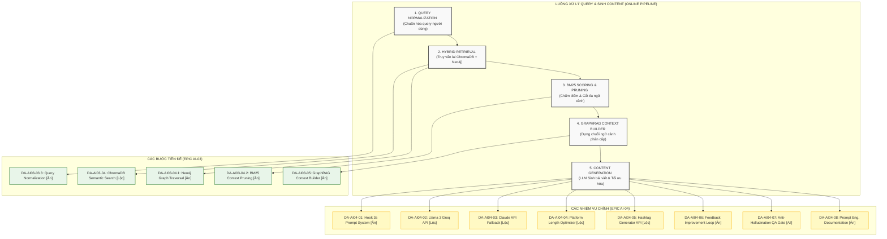

# Chi Tiết Nhiệm Vụ Epic AI-04 (User Query & Generation Pipeline Task Details)
**Epic:** `AI-04 — LLM Content Generation & Hook Optimization`  
**Dự án:** BrandHub AI Trend System  

Tài liệu này định nghĩa chi tiết các nhiệm vụ kỹ thuật phục vụ cho việc xây dựng **Luồng Xử lý Query người dùng & Sinh Content (Online/Runtime)**. Các nhiệm vụ này được chia nhỏ tối đa để các thành viên trong đội phát triển (Ân, Lộc, Tuấn) có thể phối hợp triển khai một cách chính xác nhất.

---

## I. Tổng Quan Ánh Xạ Luồng Xử Lý & Nhiệm Vụ (Pipeline-to-Task Mapping)

Dưới đây là sơ đồ chi tiết các bước xử lý của luồng runtime khi người dùng yêu cầu sinh bài viết bắt trend (Flow B) và các mã nhiệm vụ tương ứng:



---

## II. Bảng Ánh Xạ Luồng Runtime & Nhiệm Vụ (Flow-to-Task Matrix)

| Bước trong Flow | Nhiệm vụ | Mã Task | Người đảm nhận | Mô tả & Đầu ra chính |
| :--- | :--- | :--- | :--- | :--- |
| **Tiền xử lý query** | Chuẩn hóa câu lệnh đầu vào | `DA-AI03-03.3` | **Ân** (Database) | Lọc bỏ emoji rác, chuẩn hóa viết tắt/từ lóng tiếng Việt trước khi tìm kiếm. |
| **Truy vấn lai** | Tìm kiếm ngữ nghĩa & Đồ thị | `DA-AI03-04`<br>`DA-AI03-04.1` | **Lộc** (APIs)<br>**Ân** (Database) | ChromaDB quét Entry Points -> Neo4j duyệt đồ thị 1-2 bước nhảy để lấy mối quan hệ. |
| **Tối ưu hóa ngữ cảnh**| Chấm điểm & Cắt tỉa node rác | `DA-AI03-04.2` | **Ân** (Algorithm) | Chấm điểm BM25 của thực thể đối với query của người dùng, lọc bỏ node điểm thấp. |
| **Dựng prompt đầu vào**| Xây dựng ngữ cảnh GraphRAG | `DA-AI03-05` | **Ân** (Database) | Tổng hợp dữ liệu thành một chuỗi context phân cấp có cấu trúc sạch sẽ. |
| **Thiết kế Prompt** | Prompt Template & Hook 3s | `DA-AI04-01` | **Ân** (Prompt) | Tạo prompt hoàn chỉnh động chứa RAG Context + Trend data + công thức Hook 3s đầu. |
| **Tích hợp LLM chính**| Kết nối API Llama 3 Groq | `DA-AI04-02` | **Lộc** (APIs/LLM) | Gửi prompt qua Groq API, thiết lập cấu hình chống ảo giác và định dạng JSON output. |
| **Tích hợp kênh phụ**| Claude API Fallback | `DA-AI04-03` | **Lộc** (APIs/LLM) | Tự động switch sang Claude API khi Groq bị lỗi rate limit (429) hoặc quá thời gian phản hồi. |
| **Hậu xử lý văn bản** | Tối ưu hóa độ dài nền tảng | `DA-AI04-04` | **Lộc** (APIs) | Tự động kiểm tra và cắt tỉa/tóm tắt bài viết theo giới hạn ký tự (FB, Threads, TikTok). |
| **Hậu xử lý thẻ** | Tự động tạo Hashtag | `DA-AI04-05` | **Lộc** (APIs) | Endpoint phân tích nội dung để trích xuất 5-10 hashtags chuẩn hóa dạng không dấu cách. |
| **Vòng lặp tối ưu** | Tinh chỉnh theo feedback | `DA-AI04-06` | **Ân** (Prompt) | Endpoint nhận bài viết cũ + feedback của khách hàng để tái tạo phiên bản mới tối ưu hơn. |
| **Đánh giá chất lượng**| Kiểm thử chống ảo giác | `DA-AI04-07` | **Cả team** | Bộ test case kiểm thử 20 bài viết mẫu đảm bảo thông tin 100% chính xác theo RAG context. |
| **Tài liệu hóa** | Tài liệu Prompt Engineering | `DA-AI04-08` | **Ân** (Prompt) | Viết tài liệu hướng dẫn kỹ thuật prompt, tone guide, và hướng dẫn bảo trì hệ thống prompt. |

---

## III. Phân Rã Chi Tiết Nhiệm Vụ Epic AI-04 (Detailed Tasks Breakdown)

### DA-AI04-01 — Thiết kế Prompt Template System & Thang chấm điểm "Hook strength" 3s đầu tiên
**Assignee:** Ân (Prompt) | **Priority:** 🔴 Critical

**Goal:** Thiết kế hệ thống prompt động kết hợp các mảnh dữ liệu đầu vào (topic, context từ GraphRAG, dữ liệu xu hướng hot, tone giọng điệu yêu cầu) thành một prompt tối ưu duy nhất gửi đến LLM, đồng thời tích hợp các chỉ dẫn bắt buộc để LLM tối ưu cấu trúc giữ chân người dùng trong 3 giây đầu tiên (Hook 3s).

**Input:**
- Query/Topic thô từ người dùng (Ví dụ: `"Viết bài giới thiệu món trà sữa nướng đất nung Hàng Bồ"`).
- Context sạch đã được định dạng phân cấp từ GraphRAG Context Builder [Đầu ra của `DA-AI03-05`].
- Thông tin trend đính kèm (Nền tảng, Virality Score, từ khóa liên quan).
- Brand Tone Guide (Ví dụ: `Hài hước`, `Giật gân/Tò mò`, `Sang trọng/Premium`).

**Output:**
- Bản prompt hoàn chỉnh dạng text chứa đầy đủ cấu trúc chỉ dẫn và dữ liệu nạp.
- Ví dụ cấu trúc prompt được sinh động:
  ```markdown
  [SYSTEM INSTRUCTION]
  Bạn là một chuyên gia sáng tạo nội dung mạng xã hội tiếng Việt cho BrandHub. Nhiệm vụ của bạn là tạo bài viết dựa trên các thông tin thực tế được cung cấp. KHÔNG được bịa đặt bất kỳ thông tin nào ngoài ngữ cảnh (RAG Context).
  
  [CONTEXT]
  - Thực thể liên quan: Trà sữa đất nung (đặc trưng: nướng nóng hổi, béo bùi), Hàng Bồ (địa điểm: Hoàn Kiếm, Hà Nội).
  - KOL review: ninheating (1.2M tương tác).
  
  [TỐI ƯU HOÁ HOOK 3 GIÂY ĐẦU]
  Áp dụng Công thức Tò mò để giật tít mở đầu. Câu đầu tiên phải thu hút người đọc dừng lại ngay lập tức (dưới 15 từ).
  ...
  ```

**Detailed Solution (Giải pháp chi tiết):**
1. **Module Prompt Engine:** Tạo class `PromptBuilder` tại thư mục `app/services/prompt_builder.py`.
2. **Jinja2 Template:** Sử dụng công cụ template Jinja2 để quản lý các mẫu prompt hệ thống nhằm dễ dàng bảo trì và cập nhật.
3. **Cấu trúc Hook 3s:** Xây dựng danh mục các công thức Hook 3s đầu tiên tích hợp sẵn trong prompt:
   - *Công thức Tò mò (Curiosity Hook):* Tạo câu hỏi bỏ ngỏ hoặc một bí mật chưa bật mí (Ví dụ: *"Đừng mua trà sữa đất nung Hàng Bồ nếu bạn chưa biết điều này..."*).
   - *Công thức Trực diện (Direct Benefit Hook):* Đưa ngay kết quả hoặc lợi ích nổi bật lên dòng đầu tiên.
   - *Công thức FOMO (Nỗi sợ bỏ lỡ):* Nhấn mạnh tính giới hạn hoặc trào lưu đang diễn ra.
4. **Anti-Hallucination Layer:** Cài đặt các quy tắc logic cứng trong system prompt yêu cầu mô hình từ chối hoặc chỉ sử dụng thông tin trong Block `[CONTEXT]`.

**Acceptance Criteria:**
- [ ] Xây dựng class `PromptBuilder` hỗ trợ nạp động RAG context, trend data, tone, topic của người dùng.
- [ ] Thiết kế system prompt nghiêm ngặt, hướng dẫn LLM phân tách bài viết thành 3 phần rõ rệt: `[HOOK_3S]`, `[BODY]`, `[CALL_TO_ACTION]`.
- [ ] Tạo ít nhất 3 bộ template prompt khác nhau tương ứng với 3 công thức viết Hook 3s đầu tiên.
- [ ] Kiểm thử việc render prompt động thông qua unit test độc lập mà không cần kết nối API.

**Technical Notes:**
- Đảm bảo prompt được thiết kế tối ưu về số lượng token. Phải đếm thử chiều dài ký tự để tránh việc prompt bị cắt cụt do vượt quá giới hạn ngữ cảnh của LLM.

**Dependencies:** Blocked by: `DA-AI03-05`. Blocks: `DA-AI04-02`, `DA-AI04-03`.

---

### DA-AI04-02 — Tích hợp Llama 3 qua Groq API & Ràng buộc System Prompt chống ảo giác
**Assignee:** Lộc (APIs) | **Priority:** 🔴 Critical

**Goal:** Phát triển module kết nối tới dịch vụ Groq Cloud API, gửi prompt đã sinh từ `DA-AI04-01` lên mô hình Llama 3 (mục tiêu: `llama-3.1-70b-versatile`), cấu hình tham số nhiệt độ thấp nhằm giảm thiểu tối đa hiện tượng ảo giác thông tin, nhận kết quả và thực hiện parse output.

**Input:**
- Chuỗi prompt hoàn chỉnh được sinh ra từ `DA-AI04-01`.

**Output:**
- JSON chứa nội dung bài viết được phân mảnh chi tiết:
  ```json
  {
    "hook_3s": "😱 Mùa đông Hà Nội lạnh căm căm thế này mà bạn vẫn chưa biết trend Trà sữa đất nung Hàng Bồ của @ninheating à?",
    "body": "Không cần phải chen chúc lên phố cổ chờ đợi, hôm nay TeaHouse chính thức ra mắt dòng Trà Sữa Đất Nung Nướng nóng hổi vị ngọt thanh thanh, béo ngậy vị sữa chuẩn vị phố cổ...",
    "cta": "Ghé ngay chi nhánh TeaHouse gần nhất để thưởng thức phiên bản trà sữa đất nung nướng nóng hổi đang làm xiêu lòng hàng triệu food reviewer!",
    "usage": { "prompt_tokens": 1250, "completion_tokens": 320, "total_tokens": 1570 }
  }
  ```

**Detailed Solution (Giải pháp chi tiết):**
1. **Thiết lập Client:** Cài đặt thư viện `groq` và tạo class `GroqClient` trong file `app/core/llm/groq_client.py`.
2. **Cấu hình tham số:**
   - Sử dụng model: `llama-3.1-70b-versatile` để đảm bảo khả năng lập luận tốt nhất.
   - Cài đặt `temperature = 0.2` hoặc `0.3` (mức nhiệt độ thấp giúp mô hình tuân thủ chặt chẽ ngữ cảnh và giảm độ sáng tạo tự do dẫn đến ảo giác).
   - Đặt `response_format = {"type": "json_object"}` để ép LLM trả về đúng định dạng JSON có cấu trúc nhằm phân tách rõ ràng Hook, Body, CTA.
3. **Quản lý Rate limit:** Triển khai cơ chế retry tự động sử dụng thư viện `tenacity` với chiến lược exponential backoff khi gặp mã lỗi HTTP 429 (Too Many Requests).

**Acceptance Criteria:**
- [ ] Kết nối thành công đến Groq API qua API Key lưu trong biến môi trường `.env`.
- [ ] Thực hiện cấu hình tham số chống ảo giác thành công (`temperature` thấp, system prompt nghiêm ngặt).
- [ ] Nhận response, xử lý đếm token và chuyển đổi dữ liệu thô từ LLM thành JSON có cấu trúc.
- [ ] Triển khai thành công cơ chế retry tự động tối đa 3 lần nếu gặp lỗi rate limit trước khi trả về lỗi cho tầng Router.

**Technical Notes:**
- Việc ép định dạng JSON từ Llama 3 Groq đòi hỏi schema yêu cầu phải được mô tả cực kỳ rõ ràng trong system prompt để tránh hiện tượng mô hình trả về chuỗi JSON lỗi cấu trúc.

**Dependencies:** Blocked by: `DA-AI04-01`. Blocks: `DA-AI04-03` (fallback logic), `DA-AI04-07`.

---

### DA-AI04-03 — Tích hợp Claude API (Anthropic) làm kênh dự phòng Fallback tự động
**Assignee:** Lộc (APIs) | **Priority:** 🔴 Critical

**Goal:** Tích hợp SDK Anthropic Claude làm LLM Client dự phòng (mô hình đề xuất: `claude-3-5-sonnet` hoặc `claude-3-haiku`) và xây dựng bộ định tuyến (Router) tự động chuyển hướng yêu cầu sinh nội dung từ Groq sang Claude khi Groq gặp sự cố (Rate Limit, Network Error, Timeout).

**Input:**
- Chuỗi prompt hoàn chỉnh từ `DA-AI04-01`.
- Lỗi ngoại lệ (Exception) bắt được từ layer `DA-AI04-02`.

**Output:**
- JSON chứa nội dung bài viết tương tự chuẩn output của `DA-AI04-02`.

**Detailed Solution (Giải pháp chi tiết):**
1. **Thiết lập Claude Client:** Cài đặt thư viện `anthropic` và tạo class `ClaudeClient` tại `app/core/llm/claude_client.py`.
2. **Xây dựng Coordinator (Router):** Thiết lập class `LLMService` đóng vai trò trung gian điều phối:
   ```python
   class LLMService:
       async def generate_content(self, prompt: str) -> dict:
           try:
               # Thử gọi Llama 3 qua Groq trước
               return await self.groq_client.generate(prompt)
           except (GroqRateLimitError, GroqConnectionError, TimeoutError) as e:
               # Log lỗi cảnh báo Groq bị lỗi
               logger.warning(f"Groq API failed: {str(e)}. Switching to Claude Fallback.")
               # Kích hoạt fallback gọi sang Claude API
               return await self.claude_client.generate(prompt)
   ```
3. **Đồng nhất Output:** Thiết lập system prompt bên phía Claude để đảm bảo phản hồi trả về có cấu trúc JSON giống hệt với output của Llama 3.

**Acceptance Criteria:**
- [ ] Kết nối thành công đến Anthropic API thông qua API Key lưu trong `.env`.
- [ ] Viết thành công class điều phối `LLMService` thực hiện cơ chế bắt lỗi và switch kênh thông minh.
- [ ] Đảm bảo định dạng JSON trả về từ Claude tương thích 100% với hệ thống xử lý sau (Post-processing) của Lộc.
- [ ] Viết script test mock giả lập lỗi của Groq (ví dụ: tắt mạng hoặc truyền key sai) để xác minh hệ thống tự động nhảy sang Claude mà người dùng không gặp gián đoạn.

**Technical Notes:**
- Timeout cho Groq Client nên được thiết lập ngắn (khoảng 5 đến 7 giây) để tránh việc người dùng phải đợi quá lâu trước khi hệ thống chuyển hướng sang kênh Claude dự phòng.

**Dependencies:** Blocked by: `DA-AI04-02`. Blocks: `DA-AI04-07`.

---

### DA-AI04-04 — Xây dựng bộ tối ưu hóa độ dài bài viết theo quy định của từng nền tảng (Platform Length Optimizer)
**Assignee:** Lộc (APIs) | **Priority:** 🟡 High

**Goal:** Phát triển tầng hậu xử lý (Post-processing) tự động kiểm tra, đo đếm ký tự và điều chỉnh độ dài bài viết sau khi sinh nhằm đảm bảo không vi phạm giới hạn ký tự của các mạng xã hội phổ biến (Facebook, Threads, TikTok, Instagram).

**Input:**
- Dữ liệu JSON chứa nội dung bài viết (Hook, Body, CTA) từ `DA-AI04-02` hoặc `DA-AI04-03`.
- Nền tảng mục tiêu người dùng lựa chọn: `facebook`, `threads`, `tiktok`, `instagram`.

**Output:**
- Nội dung văn bản đã được tối ưu hóa độ dài, cắt tỉa thông minh nếu cần thiết để đảm bảo vừa khít giới hạn của nền tảng mà không làm cụt câu.

**Detailed Solution (Giải pháp chi tiết):**
1. **Thiết lập giới hạn (Rules Engine):**
   - **Facebook:** Giới hạn kỹ thuật là 63,206 ký tự (nhưng thiết lập ngưỡng tối ưu hóa hiển thị trong khoảng 1000 - 1500 ký tự).
   - **TikTok:** Giới hạn 4,000 ký tự.
   - **Threads:** Giới hạn nghiêm ngặt 500 ký tự.
   - **Instagram:** Giới hạn 2,200 ký tự.
2. **Thuật toán cắt tỉa thông minh (Smart Truncation):**
   - Nếu tổng số ký tự (Hook + Body + CTA + Hashtags) vượt quá giới hạn:
     - Giữ nguyên vẹn 100% phần `hook_3s` và `cta`.
     - Tính toán số lượng ký tự thừa và thực hiện cắt tỉa phần `body`.
     - Tìm dấu chấm câu (`.`, `!`, `?`) gần nhất trước điểm giới hạn để cắt, tránh việc văn bản bị ngắt nửa chừng giữa từ hoặc giữa câu.
3. **Cơ chế nén bằng LLM (Auto-Summarize):**
   - Đối với các nền tảng có giới hạn siêu ngắn như **Threads (500 ký tự)**, nếu nội dung sinh ra quá dài, hệ thống sẽ thực hiện một cuộc gọi nhanh (sub-request) sang mô hình Claude-Haiku yêu cầu tóm tắt cô đọng phần body mà vẫn giữ được thông tin đắt giá nhất.

**Acceptance Criteria:**
- [ ] Viết hàm helper đo đếm độ dài ký tự tiếng Việt UTF-8 chính xác.
- [ ] Triển khai thuật toán cắt tỉa thông minh theo dấu chấm câu để bài viết không bị cụt lủn.
- [ ] Tích hợp luồng auto-summarize bằng LLM khi bài viết đăng lên Threads vượt quá 500 ký tự.
- [ ] Trả về cảnh báo (warning metadata) cho client nếu hệ thống buộc phải cắt bớt văn bản.

**Technical Notes:**
- Phải tính toán gộp cả độ dài của danh sách hashtag sẽ được chèn vào cuối bài viết để đảm bảo tổng số ký tự cuối cùng gửi lên mạng xã hội không bị lỗi.

**Dependencies:** Blocked by: `DA-AI04-02`, `DA-AI04-03`. Blocks: `DA-AI04-07`.

---

### DA-AI04-05 — Phát triển Endpoint tự động sinh Hashtags bắt trend và Hashtags thương hiệu
**Assignee:** Lộc (APIs) | **Priority:** 🟡 High

**Goal:** Phát triển endpoint API `/ai/generate/hashtags` nhận văn bản bài viết, phân tích ngữ nghĩa và trích xuất danh sách 5-10 hashtags tối ưu nhất. Hashtags bao gồm: hashtags xu hướng đang thịnh hành trong database, hashtags nội dung bài viết và hashtags đặc trưng thương hiệu.

**Input:**
- Chuỗi văn bản bài viết đã được sinh.
- Brand Name (Ví dụ: `TeaHouse`).
- Trend Name liên kết (Ví dụ: `trà sữa đất nung` - lấy từ context).

**Output:**
- Mảng JSON chứa danh sách các hashtag đã được chuẩn hóa.
  - *Ví dụ:* `["#TeaHouse", "#trasuadatnung", "#trasuanuong", "#xuhuongtiktok"]`

**Detailed Solution (Giải pháp chi tiết):**
1. **Thiết kế API:** Tạo endpoint `POST /ai/generate/hashtags` bằng FastAPI.
2. **Hệ thống Prompt Hashtag:** Viết một prompt hệ thống ngắn gửi sang LLM Llama-8b yêu cầu: *"Phân tích đoạn văn sau và trích xuất ra 5 từ khóa chính viết liền không dấu, không chứa ký tự đặc biệt để làm hashtag."*
3. **Xử lý Regex & Ghép nối:**
   - Viết hàm chuẩn hóa ký tự tiếng Việt sang không dấu, loại bỏ dấu cách, loại bỏ các ký tự đặc biệt (Ví dụ: *"trà sữa nướng"* -> `trasuanuong`).
   - Tự động ghép thêm dấu `#` vào đầu mỗi từ khóa.
   - Đính kèm thêm các hashtag thương hiệu cố định (nếu có trong cấu hình brand) và hashtag xu hướng lấy ra từ Redis/Neo4j.

**Acceptance Criteria:**
- [ ] Endpoint `/ai/generate/hashtags` hoạt động ổn định, phản hồi dưới 200ms.
- [ ] Chuẩn hóa thành công các cụm từ tiếng Việt có dấu thành chuỗi hashtag không dấu, viết liền.
- [ ] Kết quả trả ra chứa đủ 3 nhóm: Hashtag thương hiệu, hashtag nội dung bài viết, và hashtag xu hướng của hệ thống.
- [ ] Lọc bỏ hoàn toàn các hashtag trùng lặp trong mảng đầu ra.

**Technical Notes:**
- Để giảm độ trễ (latency), tác vụ sinh hashtag có thể sử dụng mô hình nhỏ Llama 3 8B trên Groq hoặc thậm chí sử dụng thuật toán NLP trích xuất từ khóa đơn giản (như TF-IDF hoặc RAKE) chạy trực tiếp trên server backend mà không cần gọi LLM ngoài.

**Dependencies:** Blocked by: `DA-AI04-02`, `DA-AI04-03`. Blocks: `DA-AI04-07`.

---

### DA-AI04-06 — Xây dựng Endpoint Chỉnh sửa và Cải thiện bài viết dựa trên Feedback (Feedback Iteration Loop)
**Assignee:** Ân (Prompt) | **Priority:** 🟡 High

**Goal:** Phát triển tính năng cho phép người dùng nhập ý kiến phản hồi (ví dụ: *"viết ngắn lại"*, *"thêm nhiều emoji hơn"*, *"nhấn mạnh vào yếu tố vệ sinh an toàn thực phẩm"*) đối với một bài viết cũ để hệ thống tinh chỉnh và sinh ra phiên bản mới tối ưu hơn.

**Input:**
- Bài viết gốc đã được sinh ra trước đó (Original Post).
- Phản hồi bằng tiếng Việt từ phía người dùng (User Feedback).
- Context RAG ban đầu (để tránh hiện tượng LLM tự bịa ra thông tin mới trong quá trình sửa đổi).

**Output:**
- Bài viết phiên bản mới đã được cập nhật theo ý kiến phản hồi nhưng vẫn bảo tồn cấu trúc 3 phần.

**Detailed Solution (Giải pháp chi tiết):**
1. **API Endpoint:** Xây dựng endpoint `POST /ai/generate/refine` trong FastAPI.
2. **Refining Prompt Template:**
   - Xây dựng prompt có cấu trúc:
     ```markdown
     Bạn là trợ lý AI biên tập nội dung. Dưới đây là bài viết gốc:
     ---
     {original_post}
     ---
     Khách hàng phản hồi như sau: "{user_feedback}".
     Hãy viết lại bài viết trên để đáp ứng phản hồi của khách hàng.
     
     Lưu ý nghiêm ngặt:
     1. Chỉ sử dụng thông tin thực tế trong ngữ cảnh ban đầu: {rag_context}. KHÔNG tự ý bịa đặt.
     2. Giữ nguyên định dạng đầu ra gồm các thẻ [HOOK_3S], [BODY], [CALL_TO_ACTION].
     ```
3. **Cấu hình tham số:** Cài đặt `temperature = 0.4` (cao hơn một chút so với sinh gốc để mô hình có đủ không gian điều chỉnh văn phong theo phản hồi).

**Acceptance Criteria:**
- [ ] Thiết kế endpoint nhận request thành công và trả về bài viết đã được cập nhật.
- [ ] Viết prompt refining đảm bảo LLM chỉnh sửa đúng trọng tâm feedback mà không làm mất đi các dữ liệu thực tế trong RAG context.
- [ ] Triển khai cơ chế lưu vết lịch sử phiên bản (Version History) để người dùng có thể quay lại các bản nháp trước đó nếu muốn.

**Technical Notes:**
- Cần phòng chống tấn công injection qua trường feedback của người dùng. Tiến hành validate đầu vào, giới hạn độ dài của chuỗi feedback gửi lên tối đa 300 ký tự.

**Dependencies:** Blocked by: `DA-AI04-01`, `DA-AI04-02`. Blocks: `DA-AI04-07`.

---

### DA-AI04-07 — Thiết lập bộ kịch bản kiểm thử tự động & thủ công chống ảo giác (Anti-Hallucination QA Gate)
**Assignee:** Cả team (Team AI/Dev) | **Priority:** 🔴 Critical

**Goal:** Thiết lập chốt chặn chất lượng (Quality Gate) bắt buộc trước khi deploy. Tạo ra bộ 20 kịch bản kiểm thử thực tế và kiểm tra xem các bài viết sinh ra có hoàn toàn trung thực với tài liệu tri thức (RAG Context) hay không, tuyệt đối không được có lỗi tự bịa thông tin (zero hallucination).

**Input:**
- 20 kịch bản kiểm thử (Test Cases) được định nghĩa sẵn bao gồm:
  - Query của user.
  - Tài liệu RAG Context chuẩn (chứa các thông tin đúng sự thật).
  - Tệp output sinh ra từ pipeline của Llama 3 và Claude.

**Output:**
- Báo cáo chất lượng `hallucination_test_report.json` với điểm Factuality đạt 100% (20/20 kịch bản vượt qua kiểm thử).

**Detailed Solution (Giải pháp chi tiết):**
1. **Thiết kế Test Cases:** Biên soạn 20 kịch bản kiểm thử bao gồm các thông tin dễ gây ảo giác cho LLM như: địa chỉ quán ăn, tên KOL review, thông số giá cả, đặc sản vùng miền.
2. **Kiểm thử tự động (LLM-as-a-judge):**
   - Viết một script Python chạy tự động. Script này gửi bài viết đã sinh cùng với tài liệu RAG Context gốc lên mô hình `claude-3-5-sonnet`.
   - Sử dụng prompt đánh giá logic học: *"Hãy phân tích từng câu khẳng định trong bài viết. Đối chiếu với RAG Context và xác định xem khẳng định đó là Đúng (True) hay Sai/Không có căn cứ (False). Trả về định dạng JSON: { 'factuality_score': float, 'failed_statements': list }."*
3. **Kiểm thử thủ công (Manual Review):** Tổ chức một buổi họp rà soát chung cả nhóm để duyệt thủ công 20 bài viết mẫu, đánh giá độ tự nhiên của Hook 3s đầu và độ khớp thông tin.

**Acceptance Criteria:**
- [ ] Xây dựng hoàn chỉnh bộ dữ liệu 20 kịch bản test case mẫu.
- [ ] Phát triển thành công script Python chạy tự động chấm điểm độ trung thực của bài viết (LLM-as-a-judge).
- [ ] Đạt tỷ lệ chính xác 100% trên cả 20 test case (Không phát hiện bất kỳ thông tin nào ngoài RAG context).
- [ ] Báo cáo kiểm thử được ghi nhận và lưu trữ trong thư mục dự án.

**Technical Notes:**
- Đây là **cửa chặn chất lượng bắt buộc (Blocking Quality Gate)**. Nếu có bất kỳ test case nào thất bại, nhiệm vụ phát triển prompt (`DA-AI04-01`) buộc phải mở lại để tinh chỉnh và kiểm thử lại từ đầu.

**Dependencies:** Blocked by: `DA-AI04-01`, `DA-AI04-02`, `DA-AI04-03`, `DA-AI04-04`, `DA-AI04-05`, `DA-AI04-06`. Blocks: Deploy hệ thống.

---

### DA-AI04-08 — Biên soạn Tài liệu Kỹ thuật Prompt Engineering & Hướng dẫn Bảo trì Prompt
**Assignee:** Ân (Prompt) | **Priority:** 🟢 Medium

**Goal:** Viết tài liệu kỹ thuật hướng dẫn chi tiết về cấu trúc Prompt Engineering trong dự án, bao gồm cấu trúc template prompt hệ thống, danh sách các công thức Hook 3s đang chạy, cấu hình tone guide và các kịch bản đối phó với lỗi ảo giác nhằm phục vụ cho việc bảo trì hệ thống lâu dài.

**Acceptance Criteria:**
- [ ] Biên soạn thành công tài liệu `docs/ai/prompt_engineering_guide.md`.
- [ ] Giải thích rõ ràng cấu trúc prompt hệ thống của Groq và Claude API.
- [ ] Tài liệu hóa cách cấu hình và thêm mới các platform, giọng điệu tone guide hoặc công thức hook mới vào hệ sinh thái.
- [ ] Tài liệu được review và phê duyệt bởi các thành viên trong đội phát triển AI.

**Dependencies:** Blocked by: `DA-AI04-07`.

---

## IV. Bản Đồ Phụ Thuộc (Dependency Map) & Trình Tự Thực Thi

Để đảm bảo việc xây dựng hệ thống không bị tắc nghẽn, các nhiệm vụ cần được thực hiện theo trình tự tối ưu sau:

```
[BƯỚC TIỀN ĐỀ - EPIC AI-03]
DA-AI03-03.3 (Query Normalization) ➔ DA-AI03-04 (Chroma Search) & DA-AI03-04.1 (Neo4j Traversal)
                                                     │
                                                     ▼
                                         DA-AI03-04.2 (BM25 Pruning)
                                                     │
                                                     ▼
                                         DA-AI03-05 (Context Builder)
                                                     │
                                                     ▼
[TIẾN TRÌNH EPIC AI-04]
                                         DA-AI04-01 (Prompt Builder & Hook 3s)
                                                     │
                                                     ├─────────────────────────────────┐
                                                     ▼                                 ▼
                                         DA-AI04-02 (Llama 3 Groq)         DA-AI04-03 (Claude Fallback)
                                                     │                                 │
                                                     └────────────────┬────────────────┘
                                                                      ▼
                                                         DA-AI04-04 (Platform Length)
                                                         DA-AI04-05 (Hashtags API)
                                                         DA-AI04-06 (Feedback Loop)
                                                                      │
                                                                      ▼
                                                         DA-AI04-07 (Hallucination Test)
                                                                      │
                                                                      ▼
                                                         DA-AI04-08 (Documentation)
```
