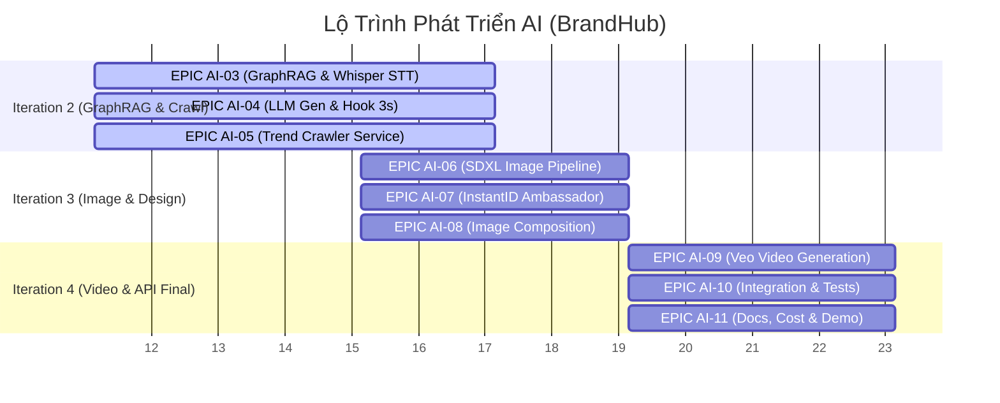
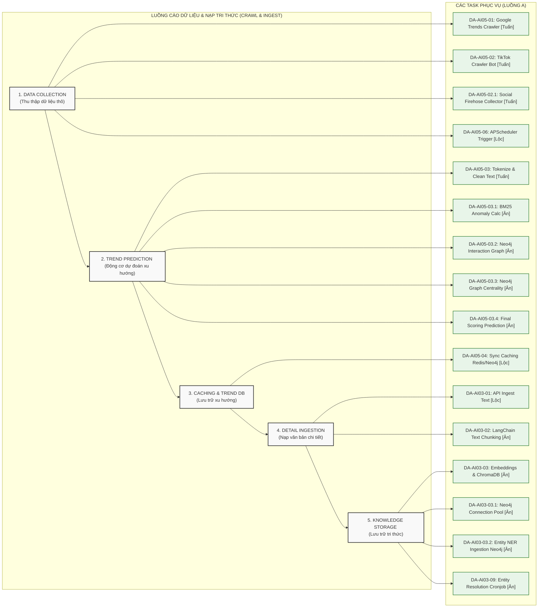
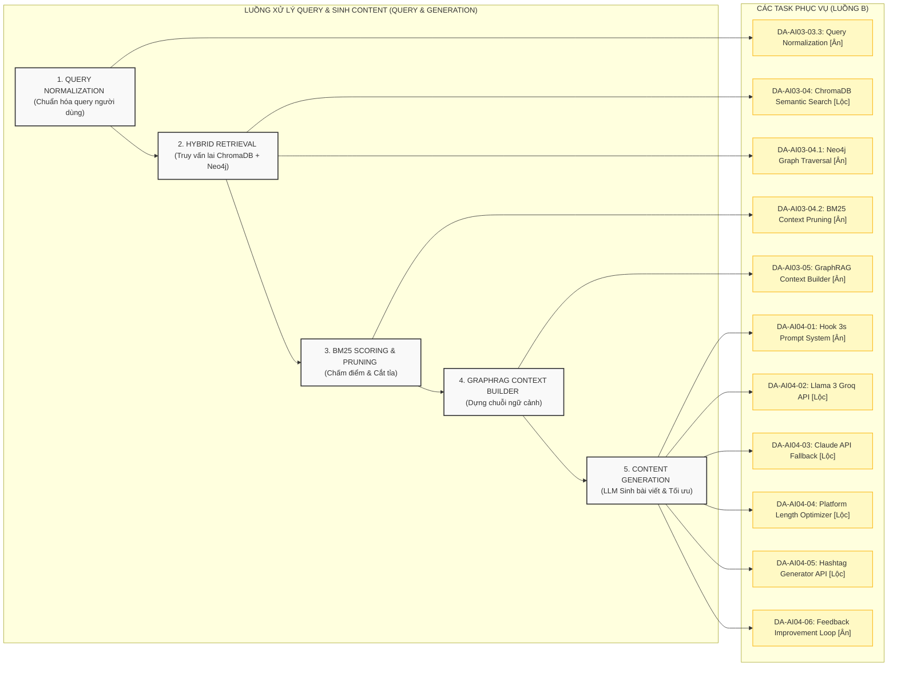

# TÀI LIỆU CHUẨN BỊ HỌP TEAM AI: TỔNG HỢP TIẾN ĐỘ & THỐNG NHẤT FLOW CÔNG NGHỆ

Tài liệu này tổng hợp toàn bộ nội dung quan trọng để chuẩn bị cho cuộc họp sắp tới với team AI, bao gồm: review kết quả Iteration 1, lộ trình phát triển sắp tới (khi đã xong Epic 1 & 2), và luồng xử lý kỹ thuật (Data Pipeline) chi tiết của tính năng Crawl Trend & AI Generate (GraphRAG).

---

## I. Báo Cáo & Đánh Giá AI Iteration 1 (Research & Evaluation)
*Thời gian chạy: Song song với Sprint 5–6 (Weeks 9–12)*

### 1. Mục tiêu ban đầu
Đánh giá công nghệ cho 3 nhánh cốt lõi (Virtual Ambassador, AI Video, Image Composition) và thiết lập nền tảng hạ tầng kỹ thuật ban đầu cho dịch vụ `brandhub-ai-service` (FastAPI).

### 2. Các kết quả đã đạt được (Epic 1 & 2 đã hoàn thành)
Team AI đã hoàn thành việc nghiên cứu mô hình và dựng khung hạ tầng cơ bản:
* **EPIC AI-01 — AI Model Research & Evaluation:**
  * **Virtual Ambassador:** Đã tiến hành nghiên cứu, so sánh giữa **InstantID vs IP-Adapter vs ControlNet** để tạo ra đại sứ thương hiệu ảo nhất quán về khuôn mặt. Đã chạy thử nghiệm trên 5 ảnh mẫu và lập bảng so sánh chất lượng, thời gian chạy và chi phí.
  * **AI Video:** Đã nghiên cứu Google Veo API (tính năng, giá cả, giới hạn request, tham số chuyển động) và kiểm thử hơn 20 prompt sinh video khác nhau.
  * **Image Composition (Ghép ảnh):** Nghiên cứu các kỹ thuật ghép ảnh sản phẩm vào mẫu (ControlNet Inpainting, DALL-E Edit, tách nền qua `rembg` và ghép layer qua Pillow) và thử nghiệm trên 10 cặp ảnh.
  * **LLM Engine:** So sánh chất lượng tiếng Việt, tốc độ phản hồi và chi phí giữa Llama 3 (chạy qua Groq API) và Claude API.
* **EPIC AI-02 — AI Service Infrastructure Setup:**
  * Khởi tạo thành công dự án `brandhub-ai-service` sử dụng **FastAPI + Python 3.11** với cấu trúc thư mục chuẩn (`app/api`, `app/services`, `app/models`, `app/utils`).
  * Đóng gói dịch vụ AI bằng **Dockerfile** và cấu hình chạy chung trong hệ thống qua `docker-compose.yml`.
  * Cấu hình các Client API từ biến môi trường (`.env`): ChromaDB, Groq API, Anthropic Claude, Stability AI.
  * Tích hợp thành công client AWS S3 sử dụng thư viện `boto3` và viết các hàm helper để upload/delete file và sinh presigned URL.
  * Xây dựng Middleware xác thực API Key nội bộ (`X-Internal-Key`) và định nghĩa cấu trúc Schema Pydantic.

---

## II. Lộ Trình Tiến Độ & Kế Hoạch Chi Tiết Theo Từng Epic (Iteration 2 ➔ 4)

### 1. Thông tin tổng hợp & Thời gian dự kiến các Iteration
Dưới đây là bảng tổng hợp timeline, thời lượng phát triển và trạng thái của từng Iteration trong dự án AI Track để team dễ dàng nắm bắt bức tranh toàn cảnh:

| Iteration | Nội dung trọng tâm | Thời gian dự kiến | Sprint song song | Trạng thái |
| :--- | :--- | :--- | :--- | :--- |
| **AI Iteration 1** | **Research & Evaluation** (Nghiên cứu công nghệ & dựng nền móng AI Service) | Tuần 9 – 12 (4 tuần) | Sprints 5 – 6 | **Hoàn thành** |
| **AI Iteration 2** | **GraphRAG, LLM & Trends** (Dựng Whisper STT, cào trend, GraphRAG, sinh content) | Tuần 13 – 18 (6 tuần)* | Sprints 7 – 9 | **Chuẩn bị chạy** (Đang đề xuất tăng 2 tuần do tăng quy mô) |
| **AI Iteration 3** | **Image, Ambassador & Composition** (Stability AI SDXL, InstantID, tách & ghép nền) | Tuần 17 – 20 (4 tuần) | Sprints 9 – 10 | **Sắp tới** (Chạy gối đầu song song gối đầu) |
| **AI Iteration 4** | **Video, Integration & Docs** (Google Veo, đóng gói API, test tích hợp, làm báo cáo) | Tuần 21 – 24 (4 tuần) | Sprints 11 – 12 | **Sắp tới** |

> [!IMPORTANT]
> \* **Thời gian dự kiến của Iteration 2** đã được đề xuất kéo dài từ **4 tuần lên 6 tuần** (tuần 13 đến tuần 18) để có đủ thời gian tích hợp cấu hình GPU local RTX 4050 cho Whisper và hạ tầng đồ thị Neo4j. Để bù đắp thời gian này, Iteration 3 sẽ chạy gối đầu bắt đầu từ tuần 17 (khi một số thành viên làm xong sớm chuyển sang làm trước tính năng tách/ghép nền).



---

### 2. Chi tiết các nhiệm vụ cụ thể theo từng Epic

#### 🔴 EPIC AI-03 — GraphRAG & Text Processing Pipeline
* **`DA-AI03-01` [MODIFY]:** Nâng cấp API Ingest `/ai/rag/upload` để chấp nhận dữ liệu text thô và các tệp tài liệu văn bản. *(Assignee: Lộc)*
* **`DA-AI03-02` [KEEP]:** Dựng bộ chia nhỏ văn bản (Chunking) bằng LangChain RecursiveCharacterTextSplitter (chunk_size=500, overlap=50). *(Assignee: Ân)*
* **`DA-AI03-03` [MODIFY]:** Viết module sinh vector embedding từ text chunk và nạp vào ChromaDB kèm metadata (documentId, clientId, chunkIndex). *(Assignee: Ân)*
* **`DA-AI03-03.1` [MODIFY]:** Cấu hình cơ sở dữ liệu Neo4j chạy trên container Docker, viết class quản lý connection pool (`app/core/neo4j.py`). *(Assignee: Ân)*
* **`DA-AI03-03.2` [NEW]:** Xây dựng module trích xuất thực thể (NER) và nạp mạng lưới quan hệ (`KOL`, `Món ăn`, `Địa danh`) vào Neo4j bằng Cypher query. *(Assignee: Ân)*
* **`DA-AI03-03.3` [NEW]:** Xây dựng module Chuẩn hóa Ngôn ngữ (Normalization) cho query của người dùng (loại bỏ emoji, chuẩn hóa viết tắt/từ lóng tiếng Việt) trước khi đưa vào truy vấn lai. *(Assignee: Ân)*
* **`DA-AI03-04` [MODIFY]:** Tìm kiếm ngữ nghĩa ChromaDB để tìm các thực thể gần nhất làm điểm truy cập (Entry Points) cho đồ thị dựa trên query đã chuẩn hóa. *(Assignee: Lộc)*
* **`DA-AI03-04.1` [NEW]:** Viết Graph Traversal Service để duyệt đồ thị trong Neo4j (độ sâu 1–2 bước nhảy) dựa trên Entry Points để thu thập mối liên hệ. *(Assignee: Ân)*
* **`DA-AI03-04.2` [NEW]:** Phát triển thuật toán chấm điểm và cắt tỉa (BM25 Pruning) loại bỏ node có độ tương quan thấp đối với query đã chuẩn hóa của người dùng. *(Assignee: Ân)*
* **`DA-AI03-05` [MODIFY]:** Xây dựng GraphRAG Context Builder định dạng dữ liệu ChromaDB + cấu trúc liên kết Neo4j thành chuỗi context gửi LLM. *(Assignee: Ân)*
* **`DA-AI03-06` [KEEP]:** API xóa dữ liệu tri thức (dọn sạch ChromaDB chunks + node tương ứng trong Neo4j + file S3). *(Assignee: Lộc)*
* **`DA-AI03-07` [KEEP]:** Viết test case đánh giá độ chính xác của GraphRAG, tránh hiện tượng LLM bị ảo giác (hallucination). *(Assignee: Ân)*
* **`DA-AI03-08` [KEEP]:** Viết tài liệu kỹ thuật về RAG pipeline, cấu hình tham số và cách đánh giá chất lượng context. *(Assignee: Ân)*
* **`DA-AI03-09` [NEW]:** Tạo Background Cronjob chạy định kỳ (12 tiếng) thực hiện Entity Resolution (gộp các thực thể trùng lặp ngữ nghĩa). *(Assignee: Ân)*

#### 🔴 EPIC AI-04 — LLM Content Generation & Hook Optimization
* **`DA-AI04-01` [MODIFY]:** Xây dựng Prompt Template System tích hợp thêm layer chấm điểm "Hook strength" cho cấu trúc giữ chân người dùng 3s đầu. *(Assignee: Ân)*
* **`DA-AI04-02` [KEEP]:** Tích hợp Llama 3 qua Groq API, thiết lập hệ thống system prompt để LLM chỉ sử dụng context thực tế được cung cấp. *(Assignee: Lộc)*
* **`DA-AI04-03` [KEEP]:** Tích hợp Claude API (Anthropic) làm fallback khi Groq bị quá tải request (rate limit) hoặc chất lượng bị sụt giảm. *(Assignee: Lộc)*
* **`DA-AI04-04` [KEEP]:** Tự động tối ưu hóa độ dài bài viết theo từng nền tảng (Facebook tối đa 63k, Threads 500, TikTok 4k ký tự). *(Assignee: Lộc)*
* **`DA-AI04-05` [KEEP]:** Viết endpoint sinh tự động danh sách hashtag liên quan đến nội dung bài viết. *(Assignee: Lộc)*
* **`DA-AI04-06` [KEEP]:** Phát triển tính năng cải thiện nội dung dựa trên feedback (User gửi lại caption cũ + feedback của client để tạo phiên bản mới). *(Assignee: Ân)*
* **`DA-AI04-07` [KEEP]:** Viết kịch bản kiểm thử chống ảo giác cho 20 bài viết mẫu khác nhau. *(Assignee: All)*
* **`DA-AI04-08` [KEEP]:** Tài liệu hướng dẫn Prompt Engineering (cấu trúc template, giọng điệu tone guide, prompt hệ thống). *(Assignee: Ân)*

#### 🔴 EPIC AI-4.99 — Analyze deeply crawl trend flow

### DA-AI04-99-01 — Phân tích và thiết kế Tầng thu thập dữ liệu (Google Trends & TikTok Crawlers, Social Firehose)
**Assignee:** Tuấn (Crawl) | **Priority:** 🔴 High

**Goal:** Nghiên cứu và tài liệu hóa cơ chế hoạt động, giao thức cào, giải pháp chống chặn (anti-blocking) và cơ chế lập lịch cào dữ liệu từ Google Trends (`pytrends`), TikTok Creative Center và các nguồn social.

**Input:**
- Cấu hình Google Trends: Khu vực (`geo='VN'`), từ khóa hoặc category, khoảng thời gian (`timeframe='now 7-d'`).
- Danh sách cào có mục tiêu (Targeted List): 50-100 usernames/IDs của các KOLs và đường dẫn của các group cộng đồng Facebook công khai cần giám sát.

**Output:**
- Danh sách bài đăng thô dạng văn bản kèm metadata tương tác.
- Định dạng JSON Output mẫu:
  ```json
  {
    "source": "tiktok/facebook/google",
    "crawl_time": "2026-07-18T20:00:00Z",
    "posts": [
      {
        "post_id": "tt_738291038102",
        "author": "ninheating",
        "content": "Hé lô mọi người, hôm nay đi uống thử trà sữa đất nung Hàng Bồ ngon lắm nha! #trasuadatnung",
        "interactions": { "likes": 45000, "shares": 1200, "comments_count": 850 },
        "comments": [
          { "user": "reviewer_A", "text": "Quán này ở số 10 Hàng Bồ đúng không anh?" }
        ]
      }
    ]
  }
  ```

**Detailed Solution (Giải pháp chi tiết):**
1. **Google Trends (`pytrends`):** Sử dụng class `TrendReq` gọi API của Google. Định kỳ chạy hàm `realtime_trending_searches(pn='VN')` mỗi 6 giờ để lấy các từ khóa đang tìm kiếm thịnh hành nhất Việt Nam.
2. **TikTok Creative Center & KOL Crawler:** Sử dụng headless browser `Playwright` truy cập vào TikTok Creative Center lấy danh sách hashtag hot. Đối với các KOLs trong danh sách mục tiêu, gọi API không chính thức (qua dịch vụ RapidAPI TikTok Scraper) để lấy feed bài đăng mới nhất dựa trên `uniqueId` hoặc `secUid`.
3. **Facebook Public Groups Scraper:** Sử dụng `Scrapy` kết hợp với dịch vụ Proxy xoay vòng (Proxy Rotation như Bright Data hoặc Webshare) để liên tục cào bài viết mới nhất từ các nhóm công khai mà không cần đăng nhập tài khoản nhằm tránh bị khóa tài khoản/checkpoint.
4. **Cơ chế lập lịch:** Sử dụng `APScheduler` tích hợp sẵn trong FastAPI chạy ngầm định kỳ mỗi 6 giờ dưới nền. Kết quả thô được ghi đệm tạm thời thành file JSON hoặc đẩy vào hàng đợi trong Redis.

**Acceptance Criteria:**
- [ ] Tài liệu hóa cách cấu hình và giới hạn tần suất (rate limits) của Google Trends qua thư viện `pytrends`.
- [ ] Nghiên cứu và tài liệu hóa cơ chế cào dữ liệu từ TikTok Creative Center và API lấy bài đăng KOLs.
- [ ] Thiết kế luồng cào các Group Facebook công khai kết hợp dịch vụ proxy xoay vòng để chống chặn.
- [ ] Cấu hình scheduler chạy ngầm thông qua thư viện `APScheduler` chạy định kỳ mỗi 6 giờ.

**Technical Notes:**
- Việc sử dụng các giải pháp chống chặn IP (Proxy Rotation, Spoofing Headers, Random User-Agents) là bắt buộc đối với TikTok và Facebook Scraper để đảm bảo hệ thống hoạt động liên tục.
- Thiết kế phương án lưu trữ văn bản thô tạm thời trước khi đẩy vào động cơ dự đoán xu hướng.

**Dependencies:** Blocks: DA-AI04-99-02.

---

### DA-AI04-99-02 — Nghiên cứu thuật toán Động cơ dự đoán xu hướng (Tách từ & BM25 Anomaly Detection)
**Assignee:** Ân (Algorithm) | **Priority:** 🔴 High

**Goal:** Thiết kế công thức toán học và logic lập trình cho việc tách từ tiếng Việt và tính toán điểm đột biến BM25 để lọc ra 100 ứng cử viên xu hướng.

**Input:**
- Danh sách bài đăng thô dạng văn bản kèm metadata tương tác [Output từ `DA-AI04-99-01`].

**Output:**
- Danh sách Top 100 từ khóa/cụm từ ứng cử viên có điểm bất thường cao nhất.
- Định dạng JSON mẫu:
  ```json
  [
    { "keyword": "trà sữa đất nung", "anomaly_score": 8.45 },
    { "keyword": "capybara", "anomaly_score": 7.12 }
  ]
  ```

**Detailed Solution (Giải pháp chi tiết):**
1. **Làm sạch thô:** Sử dụng Regex loại bỏ các ký tự đặc biệt, link URL và emoji.
2. **Tách từ tiếng Việt:** Sử dụng thư viện `Underthesea` (hàm `word_tokenize`) để phân tách văn bản thô thành các cụm từ ghép có nghĩa. Nạp bộ từ điển custom để nhận diện các từ lóng mới.
3. **Tính toán chỉ số BM25:** So sánh tần suất xuất hiện của từ khóa hôm nay (TF) so với mức độ hiếm của nó trong lịch sử 30 ngày trước (IDF).
   - Công thức: \(\text{Anomaly\_Score}(D, q_i) = \text{IDF}(q_i) \cdot \frac{f(q_i, D) \cdot (k_1 + 1)}{f(q_i, D) + k_1 \cdot \left(1 - b + b \cdot \frac{|D|}{\text{avgdl}}\right)}\)
4. **Trích xuất Candidates:** Sắp xếp giảm dần theo điểm số Anomaly Score và cắt lấy 100 từ khóa đứng đầu.

**Acceptance Criteria:**
- [ ] Xác định thư viện tách từ tiếng Việt (`Underthesea` hoặc `PyVi`) và thiết lập bộ từ điển tùy chỉnh (custom dictionary) để nhận diện các từ ghép/từ mới.
- [ ] Định nghĩa công thức toán học BM25 áp dụng cho phát hiện bất thường: tính toán tần suất $TF$ của chu kỳ 6h hiện tại so với chỉ số nghịch đảo $IDF$ của lịch sử 30 ngày trước.
- [ ] Xác định các ngưỡng lọc (thresholds) và cơ chế chuẩn hóa điểm số BM25 để chọn ra Top 100 Candidates.

**Technical Notes:**
- Thuật toán BM25 cần xử lý được các từ tiếng Việt có dấu/không dấu và loại bỏ chính xác danh sách Stop words (từ đệm, từ vô nghĩa) để tránh nhiễu dữ liệu.

**Dependencies:** Blocked by: DA-AI04-99-01. Blocks: DA-AI04-99-03.

---

### DA-AI04-99-03 — Phân tích đồ thị tương tác & Thuật toán Centrality tính Điểm lan truyền
**Assignee:** Ân (Algorithm) | **Priority:** 🔴 High

**Goal:** Thiết kế cấu trúc đồ thị tương tác Neo4j cho các ứng cử viên xu hướng và áp dụng các thuật toán đồ thị của Neo4j GDS để tính toán điểm lan truyền (Virality Score).

**Input:**
- Danh sách Top 100 ứng cử viên xu hướng [Output từ `DA-AI04-99-02`].
- Danh sách thông tin tài khoản người dùng/KOL và tương tác chéo từ Tầng cào thô [lấy từ `DA-AI04-99-01`].

**Output:**
- Bảng xếp hạng Top 10 - 20 xu hướng chính thức cuối cùng kèm điểm số tích hợp.
- Định dạng JSON mẫu:
  ```json
  [
    { "rank": 1, "trend": "trà sữa đất nung", "final_score": 7.52, "anomaly_score": 8.45, "virality_score": 0.89 }
  ]
  ```

**Detailed Solution (Giải pháp chi tiết):**
1. **Dựng đồ thị tương tác (Graph Construction):** Đẩy thông tin tương tác của 100 ứng cử viên vào Neo4j dưới dạng Node (`:User`, `:Trend`, `:Community`) và Edge (`:POSTED`, `:INTERACTED`).
2. **Chiếu đồ thị (Graph Projection):** Sử dụng Neo4j GDS để tạo một đồ thị ảo trong RAM (`gds.graph.project`).
3. **Chạy thuật toán Centrality:**
   - Chạy **Degree Centrality** để đo mức độ tiếp cận (Reach/Coverage).
   - Chạy **Betweenness Centrality** để đo khả năng lan truyền xuyên cộng đồng (Cross-community Virality).
   - Tổng hợp thành `Graph_Virality_Score` trong khoảng `[0, 1]`.
4. **Tính điểm cuối cùng:** Nhân điểm số bất thường với điểm lan truyền đồ thị:
   \[Final\_Trend\_Score = Anomaly\_Score \times Graph\_Virality\_Score\]
   Lọc lấy Top 10 - 20 xu hướng có điểm số cao nhất.

**Acceptance Criteria:**
- [ ] Định nghĩa cấu trúc Schema đồ thị tương tác thô (Nodes: `User`, `Trend`, `Community`; Edges: `POSTED`, `INTERACTED`).
- [ ] Viết sẵn các câu lệnh Cypher để chạy thuật toán Degree Centrality và Betweenness Centrality thông qua thư viện Neo4j GDS.
- [ ] Thiết lập công thức tính điểm tổng hợp cuối cùng: $Final\_Trend\_Score = Anomaly\_Score \times Graph\_Virality\_Score$.
- [ ] Thiết lập cơ chế lọc botnet bằng thuật toán Clustering Coefficient trên đồ thị.

**Technical Notes:**
- Đảm bảo cơ chế chiếu đồ thị ảo (Graph Projection) trong Neo4j GDS chạy tối ưu trên RAM để không gây trễ hệ thống khi chạy tính toán định kỳ.

**Dependencies:** Blocked by: DA-AI04-99-02. Blocks: DA-AI04-99-06, DA-AI04-99-07.

---

### DA-AI04-99-04 — Thiết kế quy trình Chuẩn hóa và Cắt nhỏ văn bản (Text Normalization & Chunking)
**Assignee:** Ân (Database) | **Priority:** 🟡 Medium

**Goal:** Định nghĩa bộ quy tắc làm sạch văn bản tiếng Việt và thiết lập thông số chia nhỏ văn bản tri thức phục vụ cho khâu nạp dữ liệu tri thức của trend.

**Input:**
- Tên các xu hướng chính thức trong Top 10 - 20 [từ `DA-AI04-99-06`].
- Văn bản thô của các bài đăng và comments chi tiết liên quan đến các xu hướng này [do bot tiếp tục cào sâu].

**Output:**
- Danh sách các text chunks sạch đã chuẩn hóa ngôn ngữ.
- Định dạng JSON mẫu:
  ```json
  {
    "trendName": "trà sữa đất nung",
    "chunks": [
      { "chunk_id": "chunk_0", "text": "Quán Trà Sữa Đất Nung Hàng Bồ nằm tại số 10 Hàng Bồ, Hoàn Kiếm, Hà Nội. Trà được nướng trực tiếp trên ấm đất..." }
    ]
  }
  ```

**Detailed Solution (Giải pháp chi tiết):**
1. **Chuẩn hóa từ lóng/viết tắt:** Thay thế các từ viết tắt và từ lóng phổ biến trên MXH bằng bộ từ điển ánh xạ (synonyms map). Loại bỏ hoàn toàn các emoji rác và URL quảng cáo.
2. **Chia nhỏ (Chunking):** Chạy thư viện LangChain `RecursiveCharacterTextSplitter` với các tham số: `chunk_size=500`, `chunk_overlap=50`. Cấu hình cắt theo độ ưu tiên: dấu xuống dòng `\n`, dấu chấm `.`, dấu phẩy `,`, và khoảng trắng để tránh đứt câu.

**Acceptance Criteria:**
- [ ] Xây dựng bộ quy tắc Regex và từ điển chuẩn hóa viết tắt/từ lóng tiếng Việt (ví dụ: "khum" -> "không", "k" -> "không", "ly" -> "cốc").
- [ ] Xác định cấu hình chia nhỏ văn bản bằng LangChain `RecursiveCharacterTextSplitter` (chunk_size=500, overlap=50).

**Technical Notes:**
- Phải đảm bảo các vết cắt chunk không làm đứt đoạn ngữ nghĩa của câu tiếng Việt (ưu tiên cắt theo dấu chấm, dấu phẩy, dấu xuống dòng).

**Dependencies:** Blocks: DA-AI04-99-05.

---

### DA-AI04-99-05 — Thiết kế cấu trúc cơ sở dữ liệu lai (ChromaDB + Neo4j NER Graph Schema)
**Assignee:** Lộc (APIs) | **Priority:** 🔴 High

**Goal:** Thiết kế sơ đồ dữ liệu (Schema) và cơ chế liên kết đồng bộ giữa Vector DB (ChromaDB) và Graph DB (Neo4j) đối với dữ liệu tri thức chi tiết của xu hướng.

**Input:**
- Danh sách các text chunks sạch kèm trendName liên kết [Output từ `DA-AI04-99-04`].

**Output:**
- Cơ sở dữ liệu ChromaDB được nạp vector embeddings.
- Neo4j được bổ sung các Node thực thể (`:KOL`, `:Dish`, `:Location`) và liên kết quan hệ (`:PROMOTED`, `:ASSOCIATED_WITH`, `:LOCATED_IN`) trỏ về Node `:Trend`.

**Detailed Solution (Giải pháp chi tiết):**
1. **Nạp ChromaDB (Vector DB):** Sử dụng mô hình `all-MiniLM-L6-v2` chuyển đổi từng text chunk thành vector 384 chiều. Lưu trữ vào ChromaDB kèm theo metadata lọc `trendName`.
2. **Trích thực thể & Nạp Neo4j (NER):** Gửi text chunk sang LLM (Llama 3 qua API) với prompt trích xuất thực thể có cấu trúc. Nhận về danh sách thực thể và chạy các câu lệnh Cypher `MERGE` để tạo mối quan hệ trên đồ thị Neo4j.
3. **Khớp nối dữ liệu (Linkage):** Đảm bảo cả bản ghi ChromaDB (qua metadata `trendName`) và các node thực thể trong Neo4j đều kết nối trực tiếp với node `:Trend` gốc để luồng GraphRAG sau này có thể truy vấn lai đồng bộ.

**Acceptance Criteria:**
- [ ] Định nghĩa Schema lưu trữ trong ChromaDB (Cấu trúc ID, nội dung document, cấu hình mô hình embedding và các trường metadata như `trendName` để filter).
- [ ] Định nghĩa Schema đồ thị tri thức trong Neo4j (Nodes: `KOL`, `Dish`, `Location`, `Trend`; Edges: `PROMOTED`, `ASSOCIATED_WITH`, `LOCATED_IN`).
- [ ] Thiết kế giải thuật chạy nền (Background Job) xử lý trùng lặp thực thể (Entity Resolution) để gộp các node tương tự ngữ nghĩa trong Neo4j.

**Technical Notes:**
- ChromaDB cần được cấu hình index tối ưu cho việc lọc theo thuộc tính metadata `trendName` để phục vụ khâu truy vấn lai (Hybrid Retrieval) đạt latency dưới 100ms.

**Dependencies:** Blocked by: DA-AI04-99-04. Blocks: DA-AI04-99-07.

---

### DA-AI04-99-06 — Thiết kế luồng lưu trữ đệm Redis và Ghi đè kết quả Neo4j (Upsert Flow)
**Assignee:** Lộc (APIs) | **Priority:** 🟡 Medium

**Goal:** Thiết kế cấu trúc dữ liệu lưu đệm trong Redis và viết các truy vấn Cypher ghi đè/tạo mới (Upsert) điểm số xu hướng vào Neo4j.

**Input:**
- Bảng xếp hạng Top 10 - 20 xu hướng chính thức [Output từ `DA-AI04-99-03`].

**Output:**
- Dữ liệu được đồng bộ hóa thành công xuống Redis (Sorted Set) và Neo4j (Trend Nodes).
- API `/ai/trends` có thể đọc trực tiếp dữ liệu từ Redis để hiển thị lên Dashboard.

**Detailed Solution (Giải pháp chi tiết):**
1. **Redis Caching:** Ghi danh sách xu hướng vào Redis dưới dạng Sorted Set (ZSET) với key `trends:vn:{date}:{category}`. Điểm score của ZSET chính là `final_score` để dashboard truy vấn và sắp xếp tự động. Thiết lập TTL là 6 giờ.
2. **Neo4j Upsert:** Thực thi câu lệnh Cypher sử dụng mệnh đề `MERGE` kết hợp `ON CREATE SET` và `ON MATCH SET` để cập nhật/ghi đè chỉ số xếp hạng và điểm số lên Node `:Trend` trong database.

**Acceptance Criteria:**
- [ ] Thiết kế cấu trúc lưu trữ bảng xếp hạng trend trong Redis (cấu trúc key `trends:vn:{date}:{category}`, sử dụng kiểu dữ liệu Sorted Set hoặc JSON String) kèm TTL 6 giờ.
- [ ] Viết câu lệnh Cypher sử dụng `MERGE` kết hợp `ON CREATE SET` và `ON MATCH SET` để thực hiện upsert điểm số, thứ hạng của Top 10-20 Trend vào Neo4j mà không làm mất lịch sử ngày tạo.

**Technical Notes:**
- Đảm bảo việc ghi vào Redis và Neo4j diễn ra đồng thời để tránh bất đồng bộ dữ liệu hiển thị trên Dashboard.

**Dependencies:** Blocked by: DA-AI04-99-03. Blocks: DA-AI04-99-07.

---

### DA-AI04-99-07 — Tổng hợp tài liệu Blueprint thiết kế hệ thống cào dữ liệu xu hướng (Final Blueprint)
**Assignee:** Lộc (APIs) | **Priority:** 🟡 Medium

**Goal:** Tổng hợp toàn bộ các phân tích, thuật toán, công thức toán học, sơ đồ database và thiết kế API từ các task trước thành một tài liệu Blueprint hoàn chỉnh bàn giao cho đội phát triển.

**Input:**
- Toàn bộ kết quả thiết kế, công thức và giải pháp kỹ thuật từ các task `DA-AI04-99-01` đến `DA-AI04-99-06`.

**Output:**
- Tệp tài liệu Blueprint hoàn chỉnh `report_crawl_trend_analysis.md` trong dự án.
- Biên bản thống nhất và bàn giao tài liệu kỹ thuật cho team dev.

**Detailed Solution (Giải pháp chi tiết):**
1. **Tổng hợp tài liệu:** Thu thập thông tin từ các thành viên (Tuấn, Ân, Lộc) sau khi hoàn thành các task phân tích thành phần.
2. **Kiểm tra liên kết dữ liệu:** Rà soát lại toàn bộ đầu vào/đầu ra của các bước để đảm bảo tính thông suốt và không bị đứt gãy luồng dữ liệu (Data Lineage).
3. **Hoàn thiện tài liệu:** Xuất bản tài liệu `report_crawl_trend_analysis.md` chứa sơ đồ, công thức toán học rõ ràng và hướng dẫn triển khai.

**Acceptance Criteria:**
- [ ] Hoàn thành tài liệu thiết kế hệ thống chi tiết `report_crawl_trend_analysis.md`.
- [ ] Tích hợp đầy đủ các sơ đồ luồng dữ liệu (Mermaid) và ví dụ JSON thô/vector/graph properties thực tế.
- [ ] Bàn giao thành công và họp thống nhất (Alignment) tài liệu thiết kế với toàn bộ thành viên trong đội phát triển AI.

**Technical Notes:**
- Tài liệu Blueprint cần lưu trực tiếp trong thư mục tài liệu thiết kế của dự án để làm tài liệu đối chiếu (Reference) trong suốt quá trình code.

**Dependencies:** Blocked by: DA-AI04-99-03, DA-AI04-99-05, DA-AI04-99-06.

---

#### 🟡 EPIC AI-05 — Trend Crawler & Scoring Service (Tích Hợp Sâu Trend_Crawler_Flow.md)
* **`DA-AI05-01` [KEEP]:** Viết module sử dụng `pytrends` để cào tự động các từ khóa tìm kiếm hot nhất tại Việt Nam từ Google Trends (Luồng MVP). *(Assignee: Tuấn)*
* **`DA-AI05-02` [KEEP]:** Viết bot cào hashtag xu hướng của TikTok bằng cách cào web hoặc sử dụng API không chính thức (Luồng MVP). *(Assignee: Tuấn)*
* **`DA-AI05-02.1` [NEW]:** Thu thập dữ liệu thô từ mạng xã hội (Social Media Firehose: bài đăng, bình luận, hashtag với số lượng lớn) phục vụ cho luồng cào nâng cao (Advanced Prediction Engine). *(Assignee: Tuấn)*
* **`DA-AI05-03` [MODIFY]:** Xây dựng module tiền xử lý (Tokenization & Cleaning) để tách từ và làm sạch dữ liệu thô thu được từ social media. *(Assignee: Tuấn)*
* **`DA-AI05-03.1` [NEW]:** Triển khai thuật toán BM25 so sánh tần suất xuất hiện của từ khóa hôm nay (TF) với mức độ hiếm của nó trong 30 ngày trước (IDF) để lọc ra top 100 từ khóa ứng cử viên trend (lọc tín hiệu đột biến). *(Assignee: Ân)*
* **`DA-AI05-03.2` [NEW]:** Xây dựng module dựng đồ thị tương tác (Node: User/Group, Edge: Tương tác) cho các bài đăng chứa từ khóa ứng cử viên trong Neo4j. *(Assignee: Ân)*
* **`DA-AI05-03.3` [NEW]:** Áp dụng các thuật toán đồ thị trong Neo4j (Betweenness Centrality đo độ lan truyền chéo giữa các cộng đồng, Degree Centrality đo lượng kết nối độc lập) để chấm điểm lan truyền (Virality Score). *(Assignee: Ân)*
* **`DA-AI05-03.4` [NEW]:** Xây dựng bộ chấm điểm và xếp hạng cuối cùng: `Final_Trend_Score = BM25_Anomaly_Score * Graph_Virality_Score` để đưa ra dự đoán Top Trending. *(Assignee: Ân)*
* **`DA-AI05-04` [MODIFY]:** Đồng bộ dữ liệu trend dự đoán được vào Redis Cache (TTL 6 tiếng, cấu trúc key: `trends:vn:{date}:{category}`) và lưu trữ cấu trúc Node/Edge vào Neo4j. *(Assignee: Lộc)*
* **`DA-AI05-05` [KEEP]:** API lấy danh sách gợi ý trend phục vụ hiển thị trên giao diện (GET `/ai/trends?category=...&limit=20`). *(Assignee: Lộc)*
* **`DA-AI05-06` [KEEP]:** Thiết lập thư viện APScheduler để kích hoạt hệ thống cào trend tự động (MVP chạy mỗi 6h, Advanced chạy ngầm liên tục theo chu kỳ). *(Assignee: Lộc)*

---

### AI Iteration 3 — Image, Ambassador & Composition (Parallel với Sprints 9–10 | Weeks 17–20)

#### 🔴 EPIC AI-06 — Image Generation Pipeline
* **`DA-AI06-01`:** Tích hợp Stability AI API (SDXL) để sinh ảnh từ text kèm các tham số: style, tỷ lệ khung hình, negative prompt. *(Assignee: Lộc)*
* **`DA-AI06-02`:** Endpoint sinh ảnh từ text và lưu trữ ảnh kết quả lên S3 (POST `/ai/image/generate`). *(Assignee: Lộc)*
* **`DA-AI06-03`:** Phát triển tính năng sinh hàng loạt (batch 3 biến thể ảnh cùng lúc) để người dùng tự chọn ảnh đẹp nhất. *(Assignee: Lộc)*
* **`DA-AI06-04`:** Thiết lập bộ lọc an toàn thương hiệu (mặc định các negative prompt để chặn ảnh nhạy cảm, bạo lực). *(Assignee: Lộc)*
* **`DA-AI06-05`:** Đánh giá chất lượng và thời gian phản hồi của mô hình trên 20 prompt sản phẩm thực tế. *(Assignee: Lộc)*

#### 🔴 EPIC AI-07 — Virtual Brand Ambassador (InstantID)
* **`DA-AI07-01`:** Thiết lập InstantID pipeline chạy local/cloud (nạp model, trích xuất InsightFace, ControlNet depth). *(Assignee: Tuấn)*
* **`DA-AI07-02`:** Phát triển module xử lý ảnh mẫu (phát hiện khuôn mặt và trích xuất vector khuôn mặt làm tham chiếu). *(Assignee: Tuấn)*
* **`DA-AI07-03`:** Viết endpoint sinh ảnh đại sứ (POST `/ai/ambassador/generate` nhận 1 ảnh mẫu + prompt tả trang phục/bối cảnh). *(Assignee: Tuấn)*
* **`DA-AI07-04`:** Chạy thử nghiệm 15 ảnh mẫu đại sứ với các tư thế/bối cảnh khác nhau, đánh giá độ giống mặt qua similarity score. *(Assignee: Tuấn)*
* **`DA-AI07-05`:** Xây dựng tính năng quản lý thư viện đại sứ thương hiệu (lưu ảnh tham chiếu và ảnh đã sinh lên S3 theo clientId). *(Assignee: Tuấn)*
* **`DA-AI07-06`:** API áp dụng ảnh đại sứ ảo lên các bối cảnh khác nhau (POST `/ai/ambassador/apply`). *(Assignee: Tuấn)*
* **`DA-AI07-07`:** Lập bảng so sánh, benchmark chất lượng giữa InstantID và IP-Adapter để đưa ra quyết định tối ưu. *(Assignee: Tuấn)*
* **`DA-AI07-08`:** Viết tài liệu hướng dẫn sử dụng tham số để sinh ảnh đại sứ đạt chất lượng cao nhất. *(Assignee: Tuấn)*

#### 🔴 EPIC AI-08 — Image Composition Pipeline
* **`DA-AI08-01`:** Triển khai thư viện `rembg` (mô hình U2Net) để tách nền tự động cho ảnh sản phẩm thô thành dạng PNG trong suốt. *(Assignee: Lộc)*
* **`DA-AI08-02`:** Triển khai tách nền cho ảnh người mẫu/đại sứ ảo để chuẩn bị ghép layer. *(Assignee: Lộc)*
* **`DA-AI08-03`:** Viết service ghép ảnh nhiều lớp sử dụng thư viện Pillow (Layer sản phẩm + Layer mẫu + Layer background). *(Assignee: Lộc)*
* **`DA-AI08-04`:** Phát triển thuật toán tự động cân bằng ánh sáng và vẽ bóng đổ nhân tạo tại chân mẫu/sản phẩm để ảnh trông thật hơn. *(Assignee: Lộc)*
* **`DA-AI08-05`:** API ghép ảnh tổng hợp (POST `/ai/compose` nhận S3 keys của sản phẩm, mẫu, background để ghép). *(Assignee: Lộc)*
* **`DA-AI08-06`:** Thử nghiệm ghép trên 20 cặp sản phẩm + người mẫu thực tế, ghi lại các case bị lỗi/mất nét. *(Assignee: Lộc)*
* **`DA-AI08-07`:** Viết tài liệu hướng dẫn kích thước tối ưu và các thông số căn lề chuẩn khi ghép ảnh. *(Assignee: Lộc)*

---

### AI Iteration 4 — Video, Integration & Documentation (Parallel với Sprints 11–12 | Weeks 21–24)

#### 🔴 EPIC AI-09 — AI Video Generation
* **`DA-AI09-01`:** Tích hợp Google Veo API (cơ chế xác thực, gọi API, polling trạng thái xử lý video bất đồng bộ). *(Assignee: Ân)*
* **`DA-AI09-02`:** Xây dựng hệ thống prompt template sinh video (nhận chủ đề + chuyển động + thời lượng để dịch ra prompt Veo). *(Assignee: Ân)*
* **`DA-AI09-03`:** Ánh xạ các lệnh chuyển động camera của người dùng (camera_pan, zoom_in, zoom_out, walk) thành tham số Veo. *(Assignee: Ân)*
* **`DA-AI09-04`:** Xây dựng thư viện chứa 30 kịch bản/template prompt video marketing mẫu chia theo nhiều lĩnh vực. *(Assignee: Ân)*
* **`DA-AI09-05`:** API sinh video bất đồng bộ (POST `/ai/video/generate` trả về `jobId`, GET `/ai/video/{jobId}/status` để lấy kết quả). *(Assignee: Ân)*
* **`DA-AI09-06`:** Upload video thành phẩm lên S3, tự động cắt 1 khung hình làm ảnh đại diện (thumbnail) và trả về thông tin đầy đủ. *(Assignee: Ân)*
* **`DA-AI09-07`:** Thực hiện chạy benchmark trên 30 prompt mẫu để thống kê thời gian và chi phí sinh một video. *(Assignee: Ân)*
* **`DA-AI09-08`:** Viết báo cáo nghiên cứu sinh video AI (bí kíp viết prompt và bảng cheat sheet tham số chuyển động). *(Assignee: Ân)*

#### 🔴 EPIC AI-10 — AI Service Integration & API Finalize
* **`DA-AI10-01`:** Đồng bộ và hoàn thiện toàn bộ các router/endpoint của `ai-service` đảm bảo chuẩn REST API. *(Assignee: Lộc)*
* **`DA-AI10-02`:** Thiết lập cơ chế bắt lỗi và thử lại (Exponential Backoff + Fallback Provider) khi gọi các API AI bên ngoài. *(Assignee: All)*
* **`DA-AI10-03`:** Viết bộ kịch bản test tích hợp với `business-service` trong môi trường Docker-compose để verify luồng gọi chéo. *(Assignee: All)*
* **`DA-AI10-04`:** Xuất collection Postman mẫu chứa đầy đủ body request/response của tất cả API AI để bàn giao. *(Assignee: Lộc)*
* **`DA-AI10-05`:** Cập nhật Swagger/OpenAPI spec của `ai-service` lên phiên bản chuẩn cuối cùng. *(Assignee: Lộc)*

#### 🔴 EPIC AI-11 — AI Research Documentation & Demo
* **`DA-AI11-01`:** Biên soạn tài liệu kỹ thuật cho Virtual Ambassador (so sánh mô hình, kết quả khảo sát similarity). *(Assignee: Tuấn)*
* **`DA-AI11-02`:** Biên soạn tài liệu kỹ thuật sinh video marketing (thư viện prompt, hướng dẫn điều khiển camera). *(Assignee: Ân)*
* **`DA-AI11-03`:** Biên soạn tài liệu kỹ thuật Image Composition (phương pháp tách nền, giải thuật đổ bóng chân thực). *(Assignee: Lộc)*
* **`DA-AI11-04`:** Thực hiện báo cáo phân tích chi phí AI dự kiến (trên quy mô 1,000 người dùng hoạt động/tháng). *(Assignee: All)*
* **`DA-AI11-05`:** Quay video demo thực tế chạy thử cả 7 tính năng AI đã phát triển trong dự án. *(Assignee: All)*
* **`DA-AI11-06`:** Trình bày kết quả nghiên cứu và chạy thử trực tiếp (Demo) với Mentor/Hội đồng chấm. *(Assignee: All)*

---

## III. Luồng Kỹ Thuật (Data Pipeline): Crawl Trend & AI Generate (GraphRAG)

Quy trình kỹ thuật được tối ưu hóa bằng cách phân tách rõ ràng thành 2 luồng độc lập: **Luồng Cào dữ liệu & Nạp tri thức (Offline/Periodic)** và **Luồng Xử lý Query người dùng & Sinh Content (Online/Runtime)**.

### 1. Luồng xử lý chi tiết (Step-by-step Flow)

#### A. Luồng Cào dữ liệu & Nạp tri thức (Crawl & Ingestion Pipeline - Theo Trend_Crawler_Flow.md)
Luồng này chạy định kỳ/tự động nhằm liên tục cập nhật xu hướng nóng nhất trên thị trường và làm giàu cơ sở tri thức đồ thị.

```
[NGUỒN DỮ LIỆU (Google Trends, Social Media Firehose: TikTok/Reels)]
                              │
                              ▼
┌────────────────────────────────────────────────────────┐
│ 1. DATA COLLECTION LAYER (Cào dữ liệu)                 │ 
│    - MVP: Google Trends / TikTok Crawler               │
│    - Advanced: Social Media Firehose (Posts, Comments) │
└─────────────────────────────┬──────────────────────────┘
                              │
                              ▼
┌────────────────────────────────────────────────────────┐
│ 2. TREND PREDICTION ENGINE (Động cơ dự đoán xu hướng)  │
│    - Tokenize & Clean: Tách từ & Làm sạch dữ liệu thô  │
│    - BM25 Anomaly Calc: Lọc 100 ứng cử viên điểm cao   │
│    - Graph Construction: Dựng đồ thị tương tác Neo4j   │
│    - Graph Algorithms: Centrality -> Điểm lan truyền   │
│    - Final Scoring (BM25 x Graph) -> Top Trending      │
└─────────────────────────────┬──────────────────────────┘
                              │
                              ├──────────────────► LƯU TRỮ VÀO CACHE REDIS & NEO4J
                              │
                              ▼ (Đối với chi tiết bài đăng/văn bản của trend)
┌────────────────────────────────────────────────────────┐
│ 3. NORMALIZATION & CLEANING                            │ ──► Loại bỏ emoji rác, sửa viết tắt/từ lóng tiếng Việt
└─────────────────────────────┬──────────────────────────┘
                              │
                              ├───► LƯU TRỮ VÀO VECTOR DB (ChromaDB) ➔ Lưu các chunk text & vector nhúng
                              │
                              └───► TRÍCH XUẤT THỰC THỂ (NER) ➔ Trích các node (KOL, Dish, Location, Trend)
                                                             ➔ Lưu liên kết vào GRAPH DB (Neo4j)
```

##### *Chi tiết hoạt động của Động cơ Dự đoán Xu hướng (Trend Prediction Engine):*
Để hiểu rõ cơ chế vận hành của khâu **2. TREND PREDICTION ENGINE**, dưới đây là mô tả chi tiết đầu vào (Input) và đầu ra (Output) của từng bước xử lý bên trong động cơ này:

*   **Bước 2.1: Tokenize & Clean (Tách từ & Làm sạch dữ liệu thô)**
    *   **Mô tả:** Nhận dữ liệu văn bản thô, làm sạch các nhiễu như HTML tags, emojis, kí tự đặc biệt và liên kết URL. Sau đó, chạy bộ phân tách từ tiếng Việt để nhóm các từ đơn thành cụm từ có nghĩa (Word Segmentation).
    *   **Input:** Danh sách các bài đăng (posts), bình luận (comments) thô thu được từ Social Media Firehose trong chu kỳ hiện tại (ví dụ: 6 giờ qua).
        *   *Ví dụ:* `"Review món trà sữa đất nung cực ngon tại quán Trà Sữa Đất Nung Hàng Bồ ☕️🥤! Đăng ký mua tại: https://example.com #trasuadatnung"`
    *   **Output:** Danh sách các token (từ/cụm từ tiếng Việt) sạch đã chuyển về dạng viết thường (lowercase) và lọc stop words cơ bản.
        *   *Ví dụ:* `["trà sữa đất nung", "ngon", "quán", "trà sữa đất nung", "hàng bồ", "trasuadatnung"]`
*   **Bước 2.2: BM25 Anomaly Calc (Lọc 100 ứng cử viên điểm cao)**
    *   **Mô tả:** So sánh tần suất xuất hiện của các token trong chu kỳ hiện tại (6 giờ qua) với baseline tần suất lịch sử của 30 ngày trước bằng thuật toán BM25 để phát hiện sự đột biến bất thường (Anomaly Detection), loại bỏ các từ khóa ngày nào cũng "hot" nhưng không phải là trend (ví dụ: "giảm giá", "quần áo").
    *   **Input:** Tập hợp các token sạch của chu kỳ hiện tại và kho dữ liệu baseline lịch sử 30 ngày trước.
    *   **Output:** Danh sách **Top 100 từ khóa/cụm từ** có điểm số bất thường (Anomaly Score) cao nhất (Trend Candidates).
        *   *Ví dụ:* `[{"keyword": "trà sữa đất nung", "anomaly_score": 8.45}, {"keyword": "capybara", "anomaly_score": 7.12}]`
*   **Bước 2.3: Graph Construction (Dựng đồ thị tương tác Neo4j)**
    *   **Mô tả:** Truy vết lại cơ sở dữ liệu thô để xác định các User/KOL/Cộng đồng đang thảo luận và tương tác chéo về 100 từ khóa ứng cử viên này, từ đó xây dựng đồ thị tương tác (nodes và edges) cục bộ và nạp trực tiếp vào Neo4j.
    *   **Input:** Top 100 ứng cử viên xu hướng và dữ liệu quan hệ người dùng tương tác liên quan đến các từ khóa này.
    *   **Output:** Mạng lưới đồ thị cục bộ (subgraph) được nạp trực tiếp vào Neo4j.
        *   *Ví dụ:* Node `User:ninheating` liên kết qua cạnh `[:POSTED]` tới Node `Trend:trà sữa đất nung`; Node `User:reviewer_A` liên kết qua cạnh `[:REPLIED_TO]` tới Node `User:ninheating`.
*   **Bước 2.4: Graph Algorithms (Centrality -> Điểm lan truyền)**
    *   **Mô tả:** Chạy thuật toán đồ thị trong Neo4j (Degree Centrality và Betweenness Centrality) trên subgraph vừa dựng để chấm điểm lan truyền **Graph_Virality_Score** chuẩn hóa về khoảng `[0, 1]` cho từng ứng cử viên.
    *   **Input:** Mạng lưới đồ thị tương tác của 100 ứng cử viên trong Neo4j.
    *   **Output:** Chỉ số `Graph_Virality_Score` trong khoảng `[0, 1]` cho từng ứng cử viên.
        *   *Ví dụ:* `"trà sữa đất nung"` có `virality_score`: `0.89` (viral rộng); `"capybara"` có `virality_score`: `0.21` (chỉ gói gọn trong 1 nhóm nhỏ cô lập).
*   **Bước 2.5: Final Scoring (BM25 x Graph) -> Top Trending**
    *   **Mô tả:** Hợp nhất điểm bất thường về số lượng và điểm lan truyền đồ thị để tạo ra điểm xu hướng cuối cùng nhằm loại bỏ nhiễu và bot spam:
        \[Final\_Trend\_Score = Anomaly\_Score \times Graph\_Virality\_Score\]
    *   **Input:** Điểm số BM25 và điểm Graph Virality của 100 ứng cử viên.
    *   **Output:** Bảng xếp xếp hạng Top Trending cuối cùng (Top 10 - 20) được sắp xếp giảm dần theo điểm số tổng hợp và ghi vào Redis Cache.
        *   *Ví dụ:* `[{"rank": 1, "trend": "trà sữa đất nung", "final_score": 7.52}]`

---

#### B. Luồng Xử lý Query người dùng & Sinh Content (User Query & Generation Pipeline)
Luồng này được kích hoạt runtime khi người dùng thực hiện yêu cầu sinh kịch bản hoặc bài viết quảng cáo theo trend.

```
                  [NGƯỜI DÙNG NHẬP TOPIC / QUERY]
                                 │
                                 ▼
┌────────────────────────────────────────────────────────┐
│ 1. QUERY NORMALIZATION (Chuẩn hóa query người dùng)   │ ──► Loại bỏ emoji rác, sửa từ viết tắt,
└─────────────────────────────┬──────────────────────────┘     từ lóng tiếng Việt trong query của user
                              │
                              ▼ (Query đã được chuẩn hóa)
┌────────────────────────────────────────────────────────┐
│ 2. HYBRID RETRIEVAL (Truy vấn lai)                     │ ──► ChromaDB tìm kiếm ngữ nghĩa lấy Entity gốc
└─────────────────────────────┬──────────────────────────┘     ➔ Neo4j duyệt đồ thị (1-2 hops) lấy các mối liên quan
                              │
                              ▼
┌────────────────────────────────────────────────────────┐
│ 3. BM25 SCORING & PRUNING                              │ ──► Chấm điểm độ tương quan thực thể bằng BM25
└─────────────────────────────┬──────────────────────────┘     ➔ Cắt tỉa node rác để tối ưu token & giảm latency
                              │
                              ▼ (Kết hợp context ChromaDB + cấu trúc mối quan hệ Neo4j)
┌────────────────────────────────────────────────────────┐
│ 4. GRAPHRAG CONTEXT BUILDER                            │ ──► Tạo chuỗi context phân cấp sạch gửi tới LLM
└─────────────────────────────┬──────────────────────────┘
                              │
                              ▼ (Llama 3 Groq / Claude Fallback)
┌────────────────────────────────────────────────────────┐
│ 5. CONTENT GENERATION (Hook 3s)                        │ ──► Sinh bài viết/kịch bản có câu mở đầu giật gân
└────────────────────────────────────────────────────────┘     ➔ Đáp ứng thuật toán phân phối dựa trên tương tác TikTok
```

## LUỒNG HOẠT ĐỘNG (FLOWS) & BẢN ĐỒ ÁNH XẠ NHIỆM VỤ (TASKS) ITERATION 2

Phần này cung cấp sơ đồ đồ thị và bảng ánh xạ trực quan giữa các bước của hai luồng hoạt động chính (Luồng Cào/Nạp tri thức & Luồng Xử lý Query/Sinh Content) với các mã task chi tiết phục vụ cho từng bước, phân chia theo vai trò thành viên: **Tuấn** (Crawl data), **Ân** và **Lộc** (Lưu trữ và xử lý query).

### 1. Sơ đồ đồ thị ánh xạ Luồng & Task phục vụ

#### A. Luồng Cào dữ liệu & Nạp tri thức (Crawl & Ingestion Pipeline)



#### B. Luồng Xử lý Query người dùng & Sinh Content (User Query & Generation Pipeline)



### 2. Bảng ánh xạ chi tiết (Flow-to-Task Mapping Table)

#### Luồng A: Luồng Cào dữ liệu & Nạp tri thức (Offline / Periodic)

| Bước trong Flow | Mục tiêu chức năng | Mã Task liên quan | Thành viên đảm nhận | Ghi chú kỹ thuật |
| :--- | :--- | :--- | :--- | :--- |
| **1. Data Collection** | Cào dữ liệu trends thô | `DA-AI05-01`<br>`DA-AI05-02`<br>`DA-AI05-02.1`<br>`DA-AI05-06` | **Tuấn** (Crawl)<br>**Tuấn** (Crawl)<br>**Tuấn** (Crawl)<br>**Lộc** (APIs) | Chạy tự động pytrends & TikTok crawler định kỳ thông qua scheduler chạy ngầm APScheduler. |
| **2. Trend Prediction** | Phát hiện xu hướng bùng nổ | `DA-AI05-03`<br>`DA-AI05-03.1`<br>`DA-AI05-03.2`<br>`DA-AI05-03.3`<br>`DA-AI05-03.4` | **Tuấn** (Crawl)<br>**Ân** (Algorithm)<br>**Ân** (Database)<br>**Ân** (Algorithm)<br>**Ân** (Algorithm) | Tiền xử lý văn bản cào về -> so sánh BM25 đột biến với 30 ngày trước -> dựng đồ thị mạng lưới -> tính toán Centrality để đo virality chéo -> tính Trend Score cuối cùng. |
| **3. Caching & Trend DB** | Lưu trữ kết quả dự đoán | `DA-AI05-04` | **Lộc** (APIs) | Ghi kết quả xếp hạng vào Redis Cache (TTL 6h) phục vụ Client và cập nhật đồ thị xu hướng trong Neo4j. |
| **4. Detail Ingestion** | Nạp văn bản chi tiết & Chuẩn hóa | `DA-AI03-01`<br>`DA-AI03-02` | **Lộc** (APIs)<br>**Ân** (Database) | API nhận các tài liệu, bài đăng thô -> chạy LangChain text splitter chia nhỏ đoạn văn bản (chunk size=500, overlap=50). |
| **5. Knowledge Storage** | Lưu trữ tri thức nền tảng | `DA-AI03-03`<br>`DA-AI03-03.1`<br>`DA-AI03-03.2`<br>`DA-AI03-09` | **Ân** (Database)<br>**Ân** (Database)<br>**Ân** (Database)<br>**Ân** (Database) | Sinh Vector Embedding lưu vào ChromaDB -> setup connection pool Neo4j -> trích xuất NER các thực thể (KOL, Món ăn, Địa điểm) lưu vào Neo4j -> Cronjob gom thực thể trùng lặp. |

#### Luồng B: Luồng Xử lý Query người dùng & Sinh Content (Online / Runtime)

| Bước trong Flow | Mục tiêu chức năng | Mã Task liên quan | Thành viên đảm nhận | Ghi chú kỹ thuật |
| :--- | :--- | :--- | :--- | :--- |
| **1. Query Normalization** | Chuẩn hóa câu lệnh người dùng | `DA-AI03-03.3` | **Ân** (Database) | Tiền xử lý query đầu vào (loại emoji, sửa từ viết tắt, từ lóng tiếng Việt) để tăng độ chính xác khi truy vấn. |
| **2. Hybrid Retrieval** | Tìm kiếm ngữ nghĩa & Đồ thị | `DA-AI03-04`<br>`DA-AI03-04.1` | **Lộc** (APIs)<br>**Ân** (Database) | Truy quét ChromaDB lấy các Entity gốc (Entry Points) dựa trên query đã chuẩn hóa -> Duyệt đồ thị Neo4j 1-2 hops để lấy mối quan hệ. |
| **3. BM25 Scoring & Pruning**| Cắt tỉa bớt các node rác | `DA-AI03-04.2` | **Ân** (Algorithm) | So sánh độ tương quan từ khóa bằng BM25, lọc bỏ các node có điểm thấp dưới ngưỡng để giảm tải số lượng token gửi LLM. |
| **4. GraphRAG Context Builder**| Xây dựng ngữ cảnh LLM | `DA-AI03-05` | **Ân** (Database) | Đóng gói thông tin ngữ nghĩa (ChromaDB) + các quan hệ cấu trúc liên kết đồ thị (Neo4j) thành chuỗi context phân cấp sạch. |
| **5. Content Generation** | LLM sinh bài viết có Hook 3s | `DA-AI04-01`<br>`DA-AI04-02`<br>`DA-AI04-03`<br>`DA-AI04-04`<br>`DA-AI04-05`<br>`DA-AI04-06` | **Ân** (Prompt)<br>**Lộc** (APIs/LLM)<br>**Lộc** (APIs/LLM)<br>**Lộc** (APIs)<br>**Lộc** (APIs)<br>**Ân** (Prompt) | Chạy system prompt chấm điểm "Hook strength" -> Tích hợp Llama 3 qua Groq (Claude fallback) -> Tối ưu độ dài ký tự theo nền tảng -> Tạo Hashtag -> Xử lý feedback chỉnh sửa. |

---

### 2. Ví dụ thực tế chi tiết về vận hành của Luồng xử lý (Data Pipeline Example)

Để dễ hình dung cách hệ thống vận hành, dưới đây là kịch bản chạy thử nghiệm thực tế đối với một xu hướng ẩm thực đường phố:

#### ⚡ Bước 1: Crawl Text Dữ Liệu
* **Bối cảnh:** Bot phát hiện từ khóa `#trasuadatnung` đang có lượt tương tác tăng đột biến trong danh mục ẩm thực tại Việt Nam.
* **Hành động:** Hệ thống tự động cào bài đăng văn bản review nổi tiếng của KOL `@ninheating` (bài viết đạt 1.2M tương tác) và các bình luận liên quan về món trà sữa này.
* **Kết quả:** Hệ thống thu về văn bản thô: *"Hé lô mọi người, hôm nay cùng mình đi uống thử cái món trà sữa đất nung đang hot rần rần này nha. Quán này là Trà Sữa Đất Nung Hàng Bồ, nằm ngay tại số 10 Hàng Bồ, Hoàn Kiếm, Hà Nội nè. Trà ở đây được nướng trực tiếp trên ấm đất nung bốc khói nghi ngút, vị trà ngọt thanh thanh, béo ngậy vị sữa thơm lừng luôn. Thời tiết mùa đông lạnh lạnh mà làm một ly nóng hổi như này thì đúng là hết nước chấm."*

#### ⚡ Bước 2: Chuẩn hóa ngôn ngữ dữ liệu cào (Normalization)
* **Hành động:** Loại bỏ các từ đệm vô nghĩa ("Hé lô mọi người", "nè", "nha"), sửa từ viết tắt hoặc từ lóng ("ly" -> "cốc", "hết nước chấm" -> "cực kỳ ngon/hoàn hảo").
* **Kết quả:** *"Hôm nay đi uống thử món trà sữa đất nung đang hot. Quán Trà Sữa Đất Nung Hàng Bồ nằm tại số 10 Hàng Bồ, Hoàn Kiếm, Hà Nội. Trà được nướng trực tiếp trên ấm đất nung bốc khói nghi ngút, vị trà ngọt thanh, béo ngậy vị sữa thơm lừng. Thời tiết mùa đông lạnh mà làm một cốc nóng hổi thì cực kỳ ngon."*

#### ⚡ Bước 3: Lưu trữ cơ sở dữ liệu lai (ChromaDB + Neo4j)
Hệ thống tiến hành xử lý song song trên hai cơ sở dữ liệu:
* **Nhánh ChromaDB (Vector):** Chuyển đoạn văn bản đã chuẩn hóa ở trên thành vector nhúng (vector embedding) và lưu vào ChromaDB phục vụ tìm kiếm ngữ nghĩa mờ.
* **Nhánh Neo4j (Graph):** Chạy mô hình trích xuất thực thể (NER). Hệ thống nhận diện các thực thể chính và tạo liên kết trên Neo4j:
  * **Nodes:**
    * Node `KOL` ➔ `ninheating` (nền tảng: TikTok)
    * Node `Dish` ➔ `Trà sữa đất nung` (đặc trưng: ngọt thanh, béo bùi, nướng than)
    * Node `Location` ➔ `Hàng Bồ` (thuộc quận: Hoàn Kiếm, thành phố: Hà Nội)
    * Node `Topic` ➔ `Đồ uống mùa đông`
  * **Edges (Các mối quan hệ):**
    * `ninheating` ── `[PROMOTED_BY]` ──► `Trà sữa đất nung`
    * `Trà sữa đất nung` ── `[CHECK_IN_AT]` ──► `Hàng Bồ`
    * `Hàng Bồ` ── `[LOCATED_IN]` ──► `Hà Nội`
    * `Trà sữa đất nung` ── `[BELONGS_TO]` ──► `Đồ uống mùa đông`

#### ⚡ Bước 5: Chuẩn hóa query & Truy vấn lai & Cắt tỉa (Query Normalization -> Hybrid Retrieval & BM25 Pruning)
* **Yêu cầu của User (Brand bán đồ uống TeaHouse):** *"Lên ý tưởng viết bài quảng cáo sản phẩm mới lấy chủ đề đồ uống nóng ấm áp bắt trend để đăng lên Fanpage"*.
* **Hành động truy vấn:**
  1. **Chuẩn hóa query của người dùng (Query Normalization):** Hệ thống nhận diện query gốc từ user, thực hiện chuẩn hóa ngôn ngữ (sửa viết tắt, lọc emoji rác, chuyển từ lóng). Ví dụ: *"đăng lên Fanpage"* và *"đồ uống nóng ấm áp"* được định dạng và chuẩn hóa để tránh nhiễu thông tin.
  2. **Tìm kiếm ngữ nghĩa (ChromaDB):** Query đã chuẩn hóa được chuyển sang vector nhúng. ChromaDB quét và xác định thực thể tương đồng ngữ nghĩa nhất là node `Trà sữa đất nung` (mặc dù user gõ "đồ uống nóng ấm áp"). Node này được chọn làm **Entry Point**.
  3. **Duyệt đồ thị (Neo4j):** Từ node gốc `Trà sữa đất nung`, Neo4j duyệt đồ thị trong phạm vi 2 bước nhảy, thu về các thực thể liên quan: `ninheating`, `Hàng Bồ`, `Hà Nội`, `Đồ uống mùa đông`.
  4. **Chấm điểm BM25 & Cắt tỉa (BM25 Scoring & Pruning):** Hệ thống chạy thuật toán BM25 trên tập dữ liệu cào về để chấm điểm xem thực thể nào thực sự đang tạo xu hướng mạnh dựa trên query đã chuẩn hóa. Thực thể `Hàng Bồ` và `ninheating` đạt điểm cao. Một số node rác ít liên quan khác trong đồ thị bị cắt tỉa (prune) khỏi ngữ cảnh để tiết kiệm token.

#### ⚡ Bước 6: Tạo Context phân cấp (GraphRAG Context Builder)
* **Kết quả xây dựng Context:**
  ```
  [XU HƯỚNG MỚI NỔI]: Món Trà sữa đất nung đang cực kỳ hot tại Hà Nội.
  [ĐỊA ĐIỂM HOT]: Khu vực Hàng Bồ, Hoàn Kiếm, Hà Nội (đang là tọa độ check-in chính).
  [ĐỒNG SÁNG TẠO / KOL]: Ninheating đã review món này đạt 1.2M lượt tương tác.
  [HƯƠNG VỊ ĐẶC TRƯNG]: Vị trà nướng trên bếp ấm áp, ngọt thanh, béo ngậy, phù hợp nhất với thời tiết mùa đông.
  ```

#### ⚡ Bước 7: Sinh bài viết thương hiệu (LLM generation với Hook 3s)
* **Hành động:** Hệ thống gộp Context ở trên vào Template Prompt gửi sang Llama 3 (Groq). Prompt quy định cấu hình sinh tiêu đề và câu mở đầu giật gân (Hook 3s) thu hút tương tác.
* **Kết quả đầu ra cuối cùng gửi cho User:**
  > **[HOOK 3 CHI TIẾT ĐẦU - GIẬT TÍT]**
  > 😱 Mùa đông Hà Nội lạnh căm căm thế này mà bạn vẫn chưa biết trend Trà sữa đất nung Hàng Bồ đang làm mưa làm gió khắp TikTok của @ninheating à? Đừng để mình thành người "tối cổ" nhé!
  > 
  > **[NỘI DUNG SẢN PHẨM]**
  > Không cần phải chen chúc lên phố cổ chờ đợi xếp hàng dài cổ dưới gió lạnh, hôm nay **TeaHouse** chính thức cho ra mắt dòng **Trà Sữa Đất Nung Nướng Than Củi** chuẩn vị phố cổ ngay tại quán!
  > 
  > Vẫn là hương vị trà nướng đất nung ấm áp bốc khói, nhấp một ngụm cảm nhận ngay vị trà ngọt thanh dễ chịu kết hợp cùng lớp sữa béo ngậy thơm lừng ấm lòng. Mùa đông này chỉ cần thế là đủ trọn vẹn.
  > 
  > Ghé ngay chi nhánh TeaHouse gần nhất để thưởng thức phiên bản trà sữa đất nung nướng nóng hổi đang làm xiêu lòng hàng triệu food reviewer nhé!
  > 
  > **[HASHTAGS BẮT TREND]**
  > `#TeaHouse #trasuadatnung #trasuanuong #ninheating #hangbo #anuonghanoi #douongmuadong #xuhuong2026`

---

### 3. Tại sao chỉ tập trung cào text thô và làm sạch dữ liệu trong luồng này?
* **Tối ưu hóa hiệu năng & Chi phí:** Bằng cách loại bỏ việc xử lý video/audio (tách file mp4/mp3, chạy Whisper STT), hệ thống giảm được 90% tải tính toán và không cần phụ thuộc vào phần cứng GPU CUDA RTX 4050 đắt đỏ cho khâu Speech-to-Text. Hệ thống có thể dễ dàng deploy trên cloud server tiêu chuẩn.
* **Tập trung vào dữ liệu văn bản chất lượng:** Các bài viết review dạng text, caption của KOL và bình luận trực tiếp của người dùng chứa đựng đầy đủ từ khóa, bối cảnh và các thực thể thực tế (KOL, địa điểm, món ăn) có độ chính xác cao.
* **Lọc tiếng ồn và Spam:** Việc xây dựng module tiền xử lý (Tokenization & Cleaning) giúp loại bỏ các emoji rác, spam quảng cáo và liên kết ngoài, đảm bảo dữ liệu đưa vào thuật toán BM25 và cơ sở dữ liệu Neo4j cực kỳ cô đọng và sạch sẽ.

### 4. Tại sao phải dùng kiến trúc lai GraphRAG (ChromaDB + Neo4j)?
* **Chỉ dùng Vector DB (ChromaDB):** Chỉ tìm kiếm được các đoạn văn giống nhau về mặt ngữ nghĩa thông qua vector tương đồng (Cosine Similarity). Tuy nhiên, các mẩu thông tin trả về bị rời rạc, không liên kết logic (ví dụ: không thể liên kết chính xác quán ăn C nằm ở quận 1 và do KOL A review nếu các thông tin này nằm ở các đoạn text khác nhau).
* **Chỉ dùng Graph DB (Neo4j):** Đòi hỏi dữ liệu đầu vào có cấu trúc cứng nhắc. Nếu người dùng gõ từ khóa đồng nghĩa nhưng khác chữ, Graph DB truyền thống sẽ không thể truy quét được.
* **Kết hợp GraphRAG (ChromaDB + Neo4j):**
  * Sử dụng ChromaDB để **hiểu ngữ nghĩa câu hỏi** và tìm ra các thực thể ban đầu (Entry Points).
  * Sử dụng Neo4j để từ các Entry Points này **duyệt tìm tất cả các mối quan hệ thực tế** xung quanh nó (KOL nào đang lăng xê, có trend nào liên quan, địa điểm ở đâu) trong phạm vi 1-2 bước nhảy.
  * Giúp LLM sinh ra kịch bản bắt trend vừa chính xác về thông tin, vừa hiểu rõ bối cảnh và các mối liên hệ xã hội.

### 5. Thuật toán chấm điểm BM25 & Cắt tỉa (Pruning)
Để tránh việc gom quá nhiều node liên quan vào prompt làm quá tải token limit của LLM và tăng độ trễ (latency), hệ thống tích hợp thuật toán chấm điểm **BM25**:
$$
\text{score}(D, Q) = \sum_{i=1}^{n} \text{IDF}(q_i) \cdot \frac{f(q_i, D) \cdot (k_1 + 1)}{f(q_i, D) + k_1 \cdot \left(1 - b + b \cdot \frac{|D|}{\text{avgdl}}\right)}
$$
* **Vai trò:** Đánh giá chính xác mức độ liên quan và sức ảnh hưởng thực tế của từng thực thể đối với query của người dùng (giải quyết được vấn đề bão hòa từ khóa của TF-IDF truyền thống). Các thực thể có điểm thấp dưới ngưỡng threshold sẽ bị lọc bỏ (prune), tạo ra một gói context cô đọng và chất lượng nhất để gửi tới LLM.

---

## IV. Các Nội Dung Cần Thảo Luận & Chốt Trong Buổi Họp
Để chuẩn bị cho cuộc họp diễn ra trơn tru, bạn nên hướng cuộc thảo luận xoay quanh các vấn đề then chốt sau:

1. **Chốt Timeline & Cách Phân Bổ (Phương án A vs Phương án B):**
   * Team có đồng ý với việc Lộc gối đầu làm trước Iteration 3 từ tuần 17 để giữ nguyên deadline Tuần 24 không?
   * Hay team muốn dịch chuyển tịnh tiến dự án thêm 2 tuần (hoàn thành ở Tuần 26) để giảm áp lực?
2. **Giải pháp chống chặn (Anti-blocking/Captcha) cho Crawler:**
   * Việc cào dữ liệu thô liên tục (Social Media Firehose) của Tuấn rất dễ bị chặn IP bởi các nền tảng lớn (TikTok, Facebook, Google). Cần xác nhận phương án sử dụng proxy xoay vòng (Proxy Rotation) hoặc các API bên thứ ba để duy trì kết nối ổn định.
3. **Chi phí và Thiết lập Tài khoản Neo4j:**
   * Thống nhất việc triển khai Neo4j dạng container Docker chạy local ở môi trường phát triển để tránh phát sinh chi phí cloud ở giai đoạn này.
4. **Giải pháp xử lý trùng lặp thực thể (Entity Resolution) trong Graph DB:**
   * Bàn bạc về tần suất chạy background job xử lý trùng lặp node (Ví dụ: merge "Trấn Thành" và "MC Trấn Thành"). Đề xuất dùng cron job chạy mỗi 12 tiếng sử dụng similarity threshold của embedding.
5. **Đánh giá "Hook 3 giây" trong Prompt:**
   * Thống nhất tiêu chí đánh giá cho "Hook strength". Team AI cần tạo sẵn bộ prompt template có cấu trúc bắt buộc chứa Hook mở đầu giật gân để kiểm thử với Llama 3.
