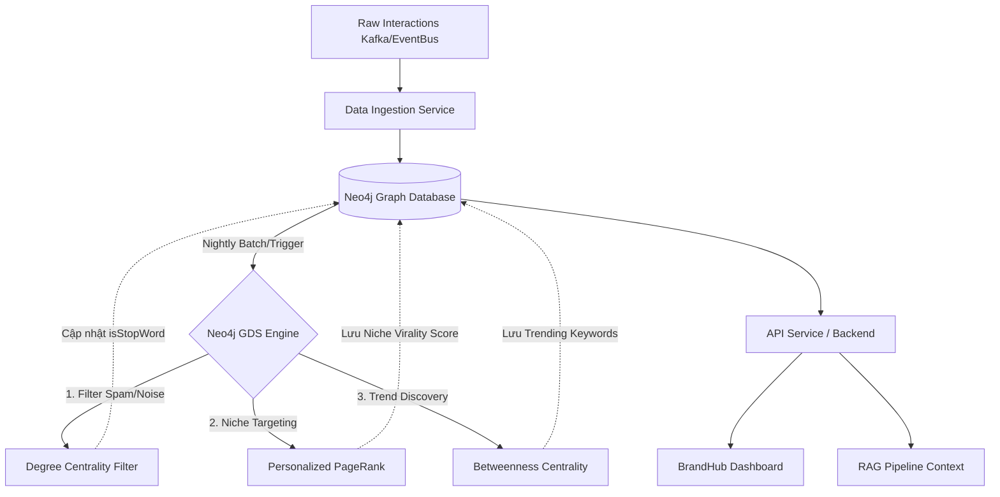

# DA-569: Graph Virality Score Design

## 1. Neo4j Schema Design

Để phân tích tương tác và tính toán độ lan truyền (virality), chúng ta cần một lược đồ đồ thị (schema) biểu diễn rõ các thực thể và hành vi tương tác trên mạng xã hội.

### Nodes (Thực thể)
- **`User`**: Người dùng trên nền tảng mạng xã hội.
  - Properties: `userId`, `username`, `followerCount`, `accountAge`
- **`Post`**: Bài viết, video hoặc nội dung được chia sẻ.
  - Properties: `postId`, `content`, `publishedAt`, `platform`
- **`Keyword` / `Hashtag`**: Từ khóa hoặc hashtag được nhắc đến.
  - Properties: `name`, `isStopWord`
- **`Brand`**: Thương hiệu liên quan.
  - Properties: `brandId`, `name`
- **`Category` / `Niche`**: Ngành hàng hoặc ngách nội dung (ví dụ: Ẩm thực, Công nghệ, Thời trang...).
  - Properties: `categoryId`, `name`

### Relationships (Mối quan hệ)
Mối quan hệ đóng vai trò quan trọng trong việc truyền trọng số (weight) khi chạy thuật toán.
- **Tương tác với Content**:
  - `(User)-[:POSTED {createdAt}]->(Post)`
  - `(User)-[:LIKED {timestamp, weight: 1.0}]->(Post)`
  - `(User)-[:COMMENTED {timestamp, weight: 2.0}]->(Post)`
  - `(User)-[:SHARED {timestamp, weight: 3.0}]->(Post)`
- **Tương tác User-User**:
  - `(User)-[:FOLLOWS {timestamp}]->(User)` (Mạng lưới follow)
  - `(User)-[:MENTIONS_USER]->(User)`
- **Phân tích Nội dung & Ngách**:
  - `(Post)-[:HAS_TAG]->(Hashtag)`
  - `(Post)-[:MENTIONS_BRAND]->(Brand)`
  - `(Post)-[:BELONGS_TO]->(Category)`
  - `(User)-[:INTERESTED_IN {weight}]->(Category)` (Hành vi quan tâm ngách)

---

## 2. Áp dụng Centrality Algorithms để tính Virality Score

Sử dụng thư viện Graph Data Science (GDS) của Neo4j để chạy các thuật toán.

### A. Personalized PageRank Algorithm (Tính Virality Score theo Tệp Khách Hàng)
**Mục tiêu:** Đo lường sức mạnh lan truyền của một bài Post. Tuy nhiên, nếu chỉ đếm lượt share/like chung chung thì sẽ bị sai lệch. Một bài viết có thể Viral toàn mạng nhưng lại "rác" đối với một tệp khách hàng cụ thể. Do đó, chúng ta dùng **Personalized PageRank (PPR)** thay vì PageRank thông thường.

**Cách triển khai:**
1. Tạo một đồ thị chiếu (Projected Graph) bao gồm Node `User`, `Post`, `Category` và các Relationship tương tác.
2. Thay vì tính PageRank phân bổ đều, ta đặt **Source Nodes** là node `Category` (ví dụ: Ngành Công nghệ) hoặc tập hợp các `User` thuộc tệp khách hàng mục tiêu.
3. Chạy thuật toán Personalized PageRank từ các Source Nodes này. Luồng "sức ảnh hưởng" sẽ chỉ chảy mạnh trong mạng lưới của những người quan tâm đến "Công nghệ".
4. **Kết quả:** Điểm số nhận được tại node `Post` chính là `Niche Virality Score` (Độ Viral chuẩn xác định vị cho tệp khách hàng đó). Tránh được tình trạng ảo tương tác từ các tệp user không liên quan.

```cypher
// Ví dụ tính toán PageRank trong Neo4j GDS
CALL gds.pageRank.write('interactionGraph', {
  maxIterations: 20,
  dampingFactor: 0.85,
  relationshipWeightProperty: 'weight',
  writeProperty: 'viralityScore'
})
YIELD nodePropertiesWritten, ranIterations;
```

### B. Betweenness Centrality (Xác định Tác nhân Gắn kết & Keyword Trending)
**Mục tiêu:** Tìm ra các `Keyword` đóng vai trò là "cầu nối" (bridge) giữa các cộng đồng khác nhau để phát hiện Trend. 

**Xử lý Từ Nhiễu (Stop words / Spam keywords):**
Các từ quá phổ biến (như "và", "là", "thì", "giveaway", "minigame") sẽ vô tình có Betweenness rất cao vì ai cũng dùng. Để xử lý:
1. **Tiền xử lý (BM25/TF-IDF Filter):** Chỉ đưa vào Neo4j những keyword đã vượt qua màng lọc BM25 Anomaly Detection (từ task DA-568) thay vì nạp toàn bộ.
2. **Ngưỡng Max-Degree:** Trong đồ thị, nếu một Keyword có In-Degree vượt quá một ngưỡng khổng lồ (vượt mức bình thường), thuật toán sẽ tự động gán cờ `isStopWord=true` và loại bỏ nó khỏi đồ thị chiếu khi tính Betweenness.

**Cách triển khai:**
1. Chiếu đồ thị cho `User` và `Keyword` (đã lọc các node có cờ `isStopWord=true`).
2. Chạy thuật toán Betweenness Centrality.
3. **Kết quả:** Những Keyword còn lại có Betweenness Score cao thực sự là Trending Keywords đang bùng nổ xuyên các tệp khách hàng.

### C. Degree Centrality (Chỉ số cơ bản - Base Engagement)
**Mục tiêu:** Đo lường số lượng tương tác "thô" (Raw Counts) để làm mốc so sánh (Baseline).
- **In-Degree của một Post:** Đơn giản chính là tổng số lượng Like + Share + Comment chĩa vào Post đó.
- **Tại sao cần Degree Centrality?** Nhìn vào lượng Share/Like (Degree) đôi khi không phản ánh độ Viral thực sự. Ví dụ:
  - Một Post có **Degree thấp (ít like/share)** nhưng **PPR Score cao**: Bài viết chưa bùng nổ đại trà nhưng được những người cực kỳ uy tín (KOLs) trong tệp khách hàng chia sẻ -> Tiềm năng Viral ngầm rất lớn.
  - Một Post có **Degree cao (rất nhiều like)** nhưng **PPR Score thấp**: Bài viết có thể đang dùng tool buff like/share hoặc tương tác rác, không có giá trị lan truyền trong tệp khách hàng mục tiêu -> Đánh dấu là Spam.

---

## 3. Kiến trúc tích hợp (Data Flow)



**Giải thích chi tiết luồng chạy (Data Flow) và tác dụng của từng ô:**

**Giai đoạn 1: Thu thập & Nạp dữ liệu (Ingestion)**
- **[A] Raw Interactions Kafka/EventBus**: Mọi lượt Like, Share, Comment, Follow từ người dùng sẽ được bắn vào Kafka dưới dạng các event luồng dữ liệu thời gian thực.
- **[B] Data Ingestion Service**: Service đóng vai trò "Consumer", đọc dữ liệu từ Kafka, chuẩn hóa và ghi (insert/update) trực tiếp vào đồ thị Neo4j.
- **[C] Neo4j Graph Database**: Cơ sở dữ liệu đồ thị trung tâm, nơi lưu trữ schema (User, Post, Keyword, Category) và các mũi tên quan hệ tương tác.

**Giai đoạn 2: Xử lý thuật toán (Batch Processing)**
- **[D] Neo4j GDS Engine**: Module Graph Data Science của Neo4j. Định kỳ hàng đêm hoặc mỗi vài giờ, hệ thống sẽ kích hoạt Engine này để tính toán lại điểm số cho toàn bộ dữ liệu mới. Quá trình tính toán đi qua 3 bước:
  - **[E] 1. Filter Spam/Noise (Degree Centrality Filter)**: Tính tổng Like/Share thô (In-Degree). Nếu phát hiện một tài khoản ảo buff like quá nhanh, hoặc một từ khóa "rác" xuất hiện quá nhiều, hệ thống đánh dấu nó là spam (`isStopWord=true`) để loại bỏ khỏi các bước sau.
  - **[F] 2. Niche Targeting (Personalized PageRank)**: Sau khi lọc rác, hệ thống bắt đầu chạy PageRank có định hướng. Nó sẽ xuất phát từ các ngách (Category) để chấm điểm `Virality Score` cho các bài Post dựa trên mức độ lan truyền trong đúng tệp khách hàng đó.
  - **[G] 3. Trend Discovery (Betweenness Centrality)**: Chạy thuật toán để tìm ra những Keyword đóng vai trò làm cầu nối giữa nhiều nhóm User khác nhau -> Xác định Trend đang lên.
- **Kết quả trả về**: Các điểm số (Virality Score) và cờ đánh dấu (isStopWord, Trending) từ bước E, F, G sẽ được Ghi đè (Write-back) ngược lại vào các Node trong **[C] Neo4j Graph Database**.

**Giai đoạn 3: Khai thác dữ liệu (Serving)**
- **[H] API Service / Backend**: Backend đọc kết quả đã tính toán sẵn từ Neo4j để cung cấp ra ngoài.
- **[I] BrandHub Dashboard**: Hiển thị bảng xếp hạng (Leaderboard) các bài Post viral nhất, các Keyword đang trending nhất theo từng ngách cho Client xem.
- **[J] RAG Pipeline Context**: Kết quả tính toán này cũng được bơm thẳng vào RAG Pipeline (chuẩn bị cho task DA-570) để làm giàu ngữ cảnh (Context) trước khi đưa vào AI phân tích nội dung sâu hơn.
