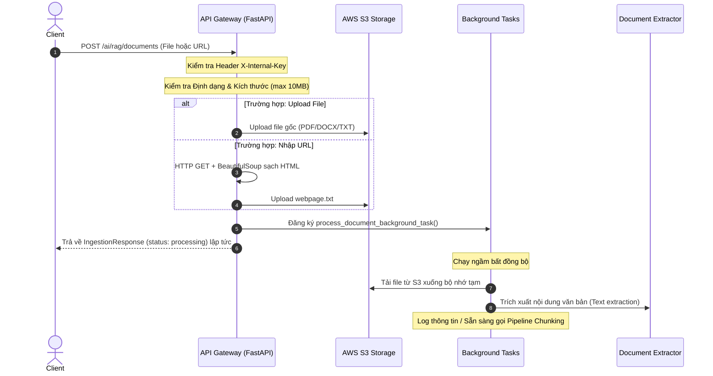

# Báo cáo hoàn thành Task: Brand Knowledge Ingestion Entry Point

- **Assignee**: Lộc (Sub-lead)
- **Trạng thái**: Hoàn thành & Kiểm thử thành công 100%
- **Mục tiêu**: Cung cấp entry point (endpoint đầu vào) cho việc ingest tài liệu kiến thức thương hiệu, cho phép khách hàng tải tài liệu (hoặc nhập URL) để lưu trữ lên S3 và sẵn sàng cho pipeline RAG lập chỉ mục (index).

---

## 1. Kết quả đáp ứng Tiêu chí nghiệm thu (Acceptance Criteria)

| Tiêu chí nghiệm thu (Acceptance Criteria) | Trạng thái | Chi tiết triển khai |
| :--- | :---: | :--- |
| **POST /ai/rag/documents** chấp nhận upload multipart file (PDF, DOCX, TXT) và tham số URL tùy chọn. | **ĐÃ HOÀN THÀNH** | Tạo endpoint `/api/v1/ai/rag/documents` chấp nhận đồng thời file upload và form-field `url`. Cả hai tham số đều là tùy chọn nhưng bắt buộc phải cung cấp ít nhất 1 trong 2. |
| File được tải lên S3 tại key `rag/{clientId}/{documentId}/{filename}` và trả về bản ghi tài liệu gồm `{documentId, s3Key, status: "processing"}`. | **ĐÃ HOÀN THÀNH** | Sử dụng helper S3 để tải tệp lên bucket với cấu trúc key chuẩn hóa. Trả về đúng Pydantic model `IngestionResponse` chứa UUID định danh tài liệu và trạng thái `processing`. |
| Tham số URL sẽ tải nội dung trang web (qua `requests` + `BeautifulSoup`), lọc sạch HTML thô và lưu dưới dạng `.txt` lên S3 trước khi tiếp tục. | **ĐÃ HOÀN THÀNH** | Tải trang tĩnh qua `requests`, dùng BeautifulSoup bóc tách text trơn (loại bỏ các thẻ `<script>`, `<style>`), chuyển đổi thành bytes UTF-8 và tải lên S3 tại key `rag/{clientId}/{documentId}/webpage.txt`. |
| Giới hạn kích thước file tải lên (tối đa 10MB); các định dạng file không hỗ trợ trả về mã HTTP 400 Bad Request. | **ĐÃ HOÀN THÀNH** | Validate kích thước file/nội dung URL tối đa 10MB. Kiểm tra đuôi file (chỉ cho phép `.pdf`, `.docx`, `.txt`), trả về lỗi 400 Bad Request nếu không hợp lệ. |

---

## 2. Chi tiết triển khai kỹ thuật (Technical Implementation)

### Các file được tạo mới và chỉnh sửa trong `brandhub-ai-service`:
1. **[`requirements.txt`](file:///d:/FPT/FA26/SEP490/brandhub-ai-service/requirements.txt)** *(Chỉnh sửa)*: Thêm thư viện `pdfplumber==0.11.4` phục vụ đọc PDF.
2. **[`app/models/response.py`](file:///d:/FPT/FA26/SEP490/brandhub-ai-service/app/models/response.py)** *(Tạo mới)*: Định nghĩa Pydantic response model `IngestionResponse` để đồng bộ JSON trả về.
3. **[`app/core/s3.py`](file:///d:/FPT/FA26/SEP490/brandhub-ai-service/app/core/s3.py)** *(Tạo mới)*: Cầu nối re-export các helper từ `app/utils/s3.py`.
4. **[`app/utils/extractor.py`](file:///d:/FPT/FA26/SEP490/brandhub-ai-service/app/utils/extractor.py)** *(Tạo mới)*: Module trích xuất văn bản:
   - Sử dụng `pdfplumber` để trích xuất văn bản từ PDF.
   - Sử dụng `python-docx` để trích xuất văn bản từ DOCX.
   - Hỗ trợ giải mã UTF-8/latin-1 đối với file văn bản thuần TXT.
5. **[`app/api/v1/documents.py`](file:///d:/FPT/FA26/SEP490/brandhub-ai-service/app/api/v1/documents.py)** *(Tạo mới)*: API Endpoint chính và background task `process_document_background_task`.
6. **[`app/api/v1/router.py`](file:///d:/FPT/FA26/SEP490/brandhub-ai-service/app/api/v1/router.py)** *(Chỉnh sửa)*: Đăng ký router tài liệu vào hệ thống định tuyến `/api/v1/ai/rag/documents`.

### Biểu đồ luồng xử lý (Processing Flow)



---

## 3. Báo cáo kiểm thử & xác thực (Testing & Verification)

### Kết quả kiểm thử tự động (`pytest`)
Đã triển khai bộ test tích hợp toàn diện tại [`tests/test_documents.py`](file:///d:/FPT/FA26/SEP490/brandhub-ai-service/tests/test_documents.py). Kết quả chạy test thành công **100%**:

```bash
collected 21 items

tests\test_documents.py ..........                                       [ 47%]
tests\test_s3.py ...........                                             [100%]

======================= 21 passed, 1 warning in 10.74s ========================
```

### Các kịch bản kiểm thử đã bao phủ:
1. **Bảo mật**: Xác thực lỗi `401 Unauthorized` khi thiếu header `X-Internal-Key`.
2. **Tham số rỗng**: Bắt lỗi `400 Bad Request` khi gửi request không kèm cả file và URL.
3. **Định dạng file không hỗ trợ**: Bắt lỗi `400 Bad Request` khi gửi file không đúng đuôi hỗ trợ (như `.png`).
4. **Vượt quá dung lượng**: Bắt lỗi `400 Bad Request` khi file gửi lớn hơn 10MB.
5. **Upload file TXT thành công**: Validate upload lên S3 và kiểm tra dữ liệu khớp với file gốc.
6. **Upload file PDF thành công**: Mock xử lý PDF và kiểm tra luồng chạy ngầm.
7. **Upload file DOCX thành công**: Mock xử lý DOCX và kiểm tra luồng chạy ngầm.
8. **Ingest URL thành công**: Kiểm tra cào web, loại bỏ thẻ `<script>`, `<style>` và lưu văn bản thô lên S3.
9. **URL fetch lỗi**: Xử lý lỗi ngoại lệ khi URL không tồn tại hoặc lỗi kết nối mạng (trả về lỗi HTTP 400).
10. **Background Task**: Đảm bảo luồng tải file từ S3 về để trích xuất text chạy trơn tru, không gặp lỗi.

---

## 4. Hướng dẫn Tích hợp & Vận hành

### 1. Cấu hình Biến môi trường
Cần bổ sung các biến sau vào file `.env` của dịch vụ `brandhub-ai-service` khi deploy:
```env
# Cấu hình kết nối AWS S3
AWS_ACCESS_KEY_ID=your_aws_access_key
AWS_SECRET_ACCESS_KEY=your_aws_secret_key
S3_BUCKET_NAME=brandhub-media
AWS_REGION=ap-southeast-1

# Khóa bảo mật nội bộ microservices
INTERNAL_SERVICE_KEY=your_internal_key_shared_across_services
```

### 2. Tích hợp với Pipeline Chunking (DA-AI03-02) và NER (DA-AI03-07)
Do các cấu phần chunking và NER được phát triển song song bởi các thành viên khác, tác vụ chạy ngầm `process_document_background_task` hiện đang dừng lại ở bước trích xuất nội dung văn bản. 

Để kết nối luồng sau khi các service trên hoàn thành, chỉ cần gọi hàm chunking tại vị trí comment `# TODO` trong file [`app/api/v1/documents.py`](file:///d:/FPT/FA26/SEP490/brandhub-ai-service/app/api/v1/documents.py):
```python
# app/api/v1/documents.py
# 1. Import service chunking
from app.services.chunking import chunk_and_embed_document 

# 2. Gọi service trong process_document_background_task sau khi trích xuất text
async def process_document_background_task(s3_key: str, client_id: str, document_id: str):
    ...
    # Trích xuất text thành công (extracted_text)
    # Gọi pipeline chunking:
    await chunk_and_embed_document(
        document_id=document_id,
        client_id=client_id,
        text=extracted_text
    )
```
