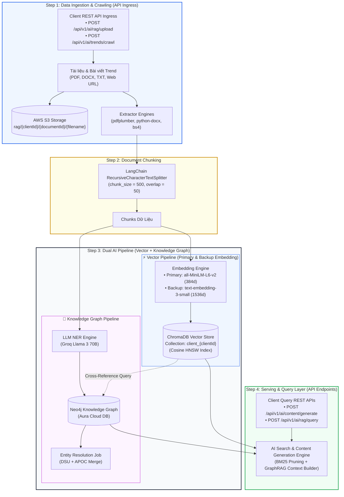
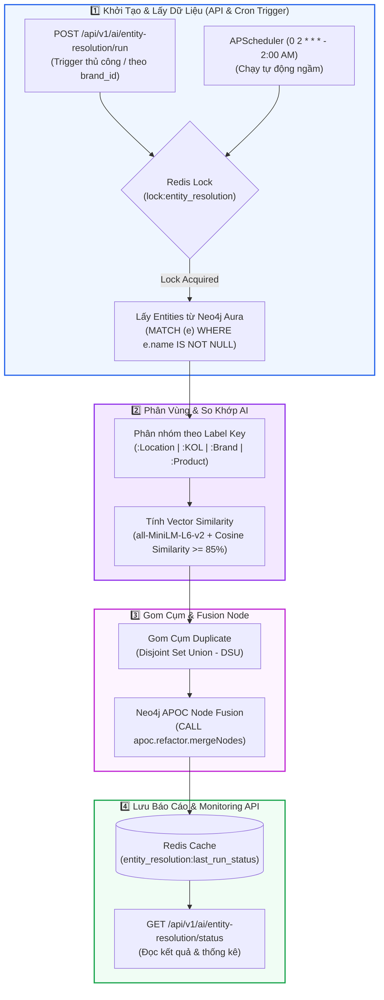

# 🏗️ Brand Knowledge Base RAG Pipeline Architecture & Design Specifications

## 📋 Document Information
- **Title**: Brand Knowledge Base RAG Pipeline Architecture & Specifications
- **System**: BrandHub AI Infrastructure & Services (`brandhub-ai-service`)
- **File Location**: `brandhub-infrastructure/docs/architecture/brand_rag_pipeline_design.md`
- **Target Audience**: AI/ML Engineers, Backend Developers, DevOps, System Architects
- **Status**: Approved Architecture & Implementation Standard
- **Associated Ticket**: `DA-AI03-08` (Blocked by `DA-AI03-04`)

---

## 1. 🌐 System Architecture & Dual Hybrid RAG Pipeline

The Brand Knowledge Base RAG Pipeline employs a **Dual Hybrid RAG Architecture** combining dense vector retrieval (**ChromaDB**) with structured knowledge graph traversal (**Neo4j**). This ensures both semantic search recall and high-precision brand entity relationship queries.

### 1.1 High-Level Architecture Flowchart



---

### 1.2 Entity Resolution & Graph Node Fusion Workflow

To prevent duplicate entities in the Neo4j Knowledge Graph across uploaded brand documents, a background Entity Resolution job runs periodically.



---

## 2. ✂️ Chunking Parameters & Text Extraction Specs

### 2.1 Chunking Configuration Matrix
The chunking process converts extracted document text into contiguous text segments formatted for dense embedding.

| Parameter | Value | Technical Justification |
| :--- | :--- | :--- |
| **Engine** | LangChain `RecursiveCharacterTextSplitter` | Hierarchical recursive splitting preserving paragraph and sentence integrity. |
| **Chunk Size** | `500` characters | Aligns with the optimal context window for `all-MiniLM-L6-v2` (max sequence 256 tokens \(\approx 500\) chars). |
| **Chunk Overlap** | `50` characters | Provides a 10% context bridge across adjacent chunks to prevent entity truncation. |
| **Separators** | `["\n\n", "\n", ".", ",", " ", ""]` | Priority order avoids splitting inside Vietnamese/English sentences or words. |
| **Max Upload Limit** | `10 MB` (API spec up to `20 MB`) | Protects memory during PDF/DOCX stream extraction. |

### 2.2 File Extractors & Preprocessing Pipeline
- **PDF Documents**: Parsed using `pdfplumber` (primary for rich layout/text) with `pypdf` fallback.
- **DOCX Documents**: Processed via `python-docx` extracting headers, paragraphs, and list items.
- **TXT / Markdown Files**: Read directly via UTF-8 text decoder.
- **Web URLs**: Downloaded via `requests` and sanitized using `BeautifulSoup4` (stripping `<script>`, `<style>`, and navigation noise).

---

## 3. 🗄️ AWS S3 Path Structure & Document Storage

### 3.1 Standardized S3 URI Pattern
All ingested documents are uploaded to AWS S3 prior to chunking and vector store indexing:

```text
s3://<bucket-name>/rag/{clientId}/{documentId}/{filename}
```

### 3.2 Path Component Definitions
- `<bucket-name>`: Configured environment variable `S3_BUCKET_NAME` (e.g., `brandhub-media-bucket`).
- `clientId`: Unique client UUID (e.g., `client_9f3a6f7b-2d4a-49a8-93cc-2b8e7a8c0d11`).
- `documentId`: MongoDB `knowledge_documents` primary object ID (e.g., `doc_550e8400-e29b-41d4-a716-446655440000`).
- `filename`: Sanitized original uploaded filename (e.g., `brand_identity_guide_2026.pdf`).

### 3.3 Example S3 Key
```text
rag/client_9f3a6f7b-2d4a-49a8-93cc-2b8e7a8c0d11/doc_550e8400-e29b-41d4-a716-446655440000/brand_identity_guide_2026.pdf
```

### 3.4 S3 Utility Functions (`app/utils/s3.py`)
```python
def upload_file(file_obj, s3_key: str, content_type: str = None) -> str:
    """Uploads document stream to S3 under specified multi-tenant key."""
    s3_client = get_s3_client()
    extra_args = {"ContentType": content_type} if content_type else {}
    s3_client.upload_fileobj(file_obj, settings.S3_BUCKET_NAME, s3_key, ExtraArgs=extra_args)
    return f"s3://{settings.S3_BUCKET_NAME}/{s3_key}"

def get_presigned_url(s3_key: str, expires_in: int = 3600) -> str:
    """Generates temporary access URL for document preview."""
    s3_client = get_s3_client()
    return s3_client.generate_presigned_url(
        "get_object",
        Params={"Bucket": settings.S3_BUCKET_NAME, "Key": s3_key},
        ExpiresIn=expires_in,
    )
```

---

## 4. 🔒 Multi-Tenant Security Tags & ChromaDB Filter Patterns

### 4.1 Security Isolation Architecture
Multi-tenancy isolation in BrandHub is enforced at two distinct security layers:
1. **Physical/Logical Collection Isolation**: Each client has an isolated ChromaDB collection named `client_{clientId}`.
2. **Metadata Filter Enforcer**: Every ChromaDB query strictly injects metadata filtering `where={"clientId": {"$eq": client_id}}`.

> [!IMPORTANT]
> Under no circumstances can a query search across multiple client collections or execute without an explicit `clientId` filter parameter.

### 4.2 Standardized Metadata Schema
Every document chunk stored in ChromaDB must include the following metadata dictionary:

```json
{
  "documentId": "doc_550e8400-e29b-41d4-a716-446655440000",
  "clientId": "client_9f3a6f7b-2d4a-49a8-93cc-2b8e7a8c0d11",
  "chunkIndex": 0,
  "source": "brand_identity_guide_2026.pdf",
  "uploadedAt": "2026-08-17T17:44:00Z"
}
```

- **Deterministic Chunk Vector ID**: `{documentId}:{chunkIndex}` (e.g., `doc_550e8400-e29b-41d4-a716-446655440000:0`).

---

### 4.3 ChromaDB Python Query & Deletion Patterns

#### Pattern A: Multi-tenant Semantic Retrieval (Client-Scoped)
```python
def query_client_knowledge_base(
    client_id: str,
    query_text: str,
    top_k: int = 5
) -> dict:
    collection_name = f"client_{client_id}"
    collection = chromadb_client.get_or_create_collection(
        name=collection_name,
        metadata={"hnsw:space": "cosine"}
    )
    
    # Strictly enforced tenant filter
    results = collection.query(
        query_texts=[query_text],
        n_results=top_k,
        where={"clientId": {"$eq": client_id}}
    )
    return results
```

#### Pattern B: Document-Scoped Semantic Retrieval
```python
def query_specific_document(
    client_id: str,
    document_id: str,
    query_text: str,
    top_k: int = 5
) -> dict:
    collection = chromadb_client.get_collection(name=f"client_{client_id}")
    
    results = collection.query(
        query_texts=[query_text],
        n_results=top_k,
        where={
            "$and": [
                {"clientId": {"$eq": client_id}},
                {"documentId": {"$eq": document_id}}
            ]
        }
    )
    return results
```

#### Pattern C: Cascade Document Deletion
```python
def delete_document_chunks(client_id: str, document_id: str) -> int:
    """Cascade deletes all vector chunks belonging to a deleted document."""
    collection = chromadb_client.get_collection(name=f"client_{client_id}")
    
    # Retrieve all chunk IDs matching documentId
    matching = collection.get(where={"documentId": {"$eq": document_id}})
    if matching and matching["ids"]:
        collection.delete(ids=matching["ids"])
        return len(matching["ids"])
    return 0
```

---

## 5. ⚡ Embedding Engine & Model Failover Strategy

### 5.1 Embedding Model Alignment
- **PRIMARY MODEL**: `all-MiniLM-L6-v2`
  - **Dimensions**: 384-dimensional dense vectors
  - **Execution**: Local CPU/GPU execution via HuggingFace `SentenceTransformers` (`sentence-transformers/all-MiniLM-L6-v2`)
  - **Distance Metric**: Cosine Distance (\(1 - \text{CosineSimilarity}\))
  - **Latency**: \(\le 15\text{ms}\) per chunk
- **BACKUP MODEL**: `text-embedding-3-small`
  - **Dimensions**: 1536-dimensional dense vectors
  - **Execution**: External API call to OpenAI Embeddings API
  - **Usage**: Used as fallback in case of local GPU OOM or model initialization failures.

### 5.2 Cosine Similarity Mathematical Formula
Cosine similarity between query vector \(\mathbf{q}\) and chunk vector \(\mathbf{d}\):

\[
\text{CosineSimilarity}(\mathbf{q}, \mathbf{d}) = \frac{\mathbf{q} \cdot \mathbf{d}}{\|\mathbf{q}\| \|\mathbf{d}\|} = \frac{\sum_{i=1}^{n} q_i d_i}{\sqrt{\sum_{i=1}^{n} q_i^2} \sqrt{\sum_{i=1}^{n} d_i^2}}
\]

### 5.3 Model Failover Circuit Breaker Logic
```python
def generate_embeddings(texts: list[str]) -> list[list[float]]:
    try:
        # Primary: Local all-MiniLM-L6-v2 execution
        return primary_sentence_transformer.encode(texts).tolist()
    except Exception as e:
        logger.warning(f"Primary embedding failed ({e}). Triggering backup text-embedding-3-small.")
        # Backup: OpenAI Embeddings API fallback
        return openai_client.embeddings.create(
            input=texts,
            model="text-embedding-3-small"
        ).data[0].embedding
```

---

## 6. 📊 Evaluation Methodology & Quality Gates

### 6.1 Anti-Hallucination Evaluator (`app/services/hallucination_evaluator.py`)
To guarantee brand compliance and accuracy, generated context and response text are benchmarked using a dual-mode evaluator:

1. **`llm-judge` Mode (Claude 3.5 Sonnet / Llama 3 70B, `temperature=0.0`)**:
   - Deconstructs output text into atomic statements.
   - Cross-references each statement against `[BRAND CONTEXT]`.
   - Returns verified claims, unsupported claims, and exact reasoning.
2. **`regex` Rule-Based Pre-filter**:
   - Extracts numbers, years, pricing amounts (\$, VND), and capitalized brand entities.
   - Verifies whether exact entities exist in reference context.

### 6.2 Hallucination Metric Formula
\[
\text{Hallucination Rate} = \frac{\text{Unsupported Claims}}{\text{Total Claims Extracted}} \times 100\%
\]

### 6.3 RAG Accuracy Quality Gate (Target: Ticket `DA-AI03-07`)
- **Benchmark Suite**: 3 real brand documents (PDF menu, Brand Guidelines, PR Brief), 15 test queries.
- **Pass Criteria**:
  - **Semantic Retrieval Precision**: \(\ge 0.85\) Cosine Similarity.
  - **Hallucination Rate**: \(0.0\%\) (Passed 100%).

---

## 7. 🔗 Task Traceability & Dependency Matrix

| Ticket ID | Description | Status & Relationship to this Document |
| :--- | :--- | :--- |
| `DA-AI03-01` | Document Upload REST Endpoint (`/api/v1/ai/rag/upload`) | Ingestion Entry Point (S3 Storage) |
| `DA-AI03-02` | Document Chunking Service | Documented (Section 2: Chunk Specs) |
| `DA-AI03-03` | Embedding Pipeline & ChromaDB Storage | Documented (Section 5: Primary `all-MiniLM-L6-v2`) |
| `DA-AI03-03.1`| Neo4j Connection Pool Singleton | Documented (Section 1: Graph DB Pool) |
| `DA-AI03-03.2`| LLM NER Extraction & Cypher Ingestion | Documented (Section 1: Knowledge Graph Pipeline) |
| `DA-AI03-03.3`| Query Normalization | Pre-processing step for retrieval queries |
| `DA-AI03-04` | ChromaDB Semantic Search | **Blocking Dependency** (Documented Section 4 Filter Patterns) |
| `DA-AI03-04.1`| Neo4j Graph Traversal Service | Graph search extension layer |
| `DA-AI03-04.2`| BM25 Scoring & Context Pruning | Context Optimization layer |
| `DA-AI03-05` | GraphRAG Context Builder | Context Assembly layer |
| `DA-AI03-06` | Document Deletion Endpoint | Documented (Section 4: Pattern C Deletion) |
| `DA-AI03-07` | RAG Accuracy Quality Gate | Documented (Section 6: Quality Gates) |
| `DA-AI03-08` | Brand Knowledge Base RAG Pipeline Design Doc | **THIS DOCUMENT** |
| `DA-AI03-09` | Entity Resolution Cronjob | Documented (Section 1.2: DSU + APOC Flow) |

---
*Document maintained by BrandHub AI Engineering Team.*
