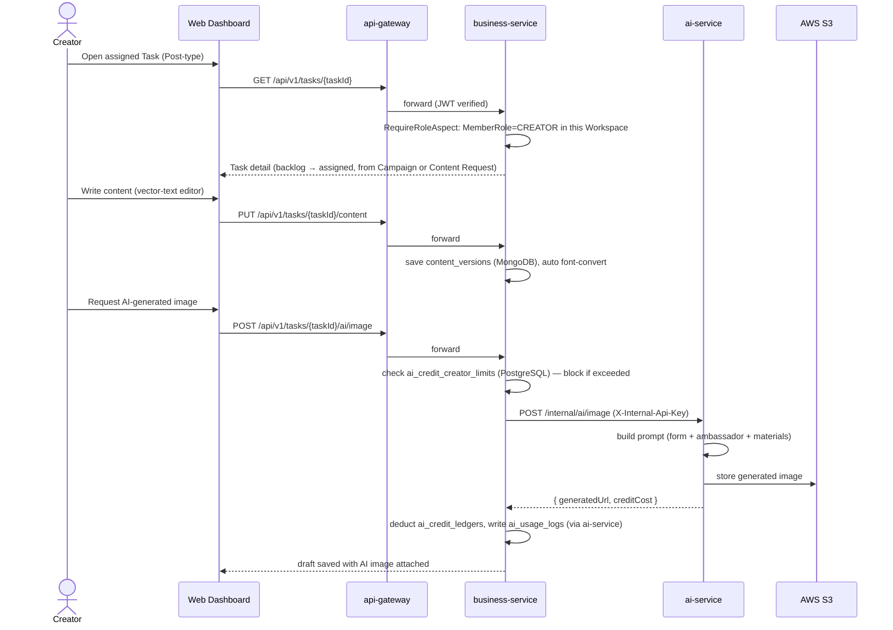
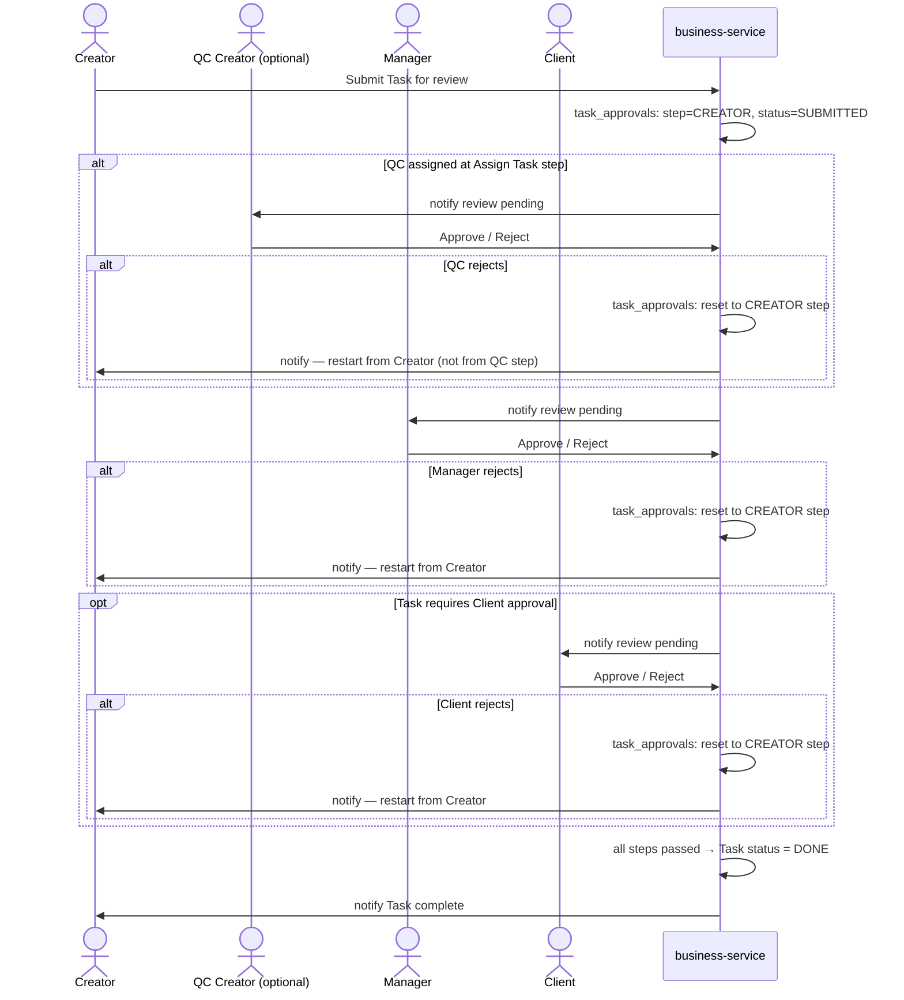
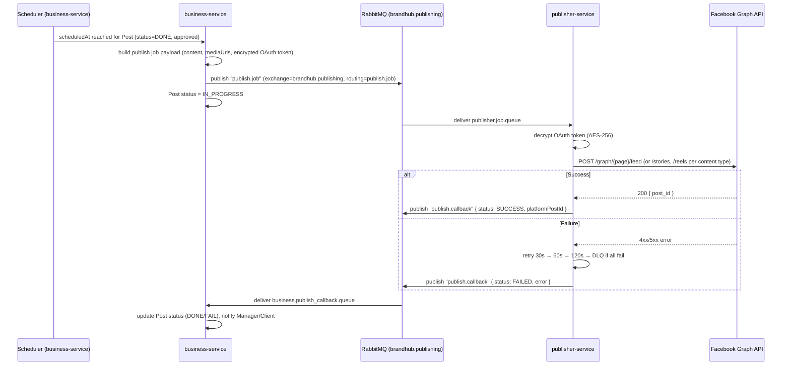
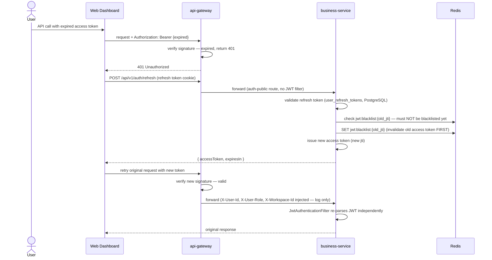

# Sequence Diagrams — 4 Core Flows (V2)

> DA-1157 (DA-E05-06). Mermaid, text-based, committable. Cập nhật theo model V2: Agency→Workspace, Task 3 loại nội dung (Post/Livestream/Survey), Approval Sequence 4 bước (Creator → [QC] → Manager → Client, reject → restart from Creator).

## 1. Content Creation (Task → Write Content → AI Generate)

## 2. Approval Workflow (4-step Task Approval Sequence)

## 3. Auto-Publishing (scheduled Post → Social Platform)

## 4. OAuth Token Refresh

## Ghi chú kỹ thuật

- **Content creation & AI generate:** credit check xảy ra ở business-service TRƯỚC khi gọi ai-service — tránh gọi AI tốn tiền rồi mới phát hiện vượt hạn mức.
- **Approval Sequence:** reject ở BẤT KỲ bước nào (QC/Manager/Client) đều quay về bước Creator đầu tiên, không quay lại bước ngay trước đó — đã confirm trong `docs/ba/05-content-task-workflow.md` §4.
- **Auto-publishing:** publisher-service không bao giờ có DB access — toàn bộ payload đóng gói sẵn trong RabbitMQ message bởi business-service.
- **OAuth refresh:** old `jti` phải bị blacklist TRƯỚC khi issue token mới (không phải sau) — tránh race condition dùng cả 2 token cùng lúc.
