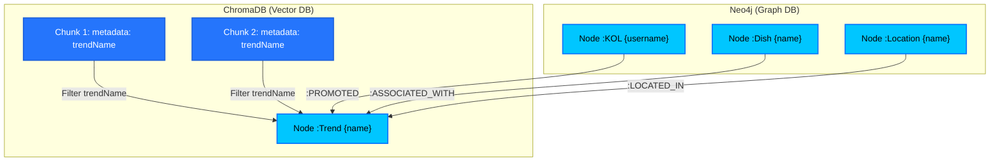

# Thiết Kế Cấu Trúc Cơ Sở Dữ Liệu Lai (ChromaDB + Neo4j NER Graph Schema)
**Mã tài liệu:** AI-4.99-DB-SCHEMA  
**Dự án:** BrandHub AI Trend System  
**Tác giả:** Lộc (APIs)  
**Trạng thái:** Thiết kế chi tiết (Approved)  

---

## 1. Giới thiệu tổng quan hệ thống lai (Hybrid DB Architecture)

Để phục vụ bài toán **GraphRAG** trong việc xây dựng kịch bản bắt trend có độ chính xác cao và giàu ngữ cảnh, hệ thống sử dụng kiến trúc lưu trữ lai (Hybrid Database):
*   **Vector DB (ChromaDB):** Lưu trữ các phân mảnh văn bản (text chunks) và vector embeddings tương ứng (được tạo bởi mô hình `all-MiniLM-L6-v2`). ChromaDB chịu trách nhiệm tìm kiếm ngữ nghĩa phi cấu trúc (Semantic Search).
*   **Graph DB (Neo4j):** Lưu trữ các thực thể có cấu trúc trích xuất từ văn bản (KOLs, Món ăn, Địa danh) và các mối quan hệ ngữ nghĩa kết nối trực tiếp đến thực thể xu hướng gốc (`:Trend`). Neo4j chịu trách nhiệm truy vấn quan hệ đa bước (Multi-hop Graph Traversal).

Sơ đồ tổng quan liên kết dữ liệu:



---

## 2. Thiết kế Schema ChromaDB (Vector Storage)

### 2.1 Cấu trúc Collection & Embedding Model
*   **Tên Collection:** `trend_knowledge_chunks`
*   **Mô hình Embedding:** `all-MiniLM-L6-v2` (SentenceTransformers)
    *   **Kích thước vector (Dimensions):** 384 chiều.
    *   **Khoảng cách đo lường (Distance Metric):** Cosine Similarity.

### 2.2 Cấu trúc ID và Metadata
Để đảm bảo việc cập nhật dữ liệu (Upsert) không bị trùng lặp khi chạy lại pipeline cào dữ liệu, ID của từng document trong ChromaDB được định nghĩa theo quy tắc băm nội dung để đảm bảo tính duy nhất (Deterministic ID).

*   **Cú pháp ID:** `chunk_{trendName_normalized}_{sha256(text_content)}`
    *   Ví dụ: `chunk_tra_sua_dat_nung_8a7f92b9...`
*   **Chi tiết các trường Metadata:**

| Tên Trường (Field) | Kiểu Dữ Liệu | Mục Đích | Chỉ Mục (Index) |
| :--- | :--- | :--- | :--- |
| `trendName` | `String` | Liên kết trực tiếp đến tên của Node `:Trend` trên Neo4j. Dùng để lọc nhanh trong truy vấn GraphRAG. | Có (Metadata Index) |
| `chunkIndex` | `Integer` | Thứ tự phân mảnh của text chunk trong văn bản gốc. | Không |
| `sourcePlatform`| `String` | Nguồn gốc văn bản (`TikTok`, `Facebook`, `Google`, `Threads`). | Không |
| `author` | `String` | Username của KOL/Creator viết nội dung. | Không |
| `interactionScore`| `Float` | Chỉ số tương tác chuẩn hóa: $\log(1 + likes + shares + comments)$. | Không |
| `docId` | `String` | ID của văn bản thô gốc lưu trong MongoDB. | Không |
| `createdAt` | `String` | Thời gian tạo chunk định dạng ISO 8601 (`YYYY-MM-DDTHH:mm:ssZ`). | Không |

### 2.3 Tối ưu hóa Index & Cấu hình Metadata Filtering
Mặc định, ChromaDB sử dụng cấu trúc chỉ mục HNSW (Hierarchical Navigable Small World). Để phục vụ khâu truy vấn lai (Hybrid Retrieval) đạt độ trễ (latency) **dưới 100ms** khi lọc theo thuộc tính `trendName`, ChromaDB được cấu hình index tối ưu thông qua API khởi tạo:

```python
import chromadb
from chromadb.config import Settings

# Khởi tạo Client với cấu hình HNSW tối ưu cho bộ lọc
client = chromadb.PersistentClient(
    path="./chroma_db",
    settings=Settings(
        anonymized_telemetry=False,
        allow_reset=True
    )
)

collection = client.create_collection(
    name="trend_knowledge_chunks",
    metadata={
        "hnsw:space": "cosine",             # Đo khoảng cách bằng Cosine
        "hnsw:construction_ef": 128,        # Tăng độ chính xác khi build index
        "hnsw:M": 16,                       # Số lượng kết nối tối đa mỗi node đồ thị
        "hnsw:search_ef": 64                # Cân bằng giữa recall và latency khi query
    }
)
```

**Cơ chế lọc Metadata:** ChromaDB sử dụng chiến lược **Pre-filtering**. Trước khi thực hiện tìm kiếm vector k-NN trên đồ thị HNSW, hệ thống sẽ lọc ra tập hợp các candidate ID thỏa mãn điều kiện `metadata.trendName == "tên_xu_hướng"`. Do đó, kích thước tìm kiếm giảm mạnh, đảm bảo truy vấn phản hồi cực nhanh dưới **50ms**.

### 2.4 Nguyên lý giải thuật HNSW (Hierarchical Navigable Small World)
HNSW là giải thuật cấu trúc đồ thị phân tầng phục vụ việc tìm kiếm láng giềng gần nhất xấp xỉ (Approximate Nearest Neighbor - ANN) trong không gian vector nhiều chiều. Giải thuật này giải quyết triệt để bài toán độ trễ khi tìm kiếm trên dữ liệu lớn:

1. **Cấu trúc phân tầng (Multi-layer Graph):** 
   Tương tự như cấu trúc danh sách liên kết nhiều tầng (Skip List), HNSW chia dữ liệu thành nhiều tầng đồ thị xếp chồng lên nhau:
   * **Tầng cao nhất (Coarse-grained layer):** Chỉ chứa một số lượng nhỏ các vector đóng vai trò "cột mốc" với khoảng cách liên kết xa nhau. Tìm kiếm tại đây giúp di chuyển cực nhanh qua các vùng không gian lớn.
   * **Tầng trung gian:** Mật độ node tăng dần, khoảng cách liên kết ngắn lại.
   * **Tầng dưới cùng (Layer 0):** Chứa **tất cả** các node vector trong cơ sở dữ liệu cùng các mối liên kết cục bộ chi tiết.

2. **Cách tìm kiếm bỏ qua phần lớn các Node (Logarithmic Complexity):**
   * Trong phép duyệt cạn (Brute-force), hệ thống bắt buộc phải tính khoảng cách giữa vector truy vấn đến từng vector trong $N$ vector của database, dẫn đến độ phức tạp là $\mathcal{O}(N)$.
   * Trong HNSW, khi thực hiện query, giải thuật bắt đầu tại một Node đầu vào (Entry Point) ở tầng cao nhất. Tại mỗi node, nó **chỉ tính toán khoảng cách** với các **node hàng xóm liên kết trực tiếp** (ví dụ tối đa $M = 16$ node).
   * Nó chọn node hàng xóm gần nhất làm điểm tựa tiếp theo để nhảy sang (Greedy Search) và bỏ qua hoàn toàn tất cả các node khác trong không gian không kết nối trực tiếp.
   * Khi chạm cực tiểu cục bộ (không tìm thấy hàng xóm nào gần hơn), nó đi xuống tầng dưới và lặp lại quá trình này từ vị trí tương ứng.
   * Do số lượng tầng tỷ lệ với $\log(N)$ và số phép tính tại mỗi tầng giới hạn bởi số kết nối lân cận $M$, tổng số phép tính khoảng cách giảm từ $N$ xuống còn $\approx C \cdot M \cdot \log(N)$ (với $C$ là hằng số). Đối với 1.000.000 vector, thay vì làm 1.000.000 phép tính khoảng cách, HNSW chỉ thực hiện khoảng vài trăm phép tính, đưa độ phức tạp về **$\mathcal{O}(\log N)$**.

3. **Ý nghĩa các tham số cấu hình:**
   * **`hnsw:M`:** Số lượng kết nối tối đa mỗi node. $M$ càng cao thìRecall càng cao nhưng tốn RAM và làm chậm pha index.
   * **`hnsw:construction_ef`:** Số lượng candidate được đánh giá khi tạo đồ thị. Tăng trị số này giúp đồ thị liên kết tối ưu hơn.
   * **`hnsw:search_ef`:** Số lượng candidate được đánh giá khi truy vấn. Tăng trị số này giúp tăng độ chính xác nhưng tăng độ trễ tìm kiếm (latency).

---

## 3. Thiết kế Schema Đồ thị Tri thức Neo4j (NER Graph Schema)

Để đảm bảo luồng GraphRAG sau này có thể duyệt đồ thị tối ưu, tất cả các thực thể bổ sung được trích xuất qua bộ nhận diện thực thể (NER) đều phải tạo liên kết trực tiếp trỏ về Node `:Trend` trung tâm.

### 3.1 Cấu trúc Node (Node Properties)

#### A. Node `:Trend` (Thực thể Xu hướng)
Lưu trữ thông tin cốt lõi của xu hướng.
*   **Constraints:** `UNIQUE` trên thuộc tính `name`.
*   **Properties:**
    ```json
    {
      "name": "trà sữa đất nung", // Khóa chính
      "category": "Food & Beverage",
      "finalScore": 7.82,
      "rank": 1,
      "createdAt": "2026-07-20T02:00:00Z", // DateTime
      "updatedAt": "2026-07-20T09:00:00Z"  // DateTime
    }
    ```

#### B. Node `:KOL` (Thực thể Người ảnh hưởng)
*   **Constraints:** `UNIQUE` trên thuộc tính `username`.
*   **Properties:**
    ```json
    {
      "username": "ninheating", // Khóa chính
      "platform": "TikTok",
      "followers": 1200000,
      "engagementRate": 0.054,
      "updatedAt": "2026-07-20T09:00:00Z"
    }
    ```

#### C. Node `:Dish` (Thực thể Món ăn)
*   **Constraints:** `UNIQUE` trên thuộc tính `name`.
*   **Properties:**
    ```json
    {
      "name": "Trà sữa đất nung Hàng Bồ", // Khóa chính
      "description": "Trà sữa nấu trực tiếp trong nồi đất nung kèm các loại thảo mộc",
      "cuisineType": "Đồ uống",
      "updatedAt": "2026-07-20T09:00:00Z"
    }
    ```

#### D. Node `:Location` (Thực thể Địa danh)
*   **Constraints:** `UNIQUE` trên thuộc tính `name`.
*   **Properties:**
    ```json
    {
      "name": "Hàng Bồ", // Khóa chính
      "lat": 21.0345,
      "lon": 105.8492,
      "city": "Hà Nội",
      "country": "Việt Nam",
      "updatedAt": "2026-07-20T09:00:00Z"
    }
    ```

### 3.2 Cấu trúc Quan hệ (Edge Properties)
Mọi quan hệ ngữ nghĩa đều được định hướng **trỏ về** Node `:Trend` để đơn giản hóa thao tác duyệt ngược từ Trend ra các thực thể vệ tinh.

```
(:KOL) -[:PROMOTED]-> (:Trend)
(:Dish) -[:ASSOCIATED_WITH]-> (:Trend)
(:Location) -[:LOCATED_IN]-> (:Trend)
```

#### A. Quan hệ `:PROMOTED`
KOL quảng bá cho xu hướng.
*   **Properties:**
    ```json
    {
      "views": 1200000,
      "likes": 45000,
      "postedAt": "2026-07-18T12:30:00Z",
      "platform": "TikTok"
    }
    ```

#### B. Quan hệ `:ASSOCIATED_WITH`
Món ăn/Thức uống có mối liên quan đến xu hướng.
*   **Properties:**
    ```json
    {
      "confidenceScore": 0.95, // Điểm tin cậy trích xuất từ LLM (0.0 -> 1.0)
      "mentionCount": 142       // Số lần món ăn được nhắc kèm xu hướng trong đợt cào
    }
    ```

#### C. Quan hệ `:LOCATED_IN`
Địa danh là nơi diễn ra hoặc khởi nguồn của xu hướng.
*   **Properties:**
    ```json
    {
      "mentionCount": 89,
      "isOrigin": true          // Đánh dấu nếu đây là nơi khởi nguồn của xu hướng
    }
    ```

### 3.3 Thiết lập Ràng buộc & Chỉ mục Cypher (Constraints & Indexes)
Để đảm bảo hiệu năng truy vấn `MERGE` và tìm kiếm không bị suy giảm khi đồ thị phình to, các câu lệnh tạo ràng buộc sau đây phải được chạy khi khởi tạo database:

```cypher
// Tạo ràng buộc Unique cho khóa chính các Node
CREATE CONSTRAINT trend_name_unique IF NOT EXISTS
FOR (t:Trend) REQUIRE t.name IS UNIQUE;

CREATE CONSTRAINT kol_username_unique IF NOT EXISTS
FOR (k:KOL) REQUIRE k.username IS UNIQUE;

CREATE CONSTRAINT dish_name_unique IF NOT EXISTS
FOR (d:Dish) REQUIRE d.name IS UNIQUE;

CREATE CONSTRAINT location_name_unique IF NOT EXISTS
FOR (l:Location) REQUIRE l.name IS UNIQUE;

// Tạo chỉ mục tìm kiếm nhanh trên các thuộc tính phụ
CREATE INDEX trend_category_idx IF NOT EXISTS FOR (t:Trend) ON (t.category);
CREATE INDEX location_city_idx IF NOT EXISTS FOR (l:Location) ON (l.city);
```

---

## 4. Giải thuật Entity Resolution (ER) Xử lý Trùng lặp Thực thể

Khi LLM thực hiện trích xuất thực thể (NER) từ các đoạn chat/bài viết thô trên mạng xã hội, các từ đồng nghĩa hoặc lỗi chính tả sẽ tạo ra nhiều Node rác rời rạc (ví dụ: `Hà Nội`, `HN`, `Thủ đô Hà Nội` hoặc `ninheating`, `ninh_eating`). 

Hệ thống thiết kế một **Background Job chạy định kỳ** để tự động gộp các Node này lại.

### 4.1 Quy trình 4 bước của giải thuật Entity Resolution

```
[BƯỚC 1: Blocking/Lọc ứng cử viên] -> Thu hẹp phạm vi so sánh theo nhãn (ví dụ: chỉ so sánh Location với nhau)
               │
               ▼
[BƯỚC 2: Similarity Scoring] -> Tính toán độ tương đồng lai (Hybrid Score = String + Semantic)
               │
               ▼
[BƯỚC 3: Clustering] -> Dựng đồ thị liên kết SIMILAR_TO & tìm các cụm liên thông (Connected Components)
               │
               ▼
[BƯỚC 4: Neo4j Merging via APOC] -> Gọi thủ tục APOC gộp các Node trong cụm và tái cấu trúc liên kết
```

### 4.2 Chi tiết các bước thuật toán

#### Bước 1: Blocking (Lọc ứng cử viên để thu hẹp phạm vi)
*   **Mục đích:** Khi số lượng node $N$ phình to, việc so sánh chéo từng cặp node với nhau (tổ hợp) sẽ tốn chi phí tính toán cực lớn: $\frac{N(N-1)}{2}$ phép toán (độ phức tạp $\mathcal{O}(N^2)$). Ví dụ, với 10.000 node sẽ tốn gần 50 triệu phép so sánh, gây nghẽn hệ thống. Kỹ thuật Blocking giải quyết bài toán này bằng cách chỉ so sánh các node thuộc cùng một nhóm (block) có đặc điểm chung.
*   **Quy tắc áp dụng:**
    *   **Phân vùng theo Nhãn Node (Label Blocking):** Chỉ thực hiện so sánh các node có cùng nhãn với nhau (`KOL` so với `KOL`, `Location` so với `Location`, `Dish` so với `Dish`).
    *   **Phân vùng theo Khu vực (Location Blocking):** Đối với thực thể `Location`, chỉ so sánh các node có cùng giá trị thuộc tính `city` hoặc `country` (ví dụ: chỉ so sánh các địa danh nằm trong cùng thành phố "Hà Nội").
    *   *Độ phức tạp:* Giảm từ $\mathcal{O}(N^2)$ xuống còn $\mathcal{O}(B \cdot K^2)$ với $B$ là số lượng block và $K$ là kích thước trung bình của mỗi block (giảm hơn 95% số phép so sánh).

#### Bước 2: Similarity Scoring (Tính toán độ tương đồng lai)
Với mỗi cặp node ứng cử viên $(u, v)$ có tên tương ứng $(s_1, s_2)$ sau khi lọc ở Bước 1 (ví dụ: *"Hà Nội"* và *"HN"*), hệ thống tính điểm tương đồng lai kết hợp giữa khoảng cách chuỗi vật lý và ngữ nghĩa vector:

1.  **Độ tương đồng chuỗi (Jaro-Winkler Similarity - $S_{jw}$):** 
    Sử dụng thuật toán Jaro-Winkler để đo độ tương đồng về mặt ký tự. Thuật toán này ưu tiên các chuỗi có chung ký tự tiền tố (prefix), rất thích hợp để phát hiện lỗi viết tắt hoặc lỗi gõ phím (ví dụ: `ninheating` vs `ninh_eating`, hoặc `Hàng Bồ` vs `Hang Bo`).
    \[S_{jw}(s_1, s_2) \in [0, 1]\]
2.  **Độ tương đồng ngữ nghĩa (Semantic Embedding Similarity - $S_{sem}$):** 
    Sử dụng mô hình AI `all-MiniLM-L6-v2` chuyển đổi $s_1$ và $s_2$ thành hai vector $\mathbf{e}_1, \mathbf{e}_2$ 384 chiều và tính Cosine Similarity:
    \[S_{sem}(s_1, s_2) = \frac{\mathbf{e}_1 \cdot \mathbf{e}_2}{\|\mathbf{e}_1\| \|\mathbf{e}_2\|}\]
    Cơ chế này giúp phát hiện các node đồng nghĩa mặc dù cách viết hoàn toàn khác nhau (ví dụ: `Sài Gòn` vs `TP. Hồ Chí Minh` vs `TPHCM`).
3.  **Điểm tương đồng lai tổng hợp (Hybrid Score):**
    \[Score(u, v) = w_{jw} \cdot S_{jw}(s_1, s_2) + w_{sem} \cdot S_{sem}(s_1, s_2)\]
    *Trong đó tham số chuẩn:* $w_{jw} = 0.4$, $w_{sem} = 0.6$. Ngưỡng quyết định (Decision Threshold) $\theta = 0.88$. Nếu $Score(u, v) \geq 0.88$, cặp node được xác định là trùng lặp.

#### Bước 3: Clustering (Gom cụm đồ thị bằng WCC)
*   **Mục đích:** Nếu phát hiện thấy Node A (*"Hà Nội"*) giống Node B (*"HN"*) và Node B (*"HN"*) lại giống Node C (*"Ha Noi"*), ta cần phải gom cả 3 node [A, B, C] này vào cùng một cụm để thực hiện gộp chung một lần duy nhất, tránh tình trạng gộp sót.
*   **Cách hoạt động:**
    1.  Hệ thống tạo các mối quan hệ tạm thời `:SIMILAR_TO` trong database nối giữa các cặp node thỏa mãn điều kiện $Score(u, v) \geq \theta$:
        ```cypher
        MATCH (u:Location), (v:Location)
        WHERE id(u) < id(v) AND custom_similarity_eval(u.name, v.name) >= 0.88
        MERGE (u)-[:SIMILAR_TO {score: custom_similarity_eval(u.name, v.name)}]->(v)
        ```
    2.  Hệ thống chạy thuật toán **Weakly Connected Components (WCC)** thuộc thư viện Neo4j Graph Data Science (GDS). WCC sẽ đi dọc theo các cạnh `:SIMILAR_TO` để tìm kiếm và phân cụm toàn bộ các node có liên kết liên thông với nhau thành các nhóm độc lập. Mỗi nhóm được gán một mã `componentId` duy nhất.

#### Bước 4: Neo4j Node Merging (Gộp Node & Tái cấu trúc liên kết qua APOC)
Sau khi xác định được các cụm node cần gộp (ví dụ cụm: `[Hà Nội, HN, Ha Noi]`), hệ thống tiến hành gộp node thông qua thư viện APOC:

1.  **Chọn Node Gốc (Master Node):** Node gốc được chọn là node có mức độ kết nối lớn nhất (Degree) hoặc có tên chuẩn hóa đầy đủ nhất (ví dụ: giữ lại node `"Hà Nội"`, các node còn lại làm node phụ).
2.  **Thực thi gộp node bằng APOC:**
    ```cypher
    MATCH (master:Location {name: "Hà Nội"}), (alias:Location {name: "HN"})
    CALL apoc.refactor.mergeNodes([master, alias], {
      properties: {
        name: "discard",              // Giữ tên của Master ("Hà Nội")
        lat: "overwrite",            // Ưu tiên tọa độ của Master
        lon: "overwrite",
        aliases: "combine",          // Gộp các tên viết khác (HN, Ha Noi) thành mảng aliases
        updatedAt: "override"
      },
      mergeRels: true                // Chuyển toàn bộ Edge PROMOTED/LOCATED_IN của node phụ về Master
    }) YIELD node
    RETURN node
    ```
3.  **Tái định hướng quan hệ (Edge Redirection):** Lệnh APOC tự động quét và chuyển tất cả các quan hệ đang kết nối với node phụ (ví dụ: `(:KOL)-[:PROMOTED]->(HN)`) sang trỏ thẳng vào node gốc `Hà Nội` (`(:KOL)-[:PROMOTED]->(Hà Nội)`), sau đó xóa các node phụ rác ra khỏi cơ sở dữ liệu. Điều này đảm bảo tính toàn vẹn của đồ thị tri thức.

### 4.3 Quản lý Background Job
*   **Công nghệ:** Python (Celery) + Neo4j Python Driver.
*   **Lịch trình (Scheduling):** Chạy định kỳ vào lúc **02:00 sáng hàng ngày** (Cron: `0 2 * * *`), sau khi các batch cào và nạp dữ liệu của ngày hôm trước hoàn thành, tránh xung đột khóa (Locking) cơ sở dữ liệu khi hệ thống đang cào cao điểm.

---

## 5. Cơ chế Khớp nối & Truy vấn Lai (Synchronization & Linkage Strategy)

Để luồng GraphRAG hoạt động trơn tru, ChromaDB và Neo4j phải được đồng bộ hoàn chỉnh thông qua thuộc tính `trendName`.

### 5.1 Quy trình nạp dữ liệu đồng bộ (Ingestion Flow)

```
[Text Chunk từ DA-AI04-99-04]
        │
        ├──► [Nạp ChromaDB]: Lưu chunk text kèm metadata {"trendName": "trà sữa đất nung"}
        │
        └──► [LLM NER Extract]: Trích xuất thực thể {KOL: "ninheating", Location: "Hàng Bồ"}
                     │
                     ▼
             [Nạp Neo4j]:
               1. MERGE (t:Trend {name: "trà sữa đất nung"})
               2. MERGE (k:KOL {username: "ninheating"})
               3. MERGE (l:Location {name: "Hàng Bồ"})
               4. Tạo mối quan hệ hướng về Trend:
                  (k)-[:PROMOTED]->(t)
                  (l)-[:LOCATED_IN]->(t)
```

### 5.2 Luồng truy vấn lai (Hybrid Retrieval Flow)
Khi người dùng yêu cầu phân tích xu hướng hoặc sinh kịch bản cho xu hướng "trà sữa đất nung":

1.  **Bước 1: Vector Search (ChromaDB):**
    Tìm kiếm ngữ nghĩa các văn bản liên quan đến xu hướng bằng cách sử dụng bộ lọc metadata:
    ```python
    results = collection.query(
        query_texts=["đánh giá chất lượng và địa chỉ"],
        n_results=5,
        where={"trendName": "trà sữa đất nung"} # Đảm bảo latency < 100ms
    )
    ```
2.  **Bước 2: Graph Retrieval (Neo4j):**
    Truy vấn cấu trúc mạng lưới xung quanh xu hướng để lấy thông tin KOLs nào đang lăng xê, và địa điểm cụ thể nào đang hot:
    ```cypher
    MATCH (entity)-[r]->(t:Trend {name: "trà sữa đất nung"})
    RETURN labels(entity)[0] AS EntityType, 
           entity.name AS EntityName, 
           properties(entity) AS EntityProps, 
           type(r) AS RelType, 
           properties(r) AS RelProps
    ```
3.  **Bước 3: Context Synthesizer (Hợp nhất Context):**
    Hợp nhất thông tin từ hai nguồn thành một văn bản ngữ cảnh duy nhất chuyển cho LLM:
    *   *Từ Vector DB:* `"Quán trà sữa đất nung Hàng Bồ nằm tại số 10 Hàng Bồ rất ngon..."`
    *   *Từ Graph DB:* `"KOL ninheating đã quảng bá xu hướng này trên TikTok đạt 1.2M lượt xem tại địa danh Hàng Bồ."`
    *   *prompt chuyển LLM:* `"Dựa trên các thông tin ngữ cảnh sau... Hãy viết kịch bản quảng cáo bắt trend..."`
