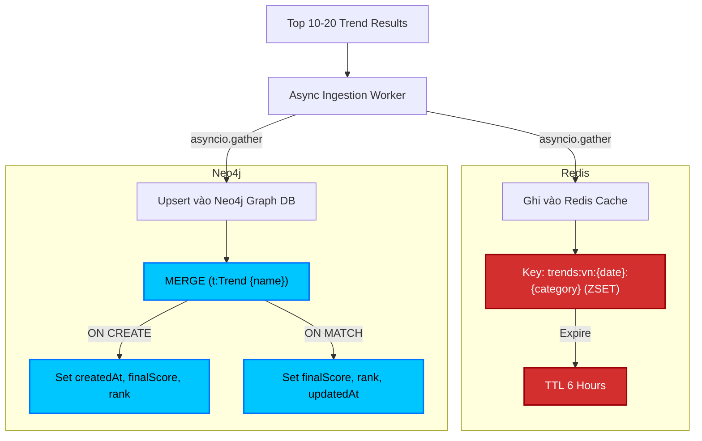

# Thiết Kế Luồng Lưu Trữ Đệm Redis và Ghi Đè Kết Quả Neo4j (Upsert Flow)
**Mã tài liệu:** AI-4.99-REDIS-NEO4J-UPSERT  
**Dự án:** BrandHub AI Trend System  
**Tác giả:** Lộc (APIs)  
**Trạng thái:** Thiết kế chi tiết (Approved)  

---

## 1. Giới thiệu tổng quan luồng ghi đồng bộ (Upsert Flow Architecture)

Sau khi bộ công cụ **Trend Prediction Engine (Task 99-03)** tính toán xong điểm số bùng nổ (Anomaly Score) và điểm lan truyền đồ thị (Graph Virality Score), hệ thống sẽ kết xuất ra danh sách **Top 10 - 20 xu hướng chính thức**.

Để phục vụ hiển thị lên Dashboard với thời gian phản hồi cực nhanh (<20ms) và lưu trữ lịch sử xu hướng lâu dài, dữ liệu cần được ghi đồng thời xuống:
1.  **Redis Cache (Sorted Set/JSON String):** Lưu trữ tạm thời (TTL 6 tiếng) bảng xếp hạng đã được sắp xếp để API `/ai/trends` truy vấn trực tiếp và hiển thị ngay trên Dashboard.
2.  **Neo4j Graph Database:** Thực hiện ghi đè/tạo mới (Upsert) thuộc tính xếp hạng và điểm số của các Node `:Trend`, làm giàu thông tin đồ thị mà không làm mất ngày giờ khởi tạo ban đầu (`createdAt`).

Sơ đồ luồng ghi đồng thời:



---

## 2. Thiết kế cấu trúc lưu trữ Redis

Tuân thủ tài liệu chuẩn đặt tên key của hệ thống (`DA-E06-06`), cấu trúc lưu trữ cache của xu hướng được định nghĩa như sau:

*   **Key Template:** `trends:vn:{YYYY-MM-DD}:{category}`
    *   `{YYYY-MM-DD}`: Ngày tính toán định dạng UTC. Ví dụ: `2026-07-20`.
    *   `{category}`: Tên slug của danh mục viết thường. Ví dụ: `food`, `fashion`, `tech`, `beauty`.
*   **Thời gian sống (TTL):** 21600 giây (6 giờ), tương đương chu kỳ quét và tính toán trend mới của crawler.

Hệ thống hỗ trợ 2 phương án tổ chức dữ liệu dưới đây, khuyến nghị sử dụng **Phương án 1** để tối ưu hóa hiệu năng sắp xếp động.

### 2.1 Phương án 1 (Khuyến nghị): Sử dụng Sorted Set (ZSET) kết hợp JSON Member
Mỗi keyword trend được đưa vào ZSET với điểm Score chính là `finalScore` của nó. Thành viên (Member) là một JSON string chứa toàn bộ metadata đi kèm của trend đó.

*   **Redis Command minh họa:**
    ```bash
    # Thêm các trend vào ZSET
    ZADD trends:vn:2026-07-20:food 7.82 '{"keyword": "trà sữa đất nung", "platform": "google", "region": "VN", "rank": 1, "fetchedAt": "2026-07-20T09:00:00Z"}'
    ZADD trends:vn:2026-07-20:food 6.97 '{"keyword": "labubu", "platform": "tiktok", "region": "VN", "rank": 2, "fetchedAt": "2026-07-20T09:00:00Z"}'
    
    # Thiết lập TTL 6 giờ
    EXPIRE trends:vn:2026-07-20:food 21600
    ```
*   **Ưu điểm:**
    *   Hỗ trợ phân trang, lấy Top K động ở mức database cực kỳ tối ưu thông qua lệnh `ZREVRANGE` hoặc `ZREVRANGEBYSCORE`.
    *   Ví dụ lấy Top 10 xu hướng điểm cao nhất:
        ```bash
        ZREVRANGE trends:vn:2026-07-20:food 0 9 WITHSCORES
        ```

### 2.2 Phương án 2: Lưu trữ dạng JSON String chứa mảng Object
Toàn bộ danh sách Top Trend đã được sắp xếp sẵn từ Python được serialize thành một chuỗi JSON duy nhất và lưu bằng kiểu dữ liệu String của Redis.

*   **Redis Command minh họa:**
    ```bash
    SETEX trends:vn:2026-07-20:food 21600 '[{"keyword": "trà sữa đất nung", "platform": "google", "region": "VN", "score": 7.82, "rank": 1, "fetchedAt": "2026-07-20T09:00:00Z"}, {"keyword": "labubu", "platform": "tiktok", "region": "VN", "score": 6.97, "rank": 2, "fetchedAt": "2026-07-20T09:00:00Z"}]'
    ```
*   **Ưu điểm:** Khớp 100% với định nghĩa lưu trữ thô trong tài liệu contract `DA-E06-06`. Dễ dàng cho API Gateway hoặc Backend chỉ cần đọc chuỗi String và trả trực tiếp ra Client mà không cần xử lý thêm.

---

## 3. Truy vấn Cypher Upsert Neo4j

Để thực hiện cập nhật điểm số và thứ hạng của xu hướng vào Neo4j mà không làm ảnh hưởng đến cấu trúc đồ thị hiện có cũng như giữ nguyên mốc thời gian phát hiện xu hướng ban đầu (`createdAt`), hệ thống sử dụng cú pháp kết hợp `MERGE`, `ON CREATE SET` và `ON MATCH SET`.

### 3.1 Câu lệnh Cypher Upsert theo lô (Batch Upsert Query)
Thay vì thực thi từng lệnh đơn lẻ gây nghẽn kết nối mạng, chúng ta truyền một danh sách tham số (batch parameters) vào Neo4j và sử dụng lệnh `UNWIND` để xử lý song song trong database:

```cypher
// Truyền tham số $batch dạng: 
// [ { keyword: "trà sữa đất nung", category: "food", score: 7.82, rank: 1 }, ... ]

UNWIND $batch AS item
MERGE (t:Trend {name: item.keyword})
ON CREATE SET 
    t.category = item.category,
    t.createdAt = datetime(),
    t.finalScore = item.score,
    t.rank = item.rank,
    t.updatedAt = datetime()
ON MATCH SET 
    t.finalScore = item.score,
    t.rank = item.rank,
    t.updatedAt = datetime()
```

### 3.2 Giải thích chi tiết các mệnh đề:
*   `MERGE (t:Trend {name: item.keyword})`: Kiểm tra xem Node `:Trend` có tên này đã tồn tại hay chưa dựa trên khóa chính `name` (được đảm bảo bằng ràng buộc `UNIQUE`).
*   `ON CREATE SET`: Chỉ chạy khi xu hướng này **lần đầu tiên được phát hiện**. Nó sẽ gán thuộc tính `createdAt` bằng thời gian hiện tại.
*   `ON MATCH SET`: Chạy khi xu hướng này **đã từng tồn tại trong hệ thống**. Nó chỉ ghi đè điểm số (`finalScore`), xếp hạng (`rank`), và mốc thời gian cập nhật (`updatedAt`), hoàn toàn bỏ qua và bảo toàn trường `createdAt` cũ của xu hướng.

---

## 4. Cơ chế ghi đồng thời không đồng bộ (Concurrent Sync Flow)

Để giải quyết yêu cầu kỹ thuật: *"Đảm bảo việc ghi vào Redis và Neo4j diễn ra đồng thời để tránh bất đồng bộ dữ liệu"* và đạt latency ghi tối ưu nhất, Worker chạy nền sẽ thực thi luồng ghi song song không chặn (Non-blocking I/O) bằng thư viện `asyncio` trong Python.

### 4.1 Quy trình xử lý lỗi và Retry (Retry Policy)
Nếu một trong hai cơ sở dữ liệu ghi thất bại:
*   Nếu ghi **Redis thất bại** nhưng **Neo4j thành công**: Log lỗi mức CRITICAL. Do Redis chỉ là cache, hệ thống sẽ thực hiện khôi phục đệm bằng cách đọc ngược dữ liệu vừa ghi từ Neo4j và ghi lại vào Redis (Cache Warm-up).
*   Nếu ghi **Neo4j thất bại** nhưng **Redis thành công**: Log lỗi mức CRITICAL. Tiến hành hoàn tác (Evict/Delete) Redis cache của key đó ngay lập tức để tránh Dashboard hiển thị dữ liệu "rác" chưa được đồng bộ xuống Database thật. Tiến hành thử lại (Retry) tối đa 3 lần cho Neo4j.

### 4.2 Mã Python triển khai luồng ghi đồng thời (Reference Implementation)

```python
import asyncio
import json
import logging
from datetime import datetime
import redis.asyncio as aioredis
from neo4j import AsyncGraphDatabase

logger = logging.getLogger("upsert_worker")

async def write_to_redis(redis_client: aioredis.Redis, key: str, trends_list: list, ttl_seconds: int = 21600):
    """
    Ghi dữ liệu danh sách xu hướng vào Redis dưới dạng ZSET
    """
    async with redis_client.pipeline(transaction=True) as pipe:
        # Xóa key cũ nếu có để tránh tồn đọng dữ liệu cũ khi thứ hạng thay đổi
        pipe.delete(key)
        for item in trends_list:
            member = json.dumps({
                "keyword": item["keyword"],
                "platform": item.get("platform", "all"),
                "region": item.get("region", "VN"),
                "rank": item["rank"],
                "fetchedAt": datetime.utcnow().isoformat() + "Z"
            }, ensure_ascii=False)
            # Dùng finalScore làm điểm sắp xếp (ZSET score)
            pipe.zadd(key, {member: item["score"]})
        pipe.expire(key, ttl_seconds)
        await pipe.execute()
    logger.info(f"Đã ghi cache thành công vào Redis key: {key}")

async def write_to_neo4j(neo4j_driver: AsyncGraphDatabase.driver, batch_data: list):
    """
    Ghi đè/Tạo mới điểm số xu hướng vào Neo4j bằng Cypher batching
    """
    cypher_query = """
    UNWIND $batch AS item
    MERGE (t:Trend {name: item.keyword})
    ON CREATE SET 
        t.category = item.category,
        t.createdAt = datetime(),
        t.finalScore = item.score,
        t.rank = item.rank,
        t.updatedAt = datetime()
    ON MATCH SET 
        t.finalScore = item.score,
        t.rank = item.rank,
        t.updatedAt = datetime()
    """
    async with neo4j_driver.session() as session:
        await session.run(cypher_query, batch=batch_data)
    logger.info("Đã upsert thành công bảng xếp hạng xu hướng vào Neo4j")

async def sync_trends_pipeline(redis_url: str, neo4j_uri: str, neo4j_auth: tuple, category: str, trends_data: list):
    """
    Luồng đồng bộ chạy song song
    """
    # Chuẩn bị dữ liệu đầu vào
    today_str = datetime.utcnow().strftime("%Y-%m-%d")
    redis_key = f"trends:vn:{today_str}:{category}"
    
    # Khởi tạo các clients kết nối không chặn
    redis_client = aioredis.from_url(redis_url)
    neo4j_driver = AsyncGraphDatabase.driver(neo4j_uri, auth=neo4j_auth)
    
    try:
        # Chạy đồng thời hai tiến trình I/O
        await asyncio.gather(
            write_to_redis(redis_client, redis_key, trends_data),
            write_to_neo4j(neo4j_driver, trends_data)
        )
        logger.info("Hoàn tất đồng bộ song song Redis và Neo4j thành công")
    except Exception as e:
        logger.error(f"Lỗi xảy ra trong quá trình đồng bộ song song: {str(e)}")
        # Thực hiện rollback/evict cache để đảm bảo tính nhất quán dữ liệu hiển thị
        try:
            await redis_client.delete(redis_key)
            logger.warning(f"Đã evict cache Redis key {redis_key} do lỗi đồng bộ cơ sở dữ liệu.")
        except Exception as redis_err:
            logger.error(f"Không thể xóa cache Redis: {str(redis_err)}")
        raise e
    finally:
        await redis_client.close()
        await neo4j_driver.close()
```

---

## 5. Tích hợp API Dashboard `/ai/trends` (Read Flow)

API `/ai/trends` sẽ được thiết kế để luôn ưu tiên đọc dữ liệu xếp hạng trực tiếp từ **Redis Cache** nhằm tối đa hóa tốc độ phản hồi và giảm tải cho đồ thị Neo4j.

### 5.1 Quy trình truy xuất dữ liệu (Read Cache-Aside Flow)
1.  **Bước 1:** Client gửi request yêu cầu lấy bảng xếp hạng (`category`, `date`).
2.  **Bước 2:** API Server truy quét key tương ứng trong Redis: `trends:vn:{date}:{category}`.
    *   **Trường hợp 1 (Cache Hit):** Trả ngay dữ liệu từ Redis về Client (Thời gian xử lý < 20ms).
    *   **Trường hợp 2 (Cache Miss - Ví dụ cache hết hạn):**
        *   API Server thực hiện truy vấn Neo4j để lấy danh sách xu hướng của danh mục đó trong ngày hôm nay:
            ```cypher
            MATCH (t:Trend)
            WHERE t.category = $category AND t.updatedAt >= datetime() - duration('P1D')
            RETURN t.name AS keyword, t.finalScore AS score, t.rank AS rank
            ORDER BY t.rank ASC
            LIMIT 20
            ```
        *   Nạp lại kết quả thu được vào Redis với TTL 6 giờ (Cache Warm-up).
        *   Trả dữ liệu về cho Client.
