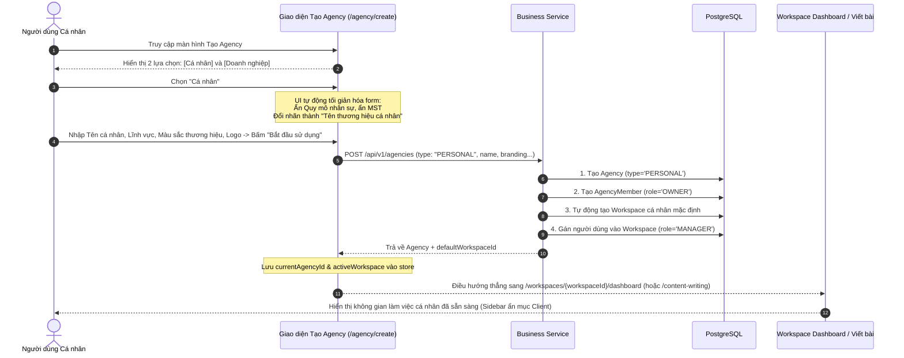
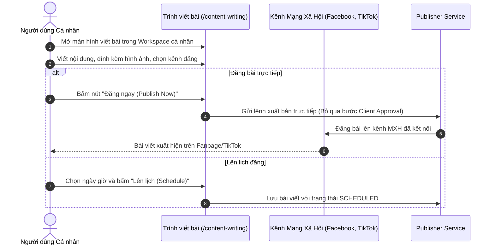

# 01. Phân Tích Nghiệp Vụ & Luồng Người Dùng (Business Requirements & User Flow)

## 1. Bối Cảnh & Vấn Đề Hiện Tại (Problem Statement)

### 1.1. Hiện trạng kiến trúc nghiệp vụ (As-Is)
Trong kiến trúc hiện tại của BrandHub:
* **Tầng 1 (Tổ chức - Agency)**: Là cấp cao nhất, đại diện cho một công ty truyền thông/marketing. Khi người dùng tạo một Agency, họ được gán vai trò `OWNER`.
* **Tầng 2 (Không gian làm việc - Workspace)**: Đại diện cho một dự án hoặc một thương hiệu khách hàng mà Agency đang phục vụ. Tất cả công cụ tạo nội dung cốt lõi của BrandHub như:
  * Soạn thảo bài viết (`/content-writing`)
  * Trình biên tập Canvas (`/editor`)
  * Lịch đăng bài (`/calendar`)
  * Thư viện ảnh/video (`/library`)
  * Xuất bản / Đăng bài (`/publish`)
  * Kết nối tài khoản mạng xã hội (`/social-accounts`)
  
  **đều bắt buộc phải thuộc về một `workspace_id` cụ thể** (`requiresWorkspace: true`, `workspaceScoped: true`).

### 1.2. Hạn chế đối với người dùng Cá nhân (Solo Creator / Freelancer)
Khi một cá nhân kinh doanh, KOL/KOC, hoặc Freelancer Content Creator đăng ký sử dụng BrandHub:
1. **Luồng tạo bị đứt gãy**: Họ bấm "Tạo Agency", nhập thông tin xong thì hệ thống chuyển hướng về trang `/agency/:id` (xem thông tin tổ chức). Họ không thể viết bài hay đăng bài ngay được vì **chưa có Workspace**. Họ phải mò mẫm sang trang Workspace để tạo thêm 1 Workspace nữa.
2. **Thừa thãi nghiệp vụ B2B**: Người dùng cá nhân không quản lý nhiều khách hàng. Họ chính là người tạo nội dung, chính là người sở hữu thương hiệu, và cũng là người trực tiếp bấm đăng bài lên mạng xã hội. Việc hệ thống hiển thị hàng loạt tính năng như:
   - *Khách hàng (`/clients`)*
   - *Hồ sơ khách hàng (`/client-profiles`)*
   - *Mời khách hàng (`/client/invitations`)*
   - *Cổng phê duyệt của khách hàng (`/portal`)*
   - *Đàm phán gói truyền thông (`/media-package` negotiation)*
   làm giao diện bị rối rắm, nặng nề và tạo cảm giác BrandHub chỉ dành cho công ty Agency lớn.
3. **Quy trình phê duyệt nội dung bị nghẽn**: Khi viết bài, hệ thống yêu cầu gửi bài cho Client duyệt (`PENDING_CLIENT_APPROVAL`). Nhưng với cá nhân, không có "Client" nào khác ngoài chính họ.

---

## 2. Mô Hình Mục Tiêu (To-Be Model)

| Tiêu chí | Mô hình Agency Doanh nghiệp (`BUSINESS`) | Mô hình Agency Cá nhân (`PERSONAL`) |
|:---|:---|:---|
| **Đối tượng sử dụng** | Marketing Agency, Doanh nghiệp truyền thông có đội ngũ nhân sự và phục vụ nhiều khách hàng. | Cá nhân kinh doanh, Solo Creator, Freelancer, KOL, người tự quản lý thương hiệu của mình. |
| **Mục đích chính** | Phân quyền nhân viên, quản lý khách hàng, đàm phán hợp đồng gói truyền thông, trình duyệt bài viết. | Tự sáng tạo nội dung, quản lý kênh mạng xã hội cá nhân và lên lịch/đăng bài trực tiếp. |
| **Quy trình sau khi tạo** | Tạo Agency -> Chuyển về trang Agency settings để mời thành viên, thiết lập bảng giá dịch vụ, tạo các workspace cho khách hàng. | **Tạo Agency -> Tự động sinh luôn 1 Workspace cá nhân -> Chuyển thẳng vào làm việc ngay lập tức.** |
| **Quản lý khách hàng (Client Management)** | Có đầy đủ: Client Profile, Thư viện khách hàng, Lời mời, Portal. | **Ẩn hoàn toàn** khỏi Sidebar và các phân hệ làm việc. |
| **Quy trình duyệt bài (Content Approval)** | Creator viết -> Manager duyệt -> Gửi Client phê duyệt -> Mới được xuất bản. | **Người dùng tự viết -> Bấm Đăng ngay hoặc Lên lịch xuất bản trực tiếp.** |
| **Số lượng Workspace** | Có thể tạo không giới hạn nhiều Workspace cho nhiều nhãn hàng. | Mặc định sở hữu 1 Workspace cá nhân làm việc duy nhất (có thể mở rộng khi nâng cấp). |

---

## 3. Chân Dung Người Dùng (User Personas)

### Persona 1: Nguyễn Minh Trí — Freelance Content Creator / KOL
* **Nhu cầu**: Muốn một nền tảng tập trung để quản lý ý tưởng, viết bài bằng AI, lên lịch đăng bài cho Fanpage và kênh TikTok cá nhân của mình.
* **Kỳ vọng**: Đăng ký tài khoản xong là vào viết bài và lên lịch được ngay. Không muốn thấy các thuật ngữ phức tạp như "Hợp đồng gói dịch vụ", "Gửi duyệt khách hàng", "Phân quyền vai trò".

### Persona 2: Trần Thị Lan — Giám đốc Media Agency "NextGen Digital"
* **Nhu cầu**: Quản lý 10 nhân viên sáng tạo nội dung và 15 khách hàng doanh nghiệp khác nhau. Mỗi khách hàng cần một không gian làm việc riêng biệt (Workspace) với màu sắc nhận diện thương hiệu riêng.
* **Kỳ vọng**: Luồng Agency đầy đủ tính năng: phân quyền Owner/Manager/Creator, mời Client vào Portal xem và duyệt bài viết trước khi xuất bản.

---

## 4. Đặc Tả Luồng Người Dùng Chi Tiết (User Journey)

### Luồng 1: Người dùng tạo Agency Cá nhân & Sử dụng ngay (Happy Path)

### Luồng 2: Quy trình Soạn thảo & Xuất bản bài viết cho Cá nhân

---

## 5. Các Quy Tắc Nghiệp Vụ Cốt Lõi (Business Rules)

* **BR-PERSONAL-01 (Lựa chọn bắt buộc)**: Khi tạo Agency mới, người dùng bắt buộc phải chọn mục đích sử dụng là `PERSONAL` hoặc `BUSINESS`. Giá trị mặc định gợi ý có thể là `PERSONAL` nếu người dùng là tài khoản mới đăng ký đơn lẻ.
* **BR-PERSONAL-02 (Tự động kích hoạt Workspace)**: Khi một Agency được tạo với `type = 'PERSONAL'`, hệ thống Backend **bắt buộc phải thực hiện trong cùng một Database Transaction**:
  1. Tạo bản ghi `agencies` với `type = 'PERSONAL'`.
  2. Tạo bản ghi `agency_members` với `role = 'OWNER'`.
  3. Tạo 1 bản ghi `workspaces` mặc định với tên và nhận diện thương hiệu kế thừa từ Agency vừa tạo.
  4. Tạo bản ghi `workspace_members` với `user_id = currentUser.id` và `role = 'MANAGER'`.
  5. Trả về `default_workspace_id` trong API response.
* **BR-PERSONAL-03 (Điều hướng tức thì)**: Frontend nhận được phản hồi tạo Agency Cá nhân thành công sẽ tự động kích hoạt Workspace vừa tạo làm `currentWorkspace` trong `workspaceStore` và điều hướng người dùng thẳng vào không gian làm việc, **không đưa về trang xem chi tiết Agency**.
* **BR-PERSONAL-04 (Giao diện tinh gọn cho Cá nhân)**: Khi người dùng đang ở trong ngữ cảnh của một Agency loại `PERSONAL`:
  - Sidebar ẩn các mục: `/clients`, `/client-profiles`, `/client/invitations`, `/portal`, `/agency/:id/roles`, `/workspaces/:id/clients`.
  - Mục `/agency/:id/members` chuyển thành chế độ hiển thị thông tin tài khoản cá nhân hoặc ẩn nếu không có thành viên thứ hai.
* **BR-PERSONAL-05 (Bỏ khâu phê duyệt Client)**: Khi tạo Task / Post trong Workspace thuộc Agency cá nhân, trạng thái bài viết không trải qua các trạng thái `PENDING_CLIENT_APPROVAL` hay `REJECTED_BY_CLIENT`. Trạng thái chuyển trực tiếp từ `DRAFT` sang `SCHEDULED` hoặc `PUBLISHED`.
* **BR-PERSONAL-06 (Quyền chuyển đổi/Nâng cấp)**: Người dùng sở hữu Agency Cá nhân có quyền nâng cấp lên Agency Doanh nghiệp (`BUSINESS`) bất kỳ lúc nào trong phần Cài đặt Agency. Khi nâng cấp:
  - Kiểu Agency chuyển thành `BUSINESS`.
  - Các tính năng quản lý Client, thành viên, và phân quyền được kích hoạt trở lại.
  - Workspace cá nhân hiện tại trở thành Workspace đầu tiên của Agency.
