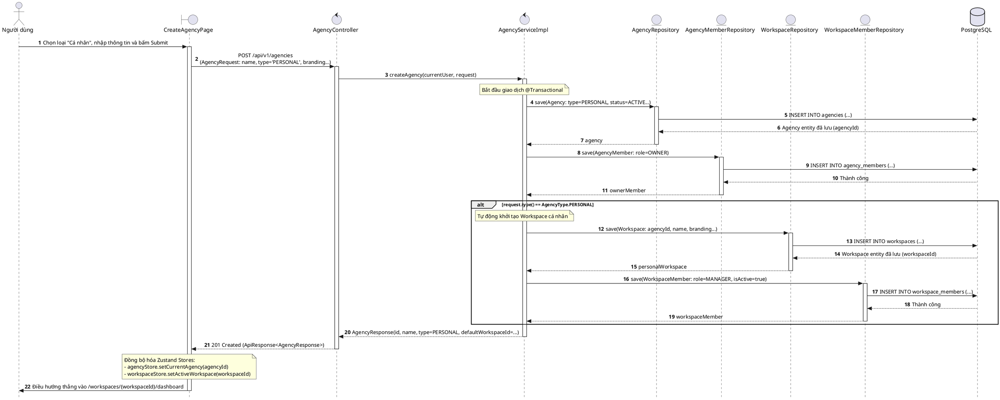

# 02. Kiến Trúc Kỹ Thuật & Luồng Dữ Liệu (Technical Architecture & Data Flow)

## 1. Tổng Quan Kiến Trúc Thành Phần (Architecture Overview)

```text
┌────────────────────────────────────────────────────────────────────────┐
│                   Frontend: brandhub-web-dashboard                     │
│    (React 19, Vite, Zustand Stores, TailwindCSS, React-Router v7)      │
└───────────────────────────────────┬────────────────────────────────────┘
                                    │ HTTP / REST (JWT Bearer)
                                    ▼
┌────────────────────────────────────────────────────────────────────────┐
│                 API Gateway: brandhub-api-gateway                      │
│        (Spring Cloud Gateway, Port 8080, Token Relay & Routing)        │
└───────────────────────────────────┬────────────────────────────────────┘
                                    │ Reverse Proxy (/api/v1/agencies/**)
                                    ▼
┌────────────────────────────────────────────────────────────────────────┐
│              Business Service: brandhub-business-service               │
│     (Spring Boot 3.3, Port 8081, Hibernate 6, Spring Security)         │
│  ├── AgencyController -> AgencyService -> AgencyRepository            │
│  └── WorkspaceController -> WorkspaceService -> WorkspaceRepository   │
└───────────────────┬───────────────────────────────┬────────────────────┘
                    │ JDBC (PostgreSQL)             │ Redis Cache
                    ▼                               ▼
       ┌─────────────────────────┐     ┌────────────────────────┐
       │   PostgreSQL Database   │     │      Redis Cluster     │
       │  (agencies, workspaces, │     │  (Session, Cache,      │
       │   agency_members, etc.) │     │   Permission Cache)    │
       └─────────────────────────┘     └────────────────────────┘
```

---

## 2. Luồng Dữ Liệu Khi Tạo Agency Cá Nhân (Data Flow)

Khi người dùng gửi yêu cầu tạo Agency với `type = 'PERSONAL'`:
1. **Frontend**: Gửi `POST /api/v1/agencies` kèm payload mở rộng (`type: "PERSONAL"`).
2. **Gateway**: Kiểm tra xác thực JWT, giải mã `userId`, chuyển tiếp request kèm header `X-User-Id`.
3. **Business Service (`AgencyServiceImpl`)**:
   - Mở 1 `@Transactional` duy nhất.
   - Lưu bản ghi `Agency` mới với `type = AgencyType.PERSONAL`.
   - Lưu bản ghi `AgencyMember` với `role = AgencyMemberRole.OWNER`.
   - **Tự động kích hoạt (Auto-provisioning)**: Gọi `WorkspaceRepository` để tạo ngay 1 `Workspace` cá nhân kế thừa toàn bộ cấu hình nhận diện thương hiệu (Tên, Logo, Brand Color, Tagline, Industry).
   - Lưu bản ghi `WorkspaceMember` cho người dùng hiện tại với `role = MemberRole.MANAGER`.
   - Trả về DTO `AgencyResponse` có bổ sung trường `defaultWorkspaceId: UUID`.
4. **Frontend Store update**:
   - `agencyStore`: Lưu `currentAgencyId = response.id`, nạp danh sách Agency mới.
   - `workspaceStore`: Lưu `currentWorkspace = response.defaultWorkspace`, nạp danh sách Workspace.
   - Điều hướng lập tức sang `/workspaces/{defaultWorkspaceId}/dashboard` (hoặc `/content-writing`).

---

## 3. PlantUML Sequence Diagram (Tương Thích Visual Paradigm)

Đoạn mã PlantUML dưới đây mô tả chính xác tương tác giữa các lớp đối tượng (Controller, Service, Repository, Database), tuân thủ định dạng mà công cụ batch plugin Visual Paradigm trong dự án có thể render:



---

## 4. Đặc Tả Giao Diện Lập Trình (API Contracts)

### 4.1. `POST /api/v1/agencies` (Tạo Agency)

#### Request Body (`AgencyRequest`):
```json
{
  "name": "Trí Nguyễn Media",
  "type": "PERSONAL",
  "category": "MARKETING",
  "companySize": "SIZE_1_10",
  "description": "Kênh nội dung cá nhân chia sẻ kiến thức công nghệ và marketing.",
  "brandColor": "#f05a28",
  "logoIcon": "Sparkles",
  "logoUrl": null,
  "bannerUrl": null,
  "website": "https://tringuyen.dev",
  "phone": "0912345678",
  "location": "Thành phố Hồ Chí Minh",
  "tagline": "Sáng tạo nội dung số đơn giản & hiệu quả",
  "facebookUrl": "https://facebook.com/tringuyen",
  "instagramUrl": "https://instagram.com/tringuyen",
  "linkedinUrl": null
}
```

#### Response Body (`ApiResponse<AgencyResponse>`):
```json
{
  "success": true,
  "message": "Tạo agency thành công",
  "data": {
    "id": "7f8b89e2-3490-4c7a-9a01-92b8d9e2a101",
    "name": "Trí Nguyễn Media",
    "type": "PERSONAL",
    "ownerId": "91a13b52-1928-4081-80a2-bf14e5917812",
    "myRole": "OWNER",
    "category": "MARKETING",
    "companySize": "SIZE_1_10",
    "description": "Kênh nội dung cá nhân chia sẻ kiến thức công nghệ và marketing.",
    "brandColor": "#f05a28",
    "logoIcon": "Sparkles",
    "logoUrl": null,
    "bannerUrl": null,
    "website": "https://tringuyen.dev",
    "phone": "0912345678",
    "location": "Thành phố Hồ Chí Minh",
    "tagline": "Sáng tạo nội dung số đơn giản & hiệu quả",
    "status": "ACTIVE",
    "defaultWorkspaceId": "8a9c02b3-5601-4d8b-a102-13c9e0f3b202",
    "createdAt": "2026-10-06T09:35:00Z",
    "updatedAt": "2026-10-06T09:35:00Z"
  },
  "requestId": "req-9a1b2c3d"
}
```

### 4.2. `PATCH /api/v1/agencies/{id}/upgrade-type` (Nâng Cấp Loại Hình)
* **Mục đích**: Cho phép Agency Cá nhân nâng cấp lên Agency Doanh nghiệp khi mở rộng kinh doanh mà không làm mất dữ liệu hiện tại.
* **Request**:
```json
{
  "type": "BUSINESS"
}
```
* **Response**: Trả về `AgencyResponse` với `type = 'BUSINESS'`. Hệ thống kích hoạt lại toàn bộ tính năng Client & Team members.

---

## 5. Kiến Trúc State Management Trên Frontend

### 5.1. Cập nhật `types/agency.ts`
```typescript
export type AgencyType = "PERSONAL" | "BUSINESS";

export interface Agency {
  id: string;
  name: string;
  type: AgencyType; // Trường mới
  ownerId: string;
  myRole?: AgencyMemberRole;
  defaultWorkspaceId?: string; // Tự sinh khi type === "PERSONAL"
  // ... các trường hiện có
}
```

### 5.2. Cập nhật `useAgencyStore` & `useWorkspaceStore`
* Khi chuyển đổi tổ chức: Store lưu trữ `currentAgencyType`.
* `sidebarNavConfig.ts`: Thêm điều kiện lọc mục menu:
  ```typescript
  if (currentAgencyType === "PERSONAL" && item.hiddenForPersonalAgency) {
    return false; // Ẩn khỏi sidebar
  }
  ```
