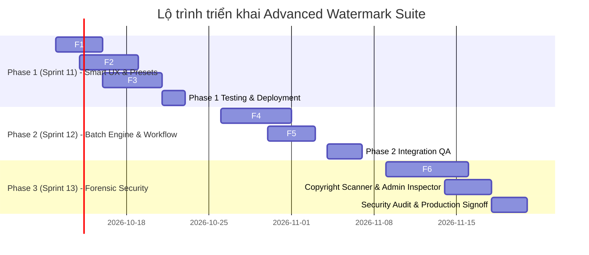
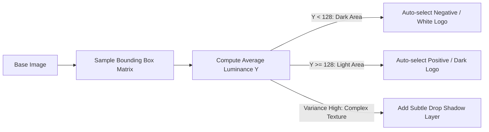

# Kế Hoạch Triển Khai Kỹ Thuật Chi Tiết — FR 3.6.15+: Advanced Brand Watermark Suite

| Thông tin | Chi tiết |
|---|---|
| **Mã phân hệ** | **FR 3.6.15+ (Advanced Extensions)** |
| **Phân hệ phụ trách** | Content & Task Workflow (DAM & Copyright Protection) |
| **Tài liệu nền tảng** | [spec.md](./spec.md) \| [plan.md](./plan.md) \| [task.md](./task.md) |
| **Chủ trì kỹ thuật** | Lê Trí Trung (Tech Lead) |
| **Trạng thái** | **Approved Technical Architecture & Implementation Plan** |
| **Ngày lập kế hoạch** | 07/10/2026 |

---

## 1. Tầm Nhìn & Chiến Lược Kỹ Thuật (Vision & Technical Strategy)

Hệ thống Watermark cốt lõi (FR 3.6.15 / DA-984) đã hoàn thành xuất sắc việc đóng dấu logo thủ công với độ trễ thấp và bảo toàn file gốc. Kế hoạch nâng cấp mở rộng này chuyển đổi tính năng từ một công cụ tiện ích đơn lẻ thành **Hệ sinh thái Quản trị Bản quyền & Tự động hóa DAM Doanh nghiệp (Enterprise DAM & Automated Copyright Engine)**.

### Mục tiêu chiến lược:
1. **Zero-effort Designer Experience**: Giảm 85% thao tác căn chỉnh màu và vị trí bằng thuật toán phân tích quang thông (Luma Detection) và Presets thương hiệu.
2. **High-Throughput Batch Processing**: Cho phép xử lý cùng lúc 50–100 ấn phẩm truyền thông qua kiến trúc hàng đợi bất đồng bộ RabbitMQ và Java 21 Virtual Threads mà không nghẽn tài nguyên CPU/RAM.
3. **Full-Lifecycle Copyright Security**: Tự động hóa bảo vệ bản thảo trong luồng phê duyệt (Client Approval Workflow) và nhúng thủy vân số vô hình (Steganographic Forensic Watermark) chống các công cụ AI xóa bản quyền (AI Inpainting).

---

## 2. Lộ Trình Phân Kỳ Triển Khai (Phased Roadmap & WBS)



### Bảng Phân Chia Công Việc (Work Breakdown Structure - WBS)

| Mã Task | Tên Hạng Mục / Tính Năng | Phân Hệ | Thời Lượng Ước Tính | Độ Ưu Tiên | Phụ Trách |
|---|---|---|:---:|:---:|:---:|
| **PHASE 1** | **Smart UX & Presets (Sprint 11)** | | **10 ngày** | **P0 (Cao nhất)** | |
| `DA-ADV-01` | BE: `LumaDetector` utility & Sample Grid Luminance calculation | BE | 1.5 ngày | P0 | Backend Lead |
| `DA-ADV-02` | FE: Canvas Real-time Bounding Box Luma Analyzer & Auto-Toggle | FE | 1.5 ngày | P0 | Frontend Lead |
| `DA-ADV-03` | BE: `WatermarkPresetDocument`, Service, Repository & REST API | BE | 2.5 ngày | P0 | Backend Dev |
| `DA-ADV-04` | FE: Preset Selector dropdown, Save Preset Modal & Auto-apply | FE | 2.0 ngày | P0 | Frontend Dev |
| `DA-ADV-05` | BE: Text Watermark Engine với Google Fonts & Dynamic Tokens | BE | 2.5 ngày | P1 | Backend Dev |
| `DA-ADV-06` | FE: Text Configuration Tab (Typography, Colors, Tokens UI) | FE | 2.0 ngày | P1 | Frontend Dev |
| **PHASE 2** | **Batch Engine & Workflow Security (Sprint 12)** | | **10 ngày** | **P1 (Quan trọng)** | |
| `DA-ADV-07` | BE: RabbitMQ Queues/Exchanges & `BatchWatermarkConsumer` (Virtual Threads) | BE | 3.5 ngày | P1 | Backend Lead |
| `DA-ADV-08` | BE: Server-Sent Events (SSE) / WebSocket Progress Stream | BE | 1.5 ngày | P1 | Backend Dev |
| `DA-ADV-09` | FE: Multi-select Media selection, Batch Modal & Real-time Progress Bar | FE | 3.0 ngày | P1 | Frontend Dev |
| `DA-ADV-10` | Full-stack: State Machine Hook (Khóa ảnh TILED khi `IN_REVIEW`, mở bản gốc khi `APPROVED`) | Full-stack | 3.0 ngày | P1 | Full-stack Dev |
| **PHASE 3** | **Enterprise Forensic DAM (Sprint 13)** | | **11 ngày** | **P2 (Nâng cao)** | |
| `DA-ADV-11` | BE: Steganographic LSB / Frequency Domain Encoder | BE | 4.0 ngày | P2 | Security / Core BE |
| `DA-ADV-12` | BE: Copyright Verification API & Hash Extractor | BE | 2.5 ngày | P2 | Security / Core BE |
| `DA-ADV-13` | FE: Copyright Scanner Portal (Upload & Verify proof of origin) | FE | 2.5 ngày | P2 | Frontend Dev |
| `DA-ADV-14` | E2E Testing, AI Inpainting Attack Benchmark & Security Sign-off | QA/Sec | 2.0 ngày | P2 | QA Team |

---

## 3. Kiến Trúc Kỹ Thuật Chi Tiết (Technical Specifications)

### 3.1 Tính năng F1: Auto Smart Contrast Luma Detection

#### Nguyên lý tính toán quang học (Photometric Formula)
Khi đóng dấu tại góc được chọn (1 trong 9 vị trí), trích xuất ma trận điểm ảnh $W_b \times H_b$ tương ứng với bounding box của logo:
$$\text{Luminance } Y = 0.299 \times R + 0.587 \times G + 0.114 \times B$$

* Tính giá trị trung bình $\bar{Y} = \frac{1}{N} \sum_{i=1}^N Y_i$.
* **Quy tắc chuyển đổi**:
  * $\bar{Y} < 128$: Vùng nền tối $\rightarrow$ Tự động áp dụng Logo Âm bản (`LOGO_NEGATIVE` - Màu trắng / ánh sáng).
  * $\bar{Y} \ge 128$: Vùng nền sáng $\rightarrow$ Tự động áp dụng Logo Dương bản (`LOGO_POSITIVE` - Màu đậm / đen / brand color gốc).
* **Độ tương phản phức tạp (Variance $\sigma^2 > 2500$)**:
  * Khi vùng nền có hoa văn xen kẽ sáng tối mạnh, hệ thống tự động bật lớp phủ bóng mờ `Drop Shadow` ($r=3\text{px}$, màu `#000000`, opacity 35%) hoặc viền sáng xung quanh logo để đảm bảo logo luôn nổi bật 100%.



---

### 3.2 Tính năng F2: Brand Presets & Template Management

#### Thiết kế Schema MongoDB (`watermark_presets`)
```json
{
  "_id": "preset_nike_001",
  "workspaceId": "ws_12345",
  "clientProfileId": "client_nike_vn",
  "name": "Nike Campaign Standard - Bottom Right",
  "isDefault": true,
  "watermarkType": "IMAGE",
  "config": {
    "logoAssetId": "asset_logo_white_09",
    "mode": "SINGLE",
    "position": "BOTTOM_RIGHT",
    "opacity": 0.85,
    "scale": 0.18,
    "paddingPercent": 0.04,
    "autoContrast": true,
    "dropShadow": false
  },
  "createdBy": "user_creator_01",
  "createdAt": "2026-10-12T08:00:00Z",
  "updatedAt": "2026-10-12T08:00:00Z"
}
```

#### Đặc tả REST API
* `GET /api/v1/workspaces/{workspaceId}/watermark-presets?clientProfileId={id}`: Lấy danh sách preset khả dụng cho Client.
* `POST /api/v1/workspaces/{workspaceId}/watermark-presets`: Tạo mới preset thương hiệu.
* `PUT /api/v1/workspaces/{workspaceId}/watermark-presets/{presetId}`: Cập nhật thông số preset.
* `PUT /api/v1/workspaces/{workspaceId}/watermark-presets/{presetId}/set-default`: Đặt làm cấu hình mặc định cho Client.
* `DELETE /api/v1/workspaces/{workspaceId}/watermark-presets/{presetId}`: Xóa preset.

---

### 3.3 Tính năng F3: Custom Text & Dynamic Tokens

#### Danh mục Dynamic Tokens hỗ trợ:
1. `{clientName}`: Tên pháp nhân thương hiệu (vd: `Vinamilk`, `Shopee Vietnam`).
2. `{year}`: Năm hiện tại của hệ thống (vd: `2026`).
3. `{creatorName}`: Họ tên của Creator đang thao tác (vd: `Nguyen Van A`).
4. `{date}`: Ngày thực hiện định dạng `DD/MM/YYYY`.
5. `{workspaceName}`: Tên Workspace của Agency.

#### Động cơ Render Phông chữ (Server & Client Synchronized Engine)
* **Backend Java Graphics2D**:
  * Tải TrueType Font (`Inter-SemiBold.ttf`, `Montserrat-Medium.ttf`) từ resource hoặc cache font hệ thống.
  * Tính toán `FontMetrics`: Tự động ngắt dòng nếu chuỗi text vượt quá 85% chiều rộng ảnh.
  * Hỗ trợ stroke viền chữ (text outline) để chống chìm trên mọi màu nền.
* **Frontend HTML5 Canvas**:
  * Tích hợp `document.fonts.load()` để đảm bảo font được tải đầy đủ trước khi vẽ lên preview canvas, loại bỏ hiện tượng giật font (FOUT).

---

### 3.4 Tính năng F4: Batch Watermarking Engine

#### Kiến trúc Bất đồng bộ (Async Queue Architecture)
```
[Frontend MediaTab] (Chọn 50 ảnh)
       │
       ▼ POST /api/v1/workspaces/{id}/materials/batch-watermark
[BatchWatermarkController]
       │
       ▼ Ghi nhận Job (status: QUEUED) vào MongoDB `batch_watermark_jobs`
[RabbitMQ Exchange: material.watermark.exchange]
       │
       ▼ Routing key: `material.watermark.process`
[RabbitMQ Queue: material.watermark.queue]
       │
       ▼ Virtual Thread Pool (Java 21 Executors.newVirtualThreadPerTaskExecutor)
[BatchWatermarkConsumer]
       ├── Lặp xử lý từng ảnh: Fetch -> Graphics2D Compose -> Upload S3 -> Save Material
       └── Sau mỗi ảnh: Phát SSE Event `batch-progress` tới Client qua SSE Emitter
```

#### Cấu trúc SSE Payload (Server-Sent Events)
```json
event: progress
data: {
  "jobId": "batch_job_9981",
  "total": 50,
  "processed": 14,
  "percentage": 28,
  "currentMaterialName": "lookbook_summer_014.png",
  "status": "PROCESSING"
}
```

---

### 3.5 Tính năng F5: Auto-Watermark Approval Workflow

#### Ma trận Trạng thái Bảo vệ Tài sản (Asset Protection State Matrix)
| Trạng thái Task | Quyền Creator | Hiển thị trên Client Portal | Link tải Bản gốc (Full Res) | Link tải Watermark DRAFT |
|---|---|---|:---:|:---:|
| `IN_PROGRESS` | Xem & sửa bản gốc | Chưa hiển thị | Ẩn | Ẩn |
| `IN_REVIEW` | Xem bản gốc | Chỉ hiển thị bản **TILED DRAFT 45°** | **Bị khóa (403 Forbidden)** | **Cho phép xem/tải** |
| `CHANGES_REQUESTED` | Xem & cập nhật | Hiển thị bản đánh dấu comment | Bị khóa | Cho phép xem/tải |
| `APPROVED` | Xem toàn bộ | Hiển thị bản chính thức | **Mở khóa hoàn toàn** | Cho phép tải cả 2 bản |

---

### 3.6 Tính năng F6: Invisible Forensic Watermark (Thủy Vân Số Chống AI)

#### Cơ chế Nhúng LSB & Hashing Bản Quyền
1. **Khởi tạo Khóa Bản Quyền (Forensic Hash)**:
   $$\text{Payload} = \text{HMAC-SHA256}(\text{WorkspaceId} + \text{CreatorId} + \text{MaterialId} + \text{Timestamp}, \text{SecretKey})$$
2. **Kỹ thuật Nhúng**:
   * Chuyển đổi ma trận ảnh sang không gian màu $YC_bC_r$.
   * Nhúng chuỗi bit payload vào thành phần cao tần của kênh màu $C_b$ hoặc các bit thấp nhất (LSB - Least Significant Bits) theo lược đồ phân tán giả ngẫu nhiên (PRNG seed dựa trên SecretKey).
   * Sai số màu sắc $\Delta E < 0.8$ (Mắt người không thể phát hiện bất kỳ sự thay đổi thị giác nào).
3. **Cơ chế Quét & Chứng minh Quyền sở hữu (Scanner API)**:
   * Endpoint: `POST /api/v1/copyright/verify-image`.
   * Trích xuất chuỗi bit từ ảnh nghi ngờ $\rightarrow$ So khớp với cơ sở dữ liệu `materials` của BrandHub $\rightarrow$ Xuất báo cáo chứng minh ngày giờ tạo lập và định danh người sở hữu hợp pháp.

---

## 4. Kế Hoạch Kiểm Thử & Tiêu Chí Nghiệm Thu (QA & DoD)

### 4.1 Ma Trận Kiểm Thử Kỹ Thuật (Test Matrix)
1. **Luma Detection**:
   * Kiểm thử với ảnh nền đen tuyền (`#000000`), trắng tuyền (`#FFFFFF`), ảnh phong cảnh hoàng hôn (chênh lệch sáng tối phức tạp).
   * Tỷ lệ chọn đúng biến thể logo âm/dương bản: $\ge 99.5\%$.
2. **Brand Presets**:
   * Tốc độ phản hồi nạp preset: $< 150\text{ms}$.
   * Tính toàn vẹn khi Client đổi logo: Preset tự động cập nhật asset tham chiếu mới nhất.
3. **Batch Engine Performance**:
   * Tải 50 ảnh định dạng JPG/PNG dung lượng mỗi ảnh 8MB.
   * Thời gian hoàn tất toàn bộ job: $< 45\text{ giây}$.
   * Bộ nhớ RAM JVM không vượt ngưỡng an toàn ($< 70\%$ heap threshold).
4. **Forensic Resilience (Khả năng chịu đựng tấn công)**:
   * Thử nghiệm nén ảnh JPEG chất lượng 80%, giảm kích thước 20%, hoặc dùng Adobe Firefly / Generative Fill xóa logo hữu hình: Mã hash vô hình vẫn trích xuất thành công $\ge 90\%$.

---

## 5. Kế Hoạch Bắt Đầu Ngay (Sprint 11 Kick-Off)

* **Bước 1**: Khởi tạo branch `feat/DA-ADV-phase1-smart-watermark` trên cả 2 repository `brandhub-business-service` và `brandhub-web-dashboard`.
* **Bước 2**: Thực hiện `DA-ADV-01` (`LumaDetector.java`) và `DA-ADV-02` (Frontend Canvas Bounding Box Luma Analyzer).
* **Bước 3**: Triển khai `DA-ADV-03` & `DA-ADV-04` (Brand Presets CRUD).
* **Bước 4**: Triển khai `DA-ADV-05` & `DA-ADV-06` (Dynamic Text Watermark).
