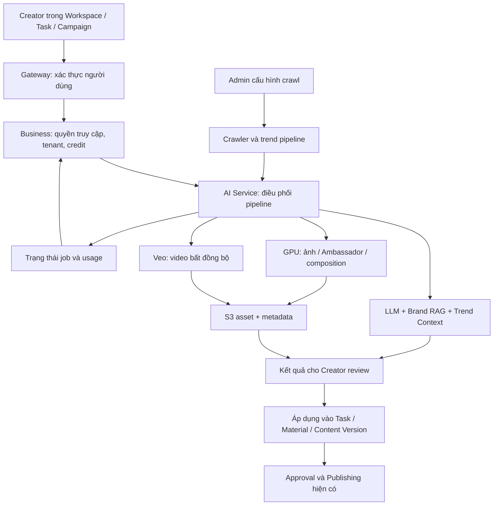

# Kế hoạch điều chỉnh đặc tả AI Features (FR 3.7.1–3.7.12)

Ngày phân tích: 2026-09-27. Trạng thái: **Kế hoạch v3 — đã cập nhật toàn bộ phản hồi của chủ sản phẩm; sẵn sàng thực hiện đợt chỉnh spec**.

Đầu ra của đợt này là kế hoạch cập nhật 12 `spec.md` trong `docs/feature/ai-features`. Chưa thay đổi các spec hay code sản phẩm. Ước lượng bên dưới chỉ dành cho công việc đặc tả, không phải thời gian triển khai toàn bộ AI.

## 1. Cơ sở lập kế hoạch và cách xử lý nguồn mâu thuẫn

Nguồn chính: [brandhub-master-plan.md](brandhub-master-plan.md), gồm bảng Epic và chi tiết AI-01…AI-11, AI-4.99; đối chiếu thêm E23/E24, E17-07, E51-06g, E51-13/14. Đã đọc cả 12 spec hiện tại, [BA AI Features](../ba/06-ai-features.md), [Subscription & Billing](../ba/08-subscription-billing.md), [Business–AI REST contract](../architecture/business-ai-rest-contract.md) và các phần liên quan của Content History/Collaborator.

Code local chỉ được kiểm tra có chọn lọc để nhận diện sai lệch lớn, chưa phải audit toàn bộ hoặc kiểm thử runtime. Không suy ra trạng thái production từ một route, checkbox hay nhãn “Completed”.

### Quyết định của chủ sản phẩm ngày 2026-09-27

- **Toàn bộ sinh ảnh chuyển sang FLUX.2**, bao gồm Concept, tạo Ambassador và Commercial Image. SDXL/Topic LoRA/Identity LoRA/DWPose/IP-Adapter trong Master Plan là lịch sử thiết kế, không là ràng buộc công nghệ của spec đích.
- **Trend giữ mô tả 7 tầng** trong đợt này; team đang cập nhật các bước. Không đóng băng Jaccard, PageRank, Betweenness hoặc công thức scoring. Quy ước tài liệu đề xuất: ingestion T0 ở trước, bảy tầng xử lý T1–T7; tên và mapping chi tiết sẽ đồng bộ với blueprint mới của team.
- **Viết spec đích**, bao gồm chức năng chưa triển khai, ghi rõ trạng thái và phần chờ thiết kế/kiểm chứng.
- **Creator tự tạo danh tính Ambassador mới từ mô tả/ảnh**. Không giới hạn vào identity đã train hoặc preset do team chuẩn bị.
- **Livestream Script dùng một model LLM theo form**. **Collaborator giai đoạn đầu dùng catalog hệ thống**, giai đoạn sau có thể dùng dữ liệu danh bạ Agency. Cả hai FR mới, chưa triển khai và chưa có task trong Master Plan.
- **Credit chung:** reserve quota khi nhận job, settle phần thành công, release khi thất bại/timeout; retry kỹ thuật cùng request không tính lượt mới; chủ động Generate lại là lượt mới.
- **Video hỗ trợ prompt thuần và ảnh tham chiếu**, gồm ảnh đã tạo/ảnh Ambassador. Model variant và cách truyền reference phải đáp ứng cả hai flow.
- **Form Livestream được phép đề xuất tạm**; team sẽ cập nhật sau research. Mục 2.8 ghi rõ các trường và output tạm.
- **Export nhận định dạng native của Veo**: chỉ thêm WebM nếu Veo hỗ trợ. Tài liệu chính thức đã kiểm tra hiện liệt kê `video/mp4`; kế hoạch dùng MP4 và chưa đưa transcode WebM vào scope.

Thứ tự giải quyết khi viết lại:

1. Quyết định được chủ sản phẩm/team xác nhận trong đợt này.
2. Quy tắc V2 đã xác nhận, đặc biệt Task/Content Version, quyền theo Workspace/Agency và credit.
3. Mục tiêu/AC chi tiết của Epic AI áp dụng cho nhánh đã chọn; ghi rõ nhánh legacy/research.
4. Spec/BA cũ dùng để bảo toàn mục tiêu người dùng và FR, có bảng giải thích khi thay đổi.
5. Code và báo cáo kiểm thử là bằng chứng của trạng thái triển khai, không tự động thay đổi yêu cầu đích.

Không chọn thiết kế chỉ vì nằm cuối file: Master Plan có task trùng mã, dấu vết merge và các code skeleton không khớp Goal/AC. Tham chiếu bằng **mã + tên task + section**, thêm Jira key nếu có; riêng `DA-AI04-06` cần phân biệt Orchestrator và Regenerate.

## 2. Flow AI đã dựng lại

### 2.1. Ranh giới nghiệp vụ chung

- Business xác định quan hệ `user → agency → workspace → client/task/campaign`, kiểm tra quyền trên tài liệu, asset và job; không tin tenant ID tự khai từ browser.
- Subscription thuộc User/Owner; credit khả dụng dùng trong phạm vi Agency và giới hạn cứng từng Creator. Business sở hữu ledger; AI xử lý generation và báo usage/kết quả.
- V2 lưu nội dung đang soạn trong Task/Content Version. `posts` chỉ được tạo sau publish thành công (E51-14). Flow “AI generate → tạo Draft Post” của E24 cũ cần được ánh xạ lại.
- Tái sử dụng asset/content đã sinh không tạo thêm lượt generation và không trừ credit lần nữa (E51-13).
- Việc auto-save kết quả vào Material và thời điểm Creator bấm Apply cần chốt; không đánh đồng “sinh xong” với “được duyệt/xuất bản”.
- Tách xác thực browser→Gateway, Business→AI và AI→GPU. Internal key/Bearer của worker là credential phía server; demo `studio.html` không đủ để xác lập contract frontend production.

### 2.2. Brand knowledge — AI-03

Upload PDF/DOCX/TXT (giới hạn 10 MB theo Master Plan; URL có trong biến thể cũ) → lưu S3 theo client/document → trả trạng thái đang xử lý → extract text → chunk 500 ký tự, overlap 50 → embedding 384d → ChromaDB. Nhánh NER trích entity/relation → Neo4j → entity resolution theo tenant.

Khi truy vấn: normalize query → vector top-K và graph traversal/pruning → dựng Brand Context. Khi xóa: xử lý cả source object, chunks, graph/provenance và cache liên quan. Mọi truy vấn/merge/xóa phải giữ ranh giới tenant, kể cả node nối tiếp trong traversal.

RAG là nền của caption và có thể cấp brand context cho video/script, nhưng chưa có FR riêng trong 12 spec. Cần mô tả như dependency chung, chốt ai được upload/xóa, tài liệu ở đâu và hành vi khi chưa ingest xong. Không tự thêm FR 3.7.13.

### 2.3. Trend collection và Trend Context — AI-05, AI-4.99

Hai luồng liên kết nhưng khác mục đích:

1. **Phát hiện/xếp hạng:** nguồn crawl → queue/buffer → chuẩn hóa/dedup → lọc bot/spam → NLP → topic → BM25 spike → engagement/mood → graph/clustering → fusion → Top trends → cache/storage → dashboard 3.7.1.
2. **Lấy context để viết:** trend đã chọn → Redis context cache → graph relations + vector snippets song song khi cache miss → tổng hợp context dưới 800 tokens → caption/hashtag. Master Plan nêu cache bảng trend 6 giờ, context cache 30 phút; hai TTL khác nhau.

Nhánh T0–T7 trong Master Plan mô tả T0 ingestion; T1 bot filter; T2 NLP; T3 phân loại; T4 BM25 split-window; T5 engagement/mood; T6 Jaccard community; T7 fusion thành Trend Object (`title/topic/mood/status`, cross-topic signal). Các task trước đó vẫn quy định Neo4j GDS PageRank/Betweenness. Theo xác nhận mới, spec chỉ giữ flow **7 tầng ở mức trách nhiệm**, không đưa thuật toán/threshold của từng phiên bản thành AC cố định. Đề xuất đặt T0 ingestion ngoài bảy tầng, ghi rõ đây là quy ước trình bày chờ blueprint mới, không đổi kiến trúc của team.

**Bằng chứng lịch sử để theo dõi:** code local `t6_graph_step.py` thực hiện NetworkX PageRank/Betweenness, T7 kết hợp BM25, graph, engagement và cross-source signal. Vì vậy “T0–T7” không đồng nghĩa “bỏ PageRank”. Tài liệu local [thiết kế nâng cấp 2026-09-02](../../../brandhub-ai-service/docs/2026-09-02-tier2-trend-detection-upgrade.md) còn mô tả LLM-at-T2, taxonomy config, MAD theo platform, queue `crawler.posts`, Redis+S3 và defer Neo4j/ChromaDB; tài liệu tự ghi chưa code. Các phiên bản này được ghi thành implementation/design notes, chờ team cập nhật, không cản trở viết spec UI/flow đầu ra.

Không dùng chung taxonomy trend (`tech/food/sports/entertainment/news/education` trong Master Plan) với ngành hàng của image template. Sáu Topic LoRA SDXL là thiết kế cũ; ngành hàng/preset vẫn có thể được giữ như cấu hình prompt cho FLUX.2. Không gọi `score` là search volume khi không có dữ liệu volume thực tế.

### 2.4. Caption và hashtag — AI-04

Creator nhập topic/tone/platform, có thể chọn trend → lấy Brand RAG và Trend Context song song qua adapters → Prompt Builder → Groq primary → fallback qua resilient router/circuit breaker → hậu xử lý theo nền tảng → trả caption và metadata → Creator review/apply.

- Có 7 tone theo AC; generate và regenerate-with-feedback là hai hành vi cần đặc tả riêng trong 3.7.2.
- Regenerate giữ grounding của brand, nhận previous caption + feedback; khác với việc chọn lại một phiên bản đã có.
- Không bịa giá, tính năng, ưu đãi, số điện thoại. Thiếu Brand Context và thiếu Trend Context cần hai chính sách riêng; `return_exceptions=True` chưa xác định đủ hành vi nghiệp vụ khi adapter lỗi.
- Hashtag có route riêng, chuẩn hóa `#`, dedup, lọc banned, clamp số lượng theo platform, cho phép apply vào Task hoặc thêm vào Hashtag Collection. Cần phân biệt “hashtag liên quan” và “hashtag có bằng chứng trending”.
- Master Plan mô tả hashtag dùng LLM; code local hiện đặt `HashtagExtractor(llm_enabled=False)` và enrich từ trend cache. Chốt implementation strategy và credit trước khi mô tả như yêu cầu bắt buộc.

### 2.5. Image, Ambassador và Composition — AI-06/07/08

**Flow đích chung đã xác nhận:** Creator chọn loại tác vụ → form/prompt và ảnh tham chiếu được phép truy cập → validate/guardrails → dựng request cho FLUX.2 → generation job → kiểm tra output → S3/metadata → review/save/apply. Cùng model family nhưng mỗi loại tác vụ có request validation, reference mapping và tiêu chí QA riêng.

**Concept Studio:** form/prompt + style + brand colors/industry → prompt assembly → FLUX.2 → logo stamp tùy chọn → S3. Giữ giá trị UX của template/intent; loại điều kiện bắt buộc phải nạp Topic LoRA SDXL. Batch 1–4 ảnh, mặc định 3 là yêu cầu kế thừa đề xuất, cần xác nhận khả năng orchestration/chi phí trên runtime mới; chỉ settle ảnh thành công.

**Tạo Ambassador self-service:** Creator nhập mô tả hoặc chọn/upload ảnh → kiểm tra đầu vào → FLUX.2 tạo các ứng viên → Creator chọn/lưu thành `ambassadorId` với reference assets/metadata → tái sử dụng cho ảnh/video. Cần đặc tả text-only và reference-based thành hai nhánh; nếu chỉ có mô tả thì chưa có ảnh danh tính gốc để tính face similarity. Đề xuất ảnh Creator chấp nhận đầu tiên trở thành canonical reference cho các lần tiếp theo. Phiên bản identity, quyền xóa và ảnh đang được Task sử dụng cần contract cụ thể.

**Dùng Ambassador đã lưu:** chọn `ambassadorId` + mô tả pose/wardrobe hoặc reference được hỗ trợ → FLUX.2 sinh ảnh biến thể → kiểm tra consistency với canonical reference → gallery/reuse. Không yêu cầu Creator chờ train LoRA để dùng identity mới. Nếu sau này cần FLUX-compatible fine-tuning, đó là thiết kế riêng cần evidence; không tái sử dụng weights SDXL theo mặc định.

**Commercial Image:** product reference + Ambassador tùy chọn + prompt/style → FLUX.2 native multi-reference → QA sản phẩm/danh tính → asset. Phase 6 quy định product index 0, ambassador index 1 và contract giản lược; phải bổ sung trường hợp chỉ product/chỉ Ambassador và kiểm chứng trên runtime thực. Không giữ các thanh trượt 2D/IP-Adapter scale như điều kiện bắt buộc của flow mới.

**QA và composition sau migration:** giữ các mục tiêu nghiệp vụ về danh tính, pose, tương tác với sản phẩm, độ trung thực SKU; không mang nguyên các cơ chế SDXL/DWPose/VTON cũ thành yêu cầu đã chốt cho FLUX.2. Các ngưỡng face similarity PASS ≥0.85, WARNING 0.75–<0.85 và FAIL <0.75 trong Master Plan là baseline đánh giá cần hiệu chuẩn lại cho pipeline mới; chỉ áp khi có reference. Chính sách nhiều mặt, WARNING/FAIL, refinement/upscale và retry cần review. Non-generative operations như logo stamp/export không tự động bị loại vì chuyển model.

**Ảnh bất đồng bộ:** đề xuất dùng chung job contract cho các tác vụ ảnh để phù hợp credit/idempotency. Redis TTL 24 giờ và timeout 120 giây xuất phát từ Phase 6 Commercial; chưa tự áp cùng SLA này cho tạo identity/batch. Cần định nghĩa queue wait, inference timeout, restart recovery, late completion và per-item settlement.

**Lịch sử dùng để trace:** SDXL Track A/B, 2D harmonizer, dual-image IP-Adapter, training Identity LoRA, DWPose và stage runner VTON/detailer/upscale giải thích mục đích của các task AI-06/07/08 cũ. Kế hoạch cần thêm bảng task nào được thay thế, mục tiêu nào giữ lại, task FLUX.2 nào còn thiếu cho Concept/Ambassador. Không tự xóa code hay sửa Master Plan trong đợt lập kế hoạch.

### 2.6. Video và export — AI-09

Form/template + subject/action + brand context + camera motion → validate/guardrails → tạo job → trả 202 → dispatch Veo → worker poll provider → stream video sang S3 + đọc duration → cập nhật job → UI poll hệ thống và preview/download.

- State đích trong AI-09: `PENDING → PROCESSING → COMPLETED|FAILED`; job TTL 24 giờ; polling provider khoảng 10 giây và timeout 600 giây theo plan. Polling của browser chỉ đọc trạng thái hệ thống, không kích hoạt lại provider.
- Output không bắt buộc thumbnail; pipeline đích không sinh thumbnail. Preview clip tĩnh trong catalog template là vấn đề khác, không mâu thuẫn với Zero Thumbnail cho video mới sinh.
- Template library: 10 archetype × 3 motion styles; spec cần input placeholders, compatibility và hành vi chọn/override.
- Plan nêu URL video 7 ngày, ảnh 24 giờ, gallery Ambassador 1 giờ. Phải lưu asset ID/object key bền vững, có cơ chế cấp lại URL; TTL URL khác TTL job và khác retention của asset.
- **Đã xác nhận hai mode:** text-to-video và image/reference-to-video. Backend resolve asset đã kiểm tra quyền thành input provider; không chỉ nhét `ambassadorId` vào prompt. Code local có `image_url` nhưng chưa chứng minh luồng provider thực sự hoạt động.
- **Export video: MP4.** Theo điều kiện của chủ sản phẩm, chỉ hỗ trợ thêm WebM nếu provider trả native. [Thông số Veo 3.1 của Google](https://docs.cloud.google.com/gemini-enterprise-agent-platform/models/veo/3-1-generate) được kiểm tra ngày 2026-09-27 liệt kê MIME `video/mp4`; chưa có cơ sở đưa WebM native vào spec. Không bổ sung transcode chỉ vì spec cũ ghi hai định dạng.
- Cùng nguồn chính thức nêu 16:9/9:16, 24 FPS và thời lượng theo mode/model; khác các lựa chọn 1:1, 30 FPS, 5–10 giây trong Master Plan. Khi viết 3.7.6/7 phải lập capability matrix cho model được chọn, không sao chép các lựa chọn cũ thành thông số Veo đã hỗ trợ. [Hướng dẫn Veo](https://ai.google.dev/gemini-api/docs/veo?hl=en) phân biệt image input với reference images; cả hai không phải một trường tùy ý dùng cho mọi variant.

### 2.7. Hai FR còn thiếu thiết kế AI chi tiết

- **3.7.11 Livestream Script — đã xác nhận:** Creator điền form → một LLM sinh script theo timeline segments → Creator review/chỉnh sửa → áp dụng vào FR 3.6.23. Chủ sản phẩm cho phép dùng form đề xuất tạm ở mục 2.8 và cập nhật sau research. Ghi rõ chức năng mới/chưa triển khai; đề xuất task mới, không giả định task AI-04 đã bao phủ.
- **3.7.12 Recommend Collaborator — đã xác nhận:** ngành hàng + audience + budget + campaign context → lấy ứng viên từ **catalog hệ thống** ở giai đoạn đầu → xếp hạng với lý do/tier → người có quyền chọn → tạo/link danh bạ Agency và CampaignCollaborator. Giai đoạn sau **có thể** bổ sung danh bạ Agency; không truy vấn chéo dữ liệu riêng của Agency khác. Giá tham khảo, quyền Creator/Manager và chiến lược ranking vẫn cần chi tiết. Không tự gán `contacted` chỉ vì AI gợi ý; BA nói AI không thay đổi trạng thái hợp tác. Cho phép no-match có lý do khi catalog không đủ, không bịa đối tác để tránh list rỗng.

AI-01 là research/benchmark nền; AI-02 cung cấp runtime/schema/auth/storage; AI-10 chuẩn hóa API, error/retry, integration; AI-11 cung cấp tài liệu, cost evidence và demo. Những Epic này đóng góp dependency/NFR/DoD chung, không phải mỗi Epic tương ứng một FR UI.

### 2.8. Form Livestream Script tạm — đề xuất để team research tiếp

Form này là thiết kế khởi đầu của BrandHub, không phải form đã được BA nghiệm thu hoặc thông số bắt buộc của một provider. Gắn version để thay đổi sau research mà không làm mất dữ liệu script cũ.

| Trường | Mức yêu cầu đề xuất | Nội dung / mặc định |
|---|---|---|
| `topic` / `idea` | Bắt buộc | Chủ đề chính; có thể điền sẵn từ Livestream Idea của Task |
| `goal` | Bắt buộc | Bán hàng / giới thiệu sản phẩm / nhận diện thương hiệu / hướng dẫn / Q&A; cho phép mô tả thêm |
| `targetAudience` | Bắt buộc | Nhóm người xem, nhu cầu và mức độ hiểu sản phẩm |
| `durationMinutes` | Bắt buộc | Số phút dự kiến, nguyên dương; mặc định đề xuất 30; giới hạn trên cấu hình sau research |
| `platform` | Tùy chọn | Kênh dự kiến phát để điều chỉnh cách nói và CTA; không tự tạo sự kiện livestream trên kênh |
| `language`, `tone` | Có mặc định | `vi`, `casual`; người dùng đổi ngôn ngữ/tone theo cấu hình được hỗ trợ |
| `products` / `productRefs` | Có điều kiện | Với mục tiêu bán hàng/demo: cần sản phẩm và dữ kiện đã cung cấp; tên, lợi ích, giá nếu muốn nêu giá |
| `keyMessages` | Tùy chọn | Các thông điệp bắt buộc phải có trong script |
| `offers` | Tùy chọn | Khuyến mãi, điều kiện và thời hạn do người dùng cung cấp; bỏ trống thì không tự sinh ưu đãi |
| `callToAction` | Tùy chọn | Hành động mong muốn: bình luận / xem link / đăng ký / mua; chỉ dùng link/thông tin liên hệ đã cung cấp |
| `hostStyle`, `interactionIdeas` | Tùy chọn | Phong cách người dẫn, Q&A, câu hỏi tương tác hoặc minigame nếu có |
| `referenceAssetIds`, `additionalNotes` | Tùy chọn | Tài liệu/asset được phép truy cập và yêu cầu bổ sung |

`workspaceId/taskId/clientId/campaignId` là context do hệ thống resolve/kiểm tra, không phải các ô tự nhập tùy ý. Có thể prefill brand context; LLM chỉ nêu facts từ form/tài liệu có nguồn.

Output đề xuất: `title`, `summary`, `totalDurationMinutes`, `segments[]`, `warnings[]`. Mỗi segment có `startSecond`, `endSecond`, `sectionTitle`, `hostScript`, `visualCues`, `interactionCue` và `productRefs` nếu liên quan. Timeline bắt đầu từ 0, không chồng lấn, thời lượng phân đoạn cộng đúng thời lượng đã yêu cầu; lời thoại là dự toán để host chỉnh sửa, không bảo đảm thời gian nói thực tế chính xác tuyệt đối.

Ví dụ cấu trúc 30 phút: mở đầu/hook 0–3; giới thiệu brand 3–5; nội dung/demo 5–17; Q&A 17–22; CTA/ưu đãi có nguồn 22–27; tổng kết 27–30. Có thể đổi cấu trúc theo mục tiêu; không bắt buộc có bán hàng/ưu đãi khi người dùng chọn hướng dẫn hoặc Q&A.

Flow UI đề xuất: điền form → xem chi phí → Generate → preview timeline → sửa thủ công hoặc Regenerate có feedback → Apply vào script của Task. Apply phải xử lý trường hợp script đang có nội dung và lưu version; Generate không tự ghi đè. Áp dụng credit policy chung; retry kỹ thuật cùng request không tính thêm.

## 3. Các quyết định cần chốt

Phần “Đã chốt” ghi lại phản hồi của chủ sản phẩm. Các chi tiết còn ghi “đề xuất/cần chốt” chưa là yêu cầu được xác nhận; xử lý trong review contract.

| ID | Quyết định và bằng chứng mâu thuẫn | Đề xuất/việc phải chốt | Tác động |
|---|---|---|---|
| D01 | SDXL/2D/IP-Adapter và FLUX.2 cùng tồn tại trong AI-06 | **Đã chốt: toàn bộ sinh ảnh dùng FLUX.2**; cần bổ sung task migration cho Concept/Ambassador ngoài Phase 6 Commercial | 3.7.3/4/5 |
| D02 | Master Plan T6 Jaccard; task cũ Neo4j GDS; code T6 NetworkX; doc 09-02 thêm LLM/MAD | **Đã chốt: giữ 7 tầng**, team đang update; defer thuật toán chi tiết, mô tả input/output và trách nhiệm ổn định | 3.7.1/2/9/10 |
| D03 | Spec “chưa code” trong khi đã có route/pipeline local | **Đã chốt: spec đích**, ghi riêng trạng thái triển khai và evidence | Cả 12 spec |
| D04 | Spec tạo Ambassador từ mô tả; AI-07 chọn identity/pose; API khác nhận upload chân dung | **Đã chốt: Creator tự tạo identity từ mô tả/ảnh**; tách creation/save/reuse; mapping FLUX.2 và canonical reference là chi tiết cần thiết kế | 3.7.3/5/7 |
| D05 | Script/Collaborator có FR nhưng thiếu task AI chi tiết | **Đã chốt: hai FR mới/chưa triển khai**, script dùng LLM theo form; collaborator catalog hệ thống trước, Agency data có thể bổ sung sau | 3.7.11/12 |
| D06 | E24 tính theo Workspace/Mongo + 429; V2 Agency/Creator + ledger; async trừ trước hay sau chưa thống nhất | **Đã chốt: reserve → settle phần thành công → release lỗi/timeout**, retry cùng request không double-charge; bảng giá cụ thể còn cần cấu hình | Các FR tính phí |
| D07 | Caption thiếu Brand Context, trend lỗi và provider lỗi chưa có product policy | Đề xuất phân biệt brand missing, trend missing/stale, provider unavailable; thiếu brand facts thì yêu cầu bổ sung hoặc chỉ viết nội dung không nêu claim theo policy được duyệt | 3.7.2/10/11 |
| D08 | AI-09 thiếu mapping Ambassador; Export yêu cầu WebM; Zero Thumbnail | **Đã chốt hai mode prompt/ảnh; MP4 theo capability native đã kiểm tra**. Chọn variant phù hợp, hoàn thiện reference mapping và job expiry/URL refresh trong contract | 3.7.6/7/8 |
| D09 | `/api/v1`, `/ai`, `/internal`, `/api/v2`; hai tên internal-key header; commercial có hai bộ status | Lập bảng public→Business→AI→worker; thống nhất auth/header/error/state mapping; không expose service secret ra browser | Cả nhóm API |
| D10 | Brand RAG không có FR UI riêng; Client upload Brand Collection còn Creator chỉ xem | Chốt entry point/quyền ingestion, mapping client/workspace, READY/FAILED document và delete lifecycle | Dependency chung, 3.7.2/5/11 |
| D11 | 15 image presets, top-10 library, 6 topic LoRAs và 5 Ambassador styles là các catalog khác nhau | Chuyển preset sang prompt/capabilities của FLUX.2; bỏ phụ thuộc SDXL LoRA; giữ riêng ID/version/mode và review số lượng catalog | 3.7.3/4/5/6 |
| D12 | Spec nhiều nơi nói không có edge case; job/asset/credit cần ranh giới rõ | Chốt auto-save/apply, output QA WARNING/FAIL, cancel nếu có, late completion, worker restart, retention và provenance | Generation/export/history |

Các con số giá/giới hạn nền tảng/model trong Master Plan được xem là cấu hình hoặc mục tiêu của dự án tại nguồn đó. Chỉ chốt thành cam kết acceptance sau khi đối chiếu provider/runtime đã chọn. Các mục tiêu 100% fidelity, deterministic reproduction hay SLA GPU phải có điều kiện đo và bằng chứng benchmark; không biến thành bảo đảm chung từ mô tả kế hoạch.

## 4. Bảng điều chỉnh đủ 12 spec

Các đường dẫn trong bảng là file đích thực tế; nội dung là phạm vi dự kiến sửa, phụ thuộc quyết định ở mục 3.

| FR / file đích | Epic/task làm cơ sở | Thay đổi chính | Điều kiện nghiệm thu spec |
|---|---|---|---|
| [3.7.1 Trending Topics](../feature/ai-features/3-7-1-view-trending-topics-suggestions/spec.md) | AI-05-15/16/17/25…32, AI-4.99 | Trend Object thay list keyword tối giản; category/source/time window, score/mood/status khi baseline hỗ trợ, timestamp/freshness; chọn trend để tạo caption; empty/stale/degraded/error | Phân biệt không có trend với hệ thống lỗi; score có định nghĩa; không lẫn taxonomy ảnh |
| [3.7.2 Caption](../feature/ai-features/3-7-2-generate-caption/spec.md) | AI-03, AI-04-01…08, E24, E51-13/14 | RAG + trend adapters, 7 tones, platform, generate/regenerate, grounding, fallback, apply/history/credit, schema metadata | Có main/alternative/error flow; thiếu brand/trend xử lý riêng; không tạo Draft Post V1 |
| [3.7.3 Ambassador](../feature/ai-features/3-7-3-generate-ambassador/spec.md) | D01/D04; mục tiêu AI-06-18…25/31 và AI-07 cần remap | Creator tạo identity bằng mô tả/ảnh với FLUX.2; chọn/lưu canonical reference, sinh biến thể, QA, gallery/reuse; tách tech legacy | Không bắt buộc identity đã train; text-only không có face-similarity trước khi có reference; nối được sang Image/Video |
| [3.7.4 Image Templates](../feature/ai-features/3-7-4-view-image-style-template/spec.md) | AI-06-04/07/17/32 + D01 | Catalog ID/version/preview/mode, preset-to-prompt cho FLUX.2, default form, chọn/bỏ chọn, unavailable template | Template cập nhật đúng form/mode; không phụ thuộc weights SDXL/Topic LoRA |
| [3.7.5 Image](../feature/ai-features/3-7-5-generate-image/spec.md) | AI-06-34…38 + D01; mục tiêu AI-06/08 cũ cần remap | Concept/real product/Commercial đều FLUX.2; reference composition, batch/partial success, job/poll, QA, save/apply, credit | Mỗi mode có schema/QA rõ; không trộn 2D/IP-Adapter legacy vào v2; SLA/giá theo mode |
| [3.7.6 Video Templates](../feature/ai-features/3-7-6-view-video-style-template/spec.md) | AI-09-06/07/09 | 30 template theo archetype/motion, placeholders, constraints và previews | Tách catalog preview khỏi thumbnail của video sinh; options khớp capability provider |
| [3.7.7 Video](../feature/ai-features/3-7-7-generate-video/spec.md) | AI-09-01…10, E23-04 | 202/job state, reference input, rate limit, provider poll vs UI poll, timeout, failure, credit, asset retrieval; Zero Thumbnail | Đủ state transitions và terminal behavior; không double-submit/double-charge; không coi mock là đã tích hợp Veo |
| [3.7.8 Export](../feature/ai-features/3-7-8-export-file/spec.md) | AI-02-03, AI-06-09, AI-07-08, AI-09-04, E51 material, D08 | PNG/JPG và MP4; binary stream hoặc signed URL contract, quyền asset, expired URL, missing/deleted asset, logo/watermark | Định dạng thực đúng; download không generate lại; WebM chỉ khi provider hỗ trợ native hoặc scope transcode được bổ sung |
| [3.7.9 Crawl Config](../feature/ai-features/3-7-9-crawl-schedule-config/spec.md) | AI-05 crawl/scheduler/buffer, AI-4.99-01 | ADMIN hệ thống, schedule/timezone/source/budget/postsPerRun, persistent config và next-run behavior; chống job trùng khi nhiều instance | Chốt n8n/APScheduler/worker ownership; config thay đổi có hiệu lực đúng kỳ; phân biệt crawl config và scoring config |
| [3.7.10 Hashtag](../feature/ai-features/3-7-10-suggest-hashtag-trend/spec.md) | AI-04-05, AI-05 retrieval, E51-07/07c | Context/platform/count/brand/trend, extraction strategy, normalization/filtering, provenance, empty/fallback; apply/save | Không gắn nhãn trending cho hashtag tự suy diễn; dedup; chốt LLM hay Zero-LLM và credit |
| [3.7.11 Livestream Script](../feature/ai-features/3-7-11-generate-livestream-script/spec.md) | D05, BA 3.7.11, E51-08/08b; task AI mới chưa có | Form tạm mục 2.8 → LLM → timeline, review/apply/regenerate, context/credit; đề xuất backlog mới | Không tự ghi đè script; không bịa claim/ưu đãi; timeline valid; đánh dấu research-pending |
| [3.7.12 Collaborator](../feature/ai-features/3-7-12-recommend-collaborator/spec.md) | D05, BA 3.7.12, E50-08/09; task AI mới chưa có | System catalog trước; Agency catalog là hướng mở rộng; ranking/tier/reason/evidence, budget/no-match, quyền; suggest tách create/link | Không bịa đối tác/giá; không tự liên hệ/đổi status; chống trùng; cách ly dữ liệu Agency |

## 5. Cấu trúc chuẩn khi viết lại spec

Giữ mã FR và thư mục hiện tại. Bổ sung các phần thiếu vào cấu trúc spec đang có, dùng cùng thuật ngữ trong 12 file:

1. Metadata: version/date, scope và trạng thái **tài liệu** tách khỏi **triển khai**; Epic/task references; unresolved decision IDs nếu còn.
2. Objective/user story, actors/permissions, entry points, preconditions.
3. Input validation và output có types, required/optional/default, units, enums và ownership.
4. Main flow; alternative/error flows; postconditions và side effects.
5. Business rules: tenant, credit/idempotency, asset ownership/reuse, save/apply/history, provider fallback.
6. UI states: initial/loading/queued/processing/success/partial/empty/stale/failed/expired tùy feature.
7. API contract: public API riêng với internal service mapping; JSON hợp lệ, status/error payload, polling nếu có.
8. Acceptance criteria có ID ổn định `AC-3.7.x-01`; test scenario liên kết AC, benchmark/NFR cần bằng chứng.
9. Out of scope/dependencies/known limitations; bảng trace FR → Epic/task → AC.

Đề xuất thêm `docs/feature/ai-features/README.md` làm chỗ dùng chung cho glossary, service boundaries, tenant IDs, credit lifecycle, error/state mapping và bảng traceability. Mỗi spec vẫn tự đọc hiểu được flow chính. Bổ sung file chung này là một phần của đợt chỉnh tài liệu dự kiến, chưa tạo trong đợt lập kế hoạch.

Sửa link `../../../BA/...` thành đúng thư mục `../../../ba/...` để tránh lỗi trên môi trường phân biệt hoa/thường. Không tự đổi API toàn hệ thống chỉ để khớp đường dẫn đề xuất cũ.

## 6. Thứ tự thực hiện

| Bước | Công việc cụ thể | Đầu ra / gate | Người review đề xuất | Ước lượng công sức |
|---|---|---|---|---|
| P0 | **Đã xử lý quyết định scope trong phiên này**; ghi nhận D01–D06/D08 và form tạm | Decision log; lập tiếp current/target/legacy matrix khi sửa spec | Product/BA + AI lead | 0.5 ngày |
| P1 | Chốt D07–D12, service/tenant/data ownership, route/status/error mapping, credit/job/asset lifecycle | Shared contract + glossary + traceability skeleton | Backend + AI + BA | 0.5–1 ngày |
| P2 | Viết 3.7.9 → 3.7.1 → 3.7.10 → 3.7.2; mô tả dependency Brand RAG | Nhóm crawl/trend/text với AC, fallback, apply/history | AI text/trend + frontend | 1 ngày |
| P3 | Viết 3.7.3/4/5 cho FLUX.2 toàn bộ; identity self-service/catalog/reference và composition | Nhóm image/Ambassador; bảng mode→input→pipeline→result; task migration còn thiếu | AI image + backend/frontend | 1–1.5 ngày |
| P4 | Viết 3.7.6/7/8 cho hai mode video, MP4; hoàn thiện 3.7.11 theo form tạm và 3.7.12 theo system catalog | Nhóm video/export và hai FR mới; backlog kỹ thuật thiếu được chỉ rõ | AI video + BA + backend | 1–1.5 ngày |
| P5 | Walkthrough end-to-end, đối chiếu cả 12 file, validate link/JSON/enum/traceability, review diff | 12 spec nhất quán + danh sách implementation gaps + sign-off | QA + đại diện BA/AI/backend/frontend | 0.5 ngày |

Tổng ước lượng P0–P5: **4.5–6 ngày công tài liệu**, làm tròn kế hoạch khoảng **5–6 ngày**, không tính thời gian chờ review, benchmark trả phí hay audit implementation toàn diện. Người review là vai trò đề xuất, chưa gán việc cho thành viên cụ thể.

Trong mỗi bước: sửa một nhóm gắn kết → kiểm tra lại contract dùng chung → review chéo → chuyển nhóm tiếp. Các thuật toán trend đang research và form Script tạm được đánh dấu rõ; không chờ research hoàn tất để viết các flow/input/output đã đủ rõ.

Backlog cần đề xuất thêm khi bàn giao: (a) FLUX.2 Concept + preset migration; (b) FLUX.2 identity self-service + canonical asset lifecycle; (c) shared job/credit settlement + reconciliation; (d) Livestream form-to-script LLM + apply/version; (e) System Collaborator Catalog + recommendation/ranking + Agency extension contract. Đây là nhóm việc đề xuất, chưa tạo Jira task hoặc tự gán mã DA mới.

Các tài liệu BA/architecture/billing/Master Plan có mâu thuẫn phải được ghi thành follow-up đồng bộ có owner. Phạm vi sửa trực tiếp chính là 12 spec và tài liệu chung; sửa các nguồn khác chỉ khi được đưa vào phạm vi đợt thực hiện.

## 7. Kiểm chứng và tiêu chí kết thúc

### 7.1. Walkthrough bắt buộc

| Kịch bản | Điều phải truy vết được từ spec |
|---|---|
| Upload brand doc → trend → caption → regenerate → apply Task | Quyền, ingestion ready, context, fallback, platform length, version và credit |
| Brand RAG rỗng; trend context rỗng/stale; LLM primary lỗi | Ba nguyên nhân khác nhau có hành vi rõ, không bịa brand facts |
| Image batch 3 ảnh, 1 lỗi | Hai kết quả vẫn dùng được, trạng thái partial, credit theo policy đã chốt |
| Mô tả/ảnh → tạo identity → lưu Ambassador → Commercial Image | FLUX.2 đúng mode, canonical reference đúng tenant, QA text-only khác reference-based, metadata/reuse truy vết được |
| Image/Ambassador → Video → reload trang → poll → export | Resolve asset reference, job tồn tại, trạng thái terminal, URL refresh và định dạng |
| Worker restart/timeout → completion đến muộn → request lặp | Job reconciliation, terminal state và settlement không trùng |
| Hai request đồng thời khi chỉ còn đủ credit cho một | Kiểm tra/reserve nguyên tử theo ledger và Creator limit |
| Reuse ảnh/content cũ ở Task khác | Không gọi generation, không trừ credit lần nữa |
| Người dùng đổi workspace hoặc đoán asset/job ID của client khác | Quyền trên submit/read/status/export đều được kiểm tra |
| Admin đổi lịch khi crawl đang chạy | Job hiện tại theo config đã chụp, lần sau dùng config mới, không chạy trùng |
| Generate Script rồi Apply; Collaborator không có ứng viên phù hợp | Có review, không ghi đè ngầm, không bịa candidate hay tự chuyển contacted |

Đây là các kịch bản nghiệm thu đặc tả và test design cho đợt implementation sau; đợt lập kế hoạch không chạy GPU/LLM/Veo hay phát sinh phí provider.

### 7.2. Diễn giải yêu cầu “hiểu ít nhất 95%”

Không có phép đo khách quan cho phần trăm hiểu chỉ từ việc đọc file. Dùng tiêu chí có thể kiểm tra để chốt độ bao phủ: ít nhất **19/20 checkpoint** dưới đây đã được giải thích/truy vết và team xác nhận; đồng thời **100% quyết định trọng yếu** về scope, identity, tenant, billing, route và state phải được chốt. Đạt 19/20 không cho phép bỏ qua một quyết định trọng yếu còn mâu thuẫn.

20 checkpoint: (1) quyền/tenant; (2) credit ownership; (3) reserve/settle/retry/reuse; (4) RAG ingestion; (5) RAG retrieval/delete; (6) nguồn crawl/schedule; (7) trend 7 tầng và phạm vi thuật toán đang update; (8) cache/persistence/freshness; (9) Trend Context; (10) caption/grounding/fallback; (11) regenerate/hashtag; (12) Concept image/template; (13) real-product/FLUX.2 migration; (14) identity creation/canonical/catalog; (15) Ambassador serving/QA; (16) composition và mục tiêu kế thừa; (17) video/template/reference; (18) job/asset/export lifecycle; (19) Livestream/Collaborator; (20) Task/Material/Content Version và handoff sang approval/publish.

**Hiện tại:** đã phân tích các nhánh trong 20 checkpoint và nhận phản hồi làm rõ toàn bộ câu hỏi đã đặt. Flow đích đủ rõ để bắt đầu chỉnh 12 spec. Các chi tiết còn lại đã được khoanh vùng thành contract decisions hoặc research-pending, đặc biệt thuật toán trend, form Script và thông số/QA runtime FLUX.2. Không dùng “95%” như một số đo thực nghiệm hoặc coi toàn bộ chi tiết implementation đã chốt; checklist trên là gate review khi hoàn tất spec.

Đợt chỉnh spec được coi là hoàn tất khi:

- 12/12 FR có traceability đến Epic/task hoặc được đánh dấu rõ thiếu task, không âm thầm bỏ FR.
- Không còn xung đột public/internal route, tenant scope, status, billing, model/mode và asset contract giữa các spec.
- Main flow, failure, partial success, fallback, reuse có AC kiểm chứng được; không còn “không có lỗi/edge case” ở nơi thực tế cần hành vi.
- JSON ví dụ parse được, các link nội bộ tồn tại, AC IDs không trùng; trạng thái tài liệu không bị nhầm với đã code/đã benchmark.
- Review end-to-end với BA/AI/backend/frontend/QA hoàn tất; còn research/NFR chưa xác minh được ghi thành điều kiện nghiệm thu riêng có owner.

## 8. Ghi nhận code local để tránh viết sai trạng thái

| Evidence đã đọc | Quan sát giới hạn trong snapshot local | Hệ quả cho spec |
|---|---|---|
| [T6 Graph](../../../brandhub-ai-service/app/services/pipeline/steps/t6_graph_step.py), [T7 Fusion](../../../brandhub-ai-service/app/services/pipeline/steps/t7_fusion_step.py) | T6 tính PageRank/Betweenness bằng NetworkX; T7 dùng graph score và co-occurrence | Theo D02 giữ flow 7 tầng; thuật toán chi tiết chờ team update, không mặc định loại graph |
| [Content endpoints](../../../brandhub-ai-service/app/api/v1/endpoints/content.py) | Route generate gọi LLM; luồng route được đọc chưa thể hiện orchestration RAG/trend như AC; hashtag có Zero-LLM | Phân biệt target pipeline với phần route đang có; chốt D07/chi phí hashtag |
| [Video endpoints](../../../brandhub-ai-service/app/api/v1/endpoints/video.py), [Veo client](../../../brandhub-ai-service/app/services/veo_client.py) | Client dựng payload nhưng xử lý job mô phỏng, tải video mẫu và tạo thumbnail; có DONE thay COMPLETED | Không ghi “Veo E2E đã hoạt động”; Zero Thumbnail và state cần implementation gap rõ |
| [API router](../../../brandhub-ai-service/app/api/v1/router.py) | Mount content/image/video/rag/trends/ner/graph trong router được đọc | Không suy ra mọi endpoint AI-10 hay toàn bộ spec đều đã hoàn thiện |
| [Trend endpoints](../../../brandhub-ai-service/app/api/v1/endpoints/trends.py) | GET hỗ trợ 6h/24h/7d; pipeline-config thay đổi object mặc định của service | Không coi scoring config là Admin Crawl Schedule persist đầy đủ |

Các quan sát trên không thay thế acceptance test hoặc deployment evidence, và không là lý do tự động hạ yêu cầu đích.
